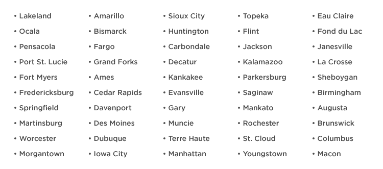

# Lyft 在全美 54 个城市推出 

> 原文：<https://web.archive.org/web/https://techcrunch.com/2017/02/23/lyft-launches-in-54-more-cities-across-the-u-s/>

# Lyft 在美国另外 54 个城市推出。

Lyft 表示，它将在 2017 年快速增长，周四，它加倍兑现了这一承诺，在美国 54 个城市推出了。此次发布是这家打车公司最大的同步扩张，仅次于 1 月份宣布的在美国 40 个城市的启动，也是该公司首次明确表示今年将寻求增长到 100 个新市场。

Lyft 实际上已经非常接近这个目标了，现在才 2 月份。它现在在 2016 年没有出现的 94 个新城市提供服务，其总覆盖范围现在跨越美国 300 个市场。

如果我的计算正确，Lyft 只需再增加 6 个市场即可完成 2017 年的扩张目标，那么这就给了该公司足够的时间来专注于今年的其他事情——比如可能与通用汽车的 Cruise 合作在几个初始市场推出自主服务。或者把剩下的一些新市场变成国际市场。

以下是从今天开始 Lyft 可以使用的所有新城市的列表，如果你想知道它是否会出现在你的城市:

【T2