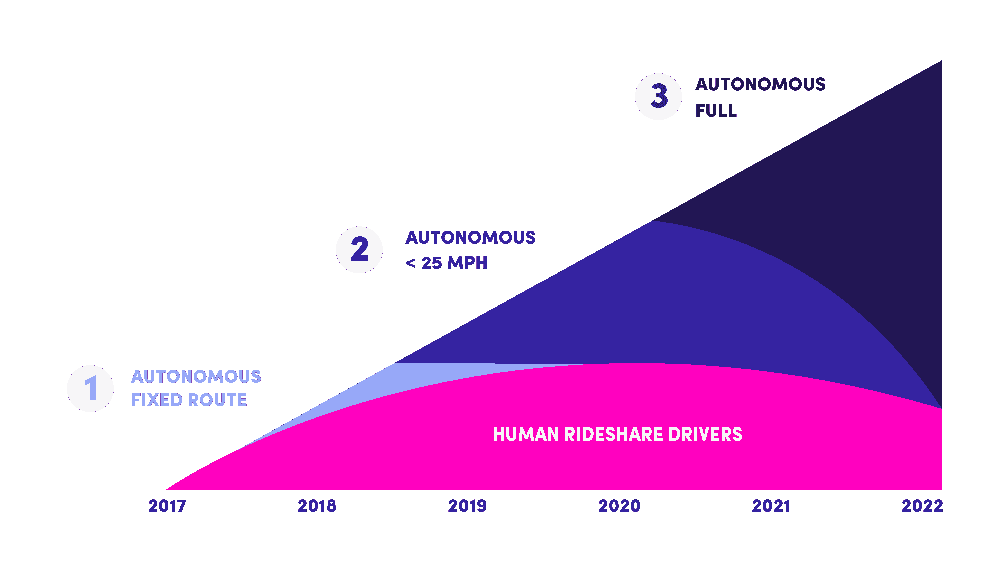

# Lyft 雄心勃勃的未来愿景包括到 2021 年自动驾驶占据主导地位 

> 原文：<https://web.archive.org/web/https://techcrunch.com/2016/09/18/lyft-self-driving-network-plan/>

本周，优步开始在匹兹堡用自动驾驶测试车搭载乘客——所以，就在几天后，Lyft 在这个问题上有所表示也就不足为奇了。Lyft 的回应可能不是现役自动驾驶汽车，但这是一篇冗长而详细的论文，讲述了 [Lyft 如何看待未来十年的交通运输](https://web.archive.org/web/20230203080429/https://medium.com/@johnzimmer/the-third-transportation-revolution-27860f05fa91)，由 Lyft 联合创始人兼总裁约翰·齐默撰写。

来自 Lyft 高管的 Medium 帖子阐明了一个未来愿景，即到 2021 年，Lyft 汽车网络上的大多数乘坐都将由自动控制。到 2025 年，Zimmer 预计个人汽车所有权，特别是在美国城市地区，将基本上成为过去，因为居民选择使用共享汽车网络。

“我想写一篇长文章，因为这是我们在 2007 年开始 Zimride 时已经工作了近 10 年的东西，”Zimmer 在一次采访中告诉我。“有很多营销噱头，你让几辆车上路，或者你发布公告和新闻稿，但没人谈论的是，你有这个百年一遇的机会——如果我们与正确的利益相关者合作——来实际影响我们的城市如何运作。”

Lyft 联合创始人约翰·齐默在 TechCrunch Disrupt SF 2013 上。

Zimmer 的帖子有点让人想起上世纪五六十年代流行科学版面上令人窒息的未来肖像，但它也源于解决真正问题的愿望。他告诉我，改造城市空间实际上从一开始就是他的目标之一，因为他在大学里上过一门城市规划课，所以有了 Zimride 的想法(它实际上早于并推出了 Lyft，但在 2013 年被该公司[卖给了 Enterprise)。](https://web.archive.org/web/20230203080429/https://techcrunch.com/2013/07/12/lyft-zimride-enterprise/)

“有些城市被错误地设计成汽车专用的，大部分都是铺面的。我从入住率的角度来考虑问题，”齐默解释道，并指出他的大学教育是酒店管理，所以他从这个角度来考虑这个问题。“如果你想想地面交通，96%的时间汽车都是停着的，那就像是一件非常非常糟糕的事情。美国人花在汽车上的钱比花在食物上的钱还多，而汽车 96%的时间都停在那里……这占用了大量的城市基础设施。”

像东京这样的停车场目前占据了大片原本无用的城市空间。

当你过渡到一个汽车所有权不是主导模式、自动驾驶是常态的世界时，他对解决这些问题的潜力感到兴奋，但季默也没有对可能阻止他的愿景成为现实的挑战抱有任何幻想。他说，我们完全“不确定”是否能实现这一目标。

“如果我们只是做特技，只是谈论自动驾驶汽车的内部是什么样子，这是不会发生的，”他指出，同时还补充说，车内体验的设计肯定仍然是拼图中的一个重要部分。他声称，汽车设计是 Lyft 这种模式的竞争优势的一部分，它将与未来基于里程的订阅模式协同工作，Lyft 认为这种模式在基于混合动力自动驾驶车队的产品中是可行的。

> 让我们想象一下，你注册了 Lyft 的月度订阅，就像你注册了 Spotify 或网飞一样。 Lyft 联合创始人兼总裁约翰·齐默

“让我们想象一下，你注册了 Lyft 的月度订阅，就像你在 Spotify 或网飞一样，你将有五到十种不同的体验可供选择，”他说。“比方说，你想要一辆汽车或一家有轮子的酒店，让你可以在上班的路上写作；或者你想小睡一会儿，那里有一辆卧铺车；或者你和一群朋友在一起，那里有点像有轮子的酒吧。有了 Lyft 计划，你将能够获得五到十种不同的体验。”

根据 Zimmer 的说法，这就是为什么自动驾驶汽车部署将通过管理车队网络(如由 Lyft 运营的网络)发挥最佳作用的部分原因，与 Elon Musk 为最终未来阐述的模型相比，在未来，个人拥有的特斯拉网络可以按需出租，为车主自己带来收入。本质上，Zimmer 对 Musk 模型的批评归结为体验的一致性和质量、清洁和维护，当车队集中管理时，所有这些都更容易保证。

Lyft 如何看待人类驾驶员需求随着近期自动驾驶技术的进步而增长。信用:Lyft。

但是乔布斯呢？对自动车队运输网络的批评通常包括对 Lyft 和其他公司目前雇用的人类司机的担忧。Zimmer 有些反直觉地认为，在短期内，在向自动驾驶汽车过渡之前，Lyft 对人类司机的需求将会增长而不是减少。他表示，城市交通的现实将扩大对 Lyft 等共享服务的需求，增加对司机的需求，同时技术赶上了车辆可以无人驾驶的水平。

Lyft 还希望在合作伙伴方面更加灵活，在整个系统中发挥自己的作用，在网络层面上运营，在当今的整个无线市场上与美国电话电报公司或 Sprint 等运营商相提并论。在回答关于公司是否不需要对等式的硬件方面进行更多控制以实现其最终愿景的问题时，Zimmer 强调这是公司的重点。

> 对我们来说，关键是我们现在关注的是网络。 Lyft 联合创始人兼总裁约翰·齐默

“对我们来说，关键是我们现在关注的是网络，”齐默说。“与此同时，我们是唯一一家有密切关系的公司，以通用汽车拥有 Lyft 10%股份的形式，我们拥有这家 100 年来一直制造安全汽车的公司，我确实认为拥有这种类型的关系很重要，因为有这种关系时，联系和体验会更加丰富。”

Zimmer 的愿景无疑是引人注目的，但关键要素需要迅速整合起来，以支持他的路线图。正如他在我们的采访中指出的那样，Lyft 已经在与通用汽车一起测试采用自动驾驶技术的车辆，因此这一部分至少已经开始认真进行。至于其他的，我们将不得不看这条路把我们带向何方。