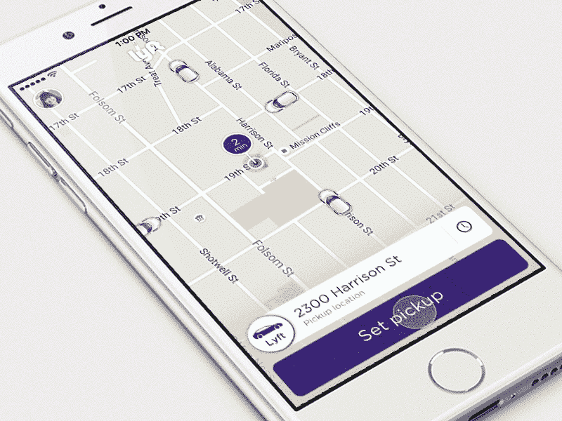

# Lyft 现在可以让你提前安排行程 

> 原文：<https://web.archive.org/web/https://techcrunch.com/2016/05/23/lyft-will-now-let-you-schedule-trips-ahead-of-time/>

# Lyft 现在可以让你提前安排行程

拼车平台 [Lyft](https://web.archive.org/web/20221207073340/http://lyft.com/) 听到了人们的声音，人们想要提前安排乘车时间。从今天开始，Lyft 将增加一项新功能，让您可以提前计划前往机场或参加您需要准时参加的重要商务会议。

纽约的拼车服务公司 Gett 提供这一功能已经一年多了，我们也听说了传言[优步](https://web.archive.org/web/20221207073340/https://www.crunchbase.com/organization/uber)曾想过提前安排乘车时间，但目前还没有提供这一选项。

目前还不清楚这项服务将如何受到高流量时期价格飙升的影响。

目前还不清楚这项功能在 Lyft 乘客中会有多受欢迎。我们询问 Lyft 对此的需求有多大，一位发言人简单地补充道:

> “乘客要求我们提供这一功能，所以我们希望推出这一功能，让用户在即将进行特定旅行时(如去机场)更加安心。人们喜欢知道自己已经有行程安排的安全感。”

我知道我个人想要这个选项已经有一段时间了，如果知道在我需要被接走的时候肯定会有人来接我，那就太好了。

该选项的工作方式是选择一个接车地点，点击 Lyft 应用右侧的时钟图标，然后选择你希望被接车的时间。您可以在取车前 30 分钟内免费更新或取消预定的行程。

日程安排功能目前仅在旧金山可用。Lyft 将测试它的运行情况，并从那里开始推出这项功能。

这是不是我们的无人驾驶汽车，聊天机器人，智能家居未来的一个伏笔？想象一下，让 Alexa 在预先评估的低流量时段为你安排一辆自动驾驶汽车，准时带你去你想去的任何地方。