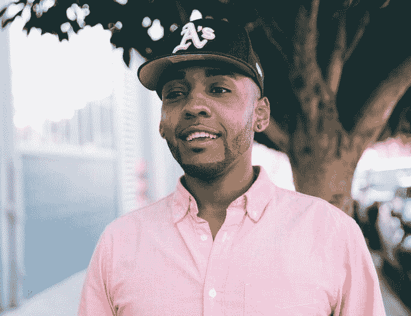

# Lyft 的多元化努力并没有被忽视

> 原文：<https://web.archive.org/web/http://techcrunch.com/2017/09/27/lyfts-diversity-efforts-are-not-going-unnoticed/>

在塔里克·梅耶斯(Tariq Meyers)去年 9 月成为 Lyft 包容性和多样性负责人之前，这家打车公司尚未发布多样性报告——许多大型科技公司多年来一直在发布这份报告。六月， [Lyft 最终发布了一份多样性报告](https://web.archive.org/web/20230314230855/https://techcrunch.com/2017/06/01/lyft-diversity-report/)，报告显示的数据与优步、脸书、谷歌等公司的数据相当。

快进到现在，人权运动，一个致力于男女同性恋，双性恋和变性社区的民权组织，正在认可 Lyft 的企业平等奖。

从迈耶斯被任命为 D&I 负责人到现在，Lyft 已经举办了无意识偏见培训，发起了向非营利组织(包括人权委员会)捐款的活动，并实施了[性别包容和肯定政策](https://web.archive.org/web/20230314230855/https://techcrunch.com/wp-content/uploads/2017/09/10d77-lyft-gia-policy.pdf)，专门确保为跨性别者提供一个包容的环境。

“我们与领导层合作起草政策，支持正在转型或正在考虑转型的团队成员，”Meyers 告诉我。“从确保我们有一个支持这一点的保险公司，或确保团队成员在恢复期有带薪休假，到让招聘经理和招聘人员对尊重姓名变更负责。”

自 5 月以来，通过 Lyft 的 Round Up & Donate 计划，75，000 名乘客向人权委员会捐赠了约 380，000 美元。人权委员会的奖项通常授予致力于 LGBTQ 群体平等的公司。去年，该奖项颁给了百事可乐。其他获奖者包括埃森哲和通用电气。

“Lyft 一直是 LGBTQ 社区的先驱企业盟友，它为员工制定了包容性的内部政策，其直言不讳的高管明确表示，公司强烈支持全国各地的支持平等的立法和政策，”人权运动工作场所平等项目主任蒂娜·菲达斯(Deena Fidas)在一份声明中说。

Lyft 是有史以来获得该奖项的最年轻的公司之一，在多元化和包容性的路线图上还有很长的路要走。它的努力开始于一年多前，随着它接近归属，已经有了五个保护措施。迈耶斯称之为五个 p:实践、伙伴关系、公共责任、规划和政策。

迈耶斯说，所有这些都需要确保 Lyft 与行业最佳实践保持同步，“从我们如何雇用候选人到我们如何培养和留住他们，我们有包容性的计划，以便人们可以真正生活在前面，庆祝对同性恋者的意义，庆祝作为护理者或残疾人的意义。公众要求我们承担责任。”

Lyft 包容性和多样性主管 Tariq Meyers

当然，Lyft 并不完美。首先，这是一家以白人为主的公司(63%是白人)。该公司也面临着自己在三藩市的法律挑战，以及 T2 歧视残疾人的指控。但在公众眼中，Lyft 比它的竞争对手优步做得更好，后者正试图从今年早些时候浮出水面的[性骚扰指控](https://web.archive.org/web/20230314230855/https://techcrunch.com/2017/02/19/former-uber-engineer-says-company-ignored-repeated-reports-of-harassment/)中恢复过来，同时受到了对其商业行为的几次[联邦调查](https://web.archive.org/web/20230314230855/https://techcrunch.com/2017/09/08/fbi-probes-ubers-use-of-software-to-target-rival-lyft/)和涉嫌窃取 Waymo 商业机密的[诉讼](https://web.archive.org/web/20230314230855/https://techcrunch.com/2017/09/17/waymo-wants-to-postpone-the-self-driving-car-technology-trial-with-uber/)。

展望未来 12 个月，Meyers 表示，他希望在团队的基础上围绕日益增长的多样性设定目标。他说，目标是有一天成为一家反映美国人口的公司。为了做到这一点，Lyft 计划继续推出无意识偏见训练，但更重要的是，推出有意识的行动训练。有意识行动培训将着眼于员工如何感受到采取行动和消除偏见的力量。在第四季度，Lyft 还将推出 allyship 培训。

在招聘过程中，Lyft 正在执行鲁尼规则，要求任何董事级别或以上的职位至少有一名少数族裔和女性进入最终面试阶段。这意味着面试官也需要反映候选人的背景。

迈耶斯说:“我们希望确保我们有意地构建面试循环，而不去修饰某人的经历，这是我们必须把握的细微差别。”“你如何反映某人的经历，以便他们能够真正了解 Lyft 的黑人生活——因为这是我加入团队时想知道的。我想知道在这里做哥哥是什么感觉。”