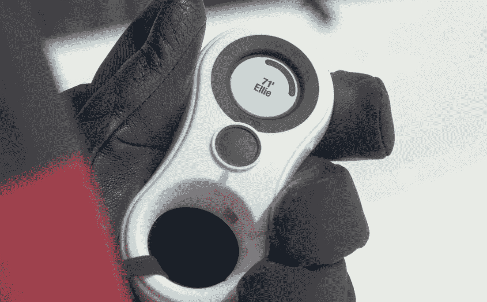

# Lynq 是一个非常简单的小工具，可以在户外找到你的朋友

> 原文：<https://web.archive.org/web/https://techcrunch.com/2018/05/15/lynq-is-a-dead-simple-gadget-for-finding-your-friends-outdoors/>

如果你曾经徒步旅行或滑雪，或者去过音乐节或州博览会，你会知道与朋友失去联系是多么容易，以及通常荒谬的“我在大事旁边”类型的信息交换。Lynq 是一个小工具，它用一个极其简单的前提解决了这个问题:它只是告诉你你的朋友有多远，在什么方向，不需要数据连接。

除了几个额外的小功能，这就是它的全部功能，我喜欢它。我在 CES 上有机会玩了一个原型，它工作起来非常棒。

这种花生状的设备结合了全球定位系统和动态定位，可以告诉你在哪里，以及任何链接的猞猁在哪里，在屏幕上你只能看到:本，240 英尺*那边*。

或者艾莉。

地图上没有大头针，没有坐标，没有路线指引。只是一个精确到几英尺以内的矢量，在户外任何地方都适用。指向他们方向的小斑点像指南针一样快速移动，当他们远离时变得更小，当你接近几英尺时变宽成一个完整的圆。

多达 12 个可以连接起来，它们应该彼此相距 3 英里(在某些情况下更远)。这个按钮可以在你追踪的人之间切换，并激活设备的几个功能。您可以创建一个链接设备可以指向的“家庭”位置，还可以设置一个安全区域(以您的设备为半径),以便在其他设备离开时向您发出警告。你还可以发送基本的预设信息，如“见面”或“求助”

它非常适合与朋友一起进行户外活动，但想想它对跟踪孩子或宠物、救援人员、确保痴呆症患者不会走得太远会有多大帮助。

军方似乎也很喜欢它；美国太平洋司令部与泰国国防部一起做了一些测试，发现它有助于士兵在无线电静默时更快地找到彼此，也有助于他们更快地进入搜索任务的队形。所有参与的警官都印象深刻。

玩了半个小时左右，我可以充满信心地说，这是一个漂亮的小设备，操作超级直观，完全准确，反应灵敏。很明显，团队花了很大力气让它变得简单而有效——在幕后做了很多工作。

由于这些设备直接相互发送它们的 GPS 坐标，该团队专门为这些数据创建了一种特殊的压缩算法——因为如果你想要精确的 GPS，实际上需要发送相当多的数字。但是压缩后它只有几个字节，这使得它比你直接冲出原始数据更频繁、更可靠地发送成为可能。

当你让它挂在小夹子上时，显示器会自动关闭，从而节省电池，但它总是在接收数据，所以当你翻转它时没有延迟——屏幕打开，然后嘣，贝蒂就在 450 英尺远的地方。

我遇到的唯一真正的问题是，单按钮界面虽然很适合正常使用，但对于输入姓名和导航菜单之类的东西来说很烦人。我明白为什么他们保持简单，通常这不会是一个问题，但你去那里。

[Lynq 正在 Indiegogo](https://web.archive.org/web/20230325190643/https://www.indiegogo.com/projects/lynq-location-tracking-even-when-cell-phones-fail-family-kids#/) 上开展预购活动，我倾向于避免这种活动，但我可以肯定地告诉你，这是一个真实的工作，任何花很多时间与朋友在户外的人都会发现这非常有用。它们的售价是每双 154 美元，这相当合理，而且因为这个价格以后可能会大幅上涨，所以我建议现在就去买。