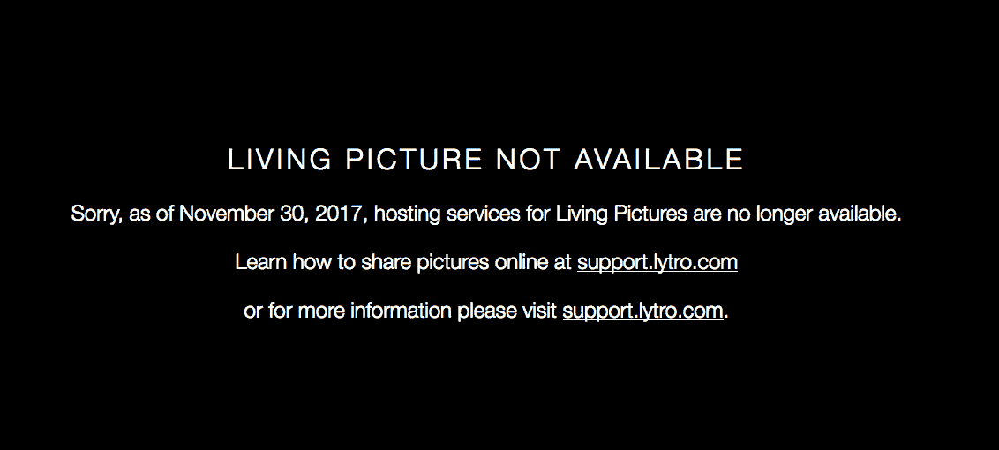

# Lytro 的“活图片”不再存在 

> 原文：<https://web.archive.org/web/https://techcrunch.com/2017/12/06/lytros-living-pictures-cease-to-live/>

# Lytro 的“生活图片”停止生活

作为其从消费设备转向专业影院硬件的一部分，Lytro 已经关闭了曾经托管其“生活图片”的网站，这些照片是用其相机拍摄的，可以在事后重新聚焦。这将把过去几年中嵌入网络的一些图片变成空框。如果你现在想看光场图像，你需要在桌面应用中看到它们。

2012 年，当我[回顾最初的 Lytro 相机时，我写下了](https://web.archive.org/web/20221025222456/https://beta.techcrunch.com/2012/03/12/review-lytro-lightfield-camera/):

“Lytro 软件仅限于浏览你的照片，并将其分组为‘故事’，你可以直接上传到(也只能上传到)Lytro，这将为它们提供……永恒的服务，你希望。没有太多的选择。”

正如我当时一半预期的那样，永恒被证明是短暂的——直到公司不方便主办它。当然，现在这项服务不太可能有很多活跃用户；Lytro 两年前离开了消费相机市场，当时对其技术惊人但最终是噱头的相机的需求很少。

无生命的画面

人们永远不应该相信在如何访问和提供自己的数据方面灵活性如此之低的服务，但 Lytro 的技术是独一无二的，因为它本质上需要一个特殊的插件才能正确查看。你可以将这些插件嵌入到你想要分享“生活图片”的任何地方，这是一个相当笨拙的解决方案，导致了整个 Lytro 提案中普遍存在的可用性问题。

除非该公司发布一些方法来自主持他们，否则生活图片格式将永远存在，但这似乎不太可能。任何剩余的用户都必须在桌面应用程序中导出到普通的静止图像或电影文件。

我很高兴看到 Lytro 的发展和[将其非常酷的技术应用到一个新的市场](https://web.archive.org/web/20221025222456/https://beta.techcrunch.com/2017/04/25/lytros-light-field-vision-finally-shows-its-worth/)，但它走过的坎坷道路充满了对年轻硬件初创公司的教训。