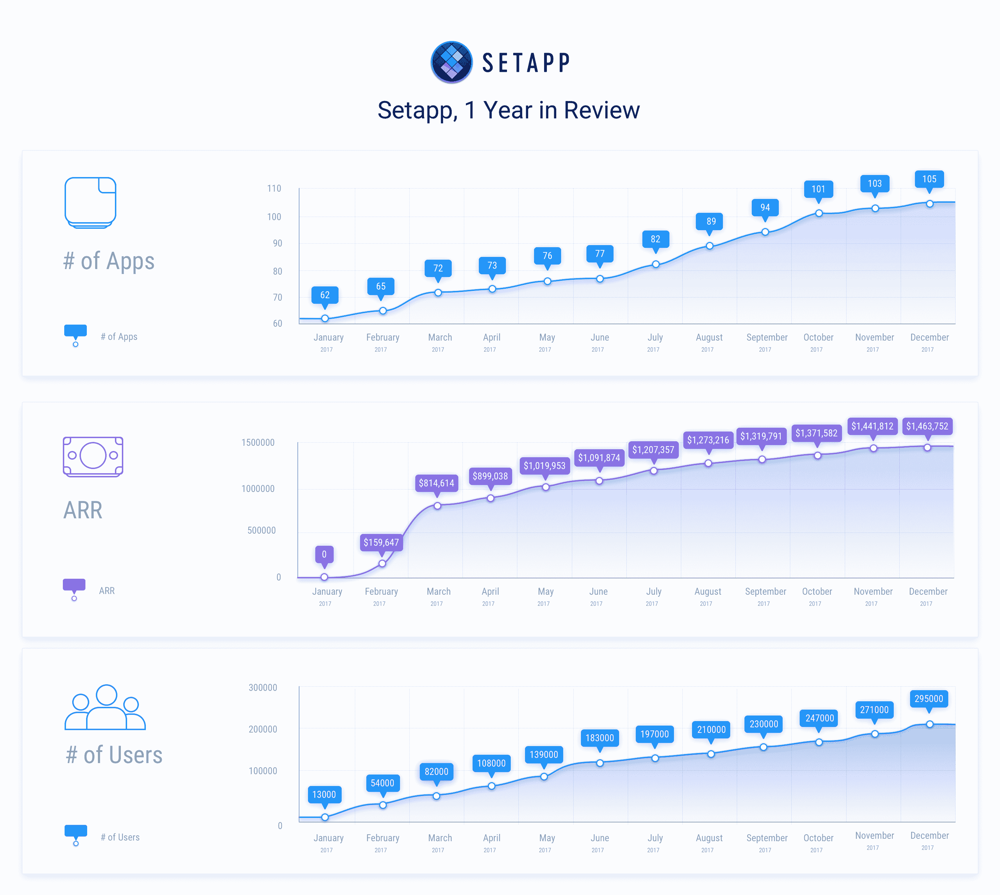

# Mac 应用订阅服务 Setapp 推出后一年就有 15000 名用户

> 原文：<https://web.archive.org/web/https://techcrunch.com/2018/01/24/mac-app-subscription-service-setapp-has-15000-subscribers-a-year-after-its-launch/>

来认识一下苹果应用的 Spotify。每月 9.99 美元，你就可以下载并使用一百多个 Mac 应用，而不用再花一分钱。所有那些应用通常都是付费应用，但 Setapp 想改变这种模式。

Setapp 由总部位于乌克兰的独立 Mac 开发公司 [MacPaw](https://web.archive.org/web/20230225043012/https://macpaw.com/) 创立。虽然他们已经开发自己的应用近十年了，但他们也一直致力于一个名为 [DevMate](https://web.archive.org/web/20230225043012/https://devmate.com/) 的开发和发布框架。

DevMate 是管理许可证密钥、更新、崩溃报告和分析的好方法。这就是为什么 Paddle [收购](https://web.archive.org/web/20230225043012/https://techcrunch.com/2017/12/14/paddle-raises-12-5m/) DevMate 来构建一个从电子商务和支付到分析的一体化 Mac SDK。

离开 DevMate 之后，MacPaw 想在发行版方面尝试一些新的东西。“通过 Setapp，我们希望帮助开发者尝试和使用订阅模式，”MacPaw 创始人兼首席执行官 Oleksandr Kosovan 告诉我。“它解决了支付 20 种不同订阅的痛苦。”

的确，许多应用程序正在转向订阅模式，因为它带来了稳定、可预测的收入。不仅仅是 Adobe 和微软，就连独立开发者也在尝试订阅模式。写 app 尤利西斯[就是一个很好的例子](https://web.archive.org/web/20230225043012/https://techcrunch.com/2017/08/11/popular-writing-app-ulysses-switches-to-subscription-model/)。

虽然订阅适用于您每天在工作中使用的应用程序，但不一定适用于您每隔一周需要的实用程序或较小的应用程序。

Setapp 订阅里现在有 [105 个应用](https://web.archive.org/web/20230225043012/https://setapp.com/apps)，比如 Ulysses，CleanMyMac，iStat 菜单和屏幕。MacPaw 不接受任何抄袭或欺骗性的应用程序，这就是为什么它变成了一种没有任何付费下载的迷你 Mac 应用程序商店。如果你正在寻找一个应用程序来做一些非常具体的事情，那么 Setapp 数据库中可能就有这样一个应用程序。而且你不用为任何重大升级买单。

[gallery ids="1590663，1590662"]

“这种模式与 Spotify 有点不同。应用程序不是消费品，”Kosovan 说。“我们将每位用户的费用在他们每月积极使用的应用程序之间进行分摊。一些应用程序是日常使用的，其他应用程序即使你每月只花 10 分钟使用它们，也能提供巨大的价值。”

只要你每个月至少打开一个应用程序，开发者就会得到补偿。当然，开发者仍然可以在 Mac 应用商店或他们自己的网站上销售他们的应用。开发者需要集成 Setapp 的库来管理激活、更新和数据分析。

在接下来的几个月里，Setapp 计划推出家庭账户，这样多人就可以通过一个订阅来访问 Setapp。该公司还想推出面向企业的 Setapp。

最终，Setapp 希望提供大约 300 款应用。MacPaw 注意到，一个典型的用户每月使用的应用程序不到 10 个。尽管现在包括了更多的应用程序，这个数字并没有太大的变化。

仅仅一年后，这些数字令人印象深刻。超过 20 万人试用了 Setapp，1.5 万人正在付费。它代表着大约 150 万美元的年度经常性收入(尽管这一收入的很大一部分回到了应用程序开发人员手中)。对于许多独立的 Mac 开发者来说，Setapp 代表了一股新鲜空气。他们可以每月从 Setapp 用户那里获得一些钱，而不是依靠主要发布的收入激增。

