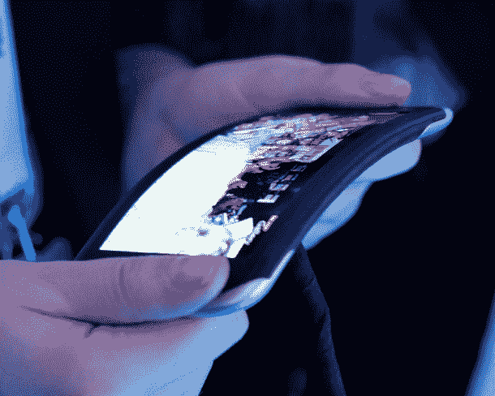
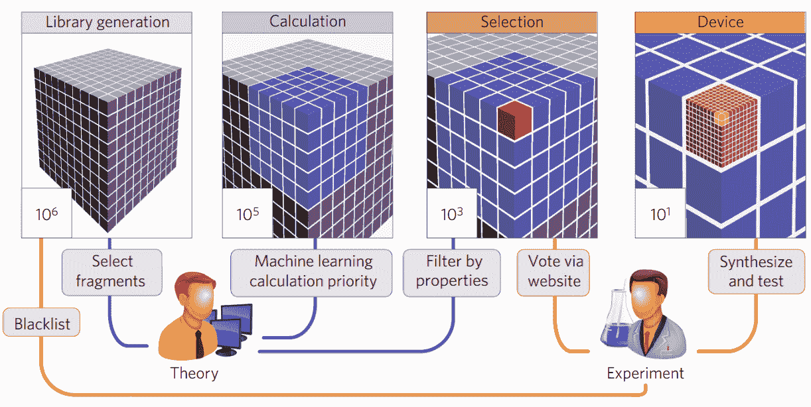

# 机器学习和“分子火种”可能会改变有机发光二极管屏幕的游戏

> 原文：<https://web.archive.org/web/https://techcrunch.com/2016/08/08/machine-learning-and-molecular-tinder-may-change-the-game-for-oled-screens/>

说外面有很多分子是一种保守的说法。因此，寻找一两个特别的就像是在一个横跨银河系的大海捞针。幸运的是，正如哈佛大学和麻省理工学院的研究人员发现的那样，机器学习科学和人类在事物上左右滑动的不可抑制的需求使搜索变得容易得多。

他们正在寻找的分子是蓝色有机磷光体，这是有机发光二极管的关键成分，可能是显示技术的下一个重大进展。

有机发光二极管依赖于分子，当引入电流时，这些分子产生特定波长的光，从而消除了对普通 LED 显示器中背光的需要。这意味着屏幕可以更薄，更灵活，更省电，等等。

来自诺基亚的柔性有机发光二极管屏幕。

已经发现了合适的磷光分子来产生红光和绿光，但是制造蓝光多年来一直是个难题。现有的有机发光二极管屏幕使用昂贵的元素，它们的寿命并不那么长——这是广泛采用该技术的主要挑战之一。

研究人员确信他们想要的分子就在那里——许多人已经找到了以这种或那种方式合适的分子(最上面的是密歇根大学最近的一个例子),但是还没有人找到一个做任何事情都正确的分子。

“分子就像运动员，”该项目首席研究员、[哈佛大学的阿兰·阿斯普鲁-古兹克在该大学](https://web.archive.org/web/20230315144353/http://www.seas.harvard.edu/news/2016/08/towards-better-screen)发布的新闻稿中说。“找到一个跑步者很容易，找到一个游泳者很容易，找到一个骑自行车的人很容易，但很难同时找到这三个人。我们的分子必须是铁人三项运动员。它们必须是蓝色的、稳定的、明亮的。”

首先，该团队建立了一个大约 160 万有机分子的库，可以想象这些分子符合这个要求。同样来自哈佛大学的瑞恩·亚当斯设计的机器学习算法搜索了这个庞大的数据库，以减少羊群。

“由于我们化学设计过程的早期阶段是从数百万个可能的候选物开始的，因此人类没有办法对所有候选物进行评估和优先排序，”该论文的合著者 David Duvenaud 说。“因此，我们使用神经网络，根据所有已经评估过的分子，快速确定候选分子的优先顺序。这是化学和机器学习之间的自然合作。”

然后以每个分子大约 12 小时的速度模拟这些精英分子，以发现每个分子可能有多亮和多蓝。然后是抛弃人工智能，引入人类的时候了。

将选择数量从数百万减少到数百的“发现管道”。

2500 个候选分子的数据被总结成卡片，团队和合作者(来自麻省理工学院和三星高级技术研究所)投票选出他们认为最有前途的分子。他们将这一过程戏称为“分子火种”

结果是一组潜在的数百个分子，是从数百万个分子的海洋中精选出来的精华——甚至没有人需要画出他们的微量移液器或旋转离心机。不管怎样，接下来就是这个部分了。

Aspuru-Guzik 说:“这项研究是迈向越来越多高级有机分子的中间站，这些分子可用于液流电池、太阳能电池、有机激光器等。”“加速分子设计的未来真的非常非常令人兴奋。”

这些分子不太可能在传闻中的 iPhone 有机发光二极管转换之前准备好投入生产，但它们很可能有助于未来几年该行业向那个方向的几乎不可避免的迁移。

描述这项研究的论文发表在今天的《自然材料》杂志上。