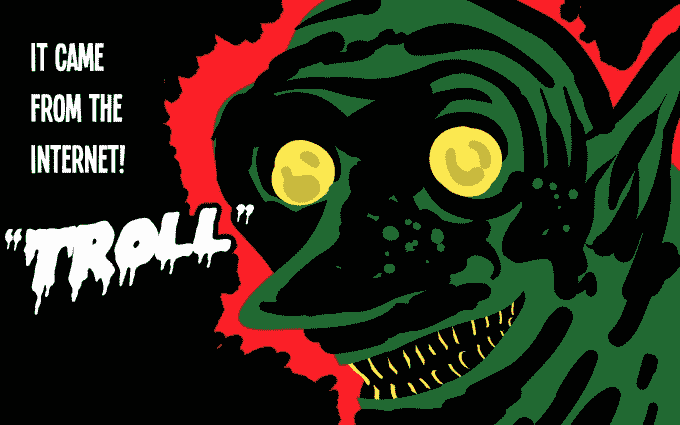
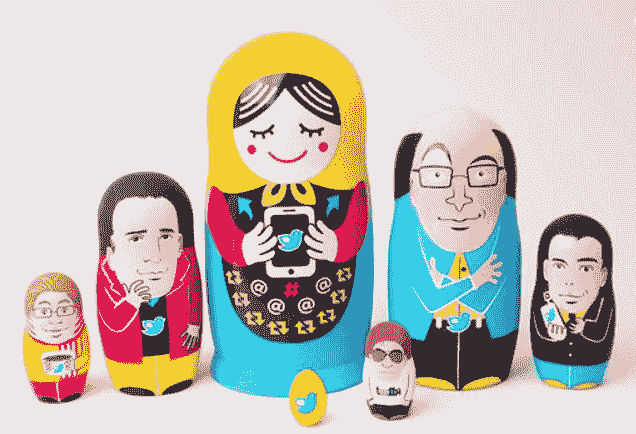
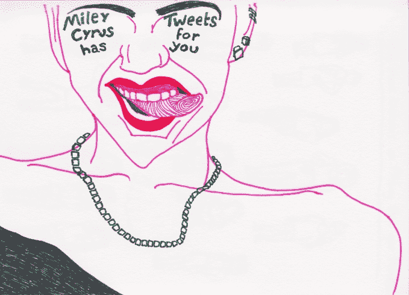

# 更新:机器学习可以修复 Twitter，脸书，甚至美国 

> 原文：<https://web.archive.org/web/https://techcrunch.com/2016/11/26/machine-learning-can-fix-twitter-facebook-and-maybe-even-america/>

克里斯·尼克尔森撰稿人

More posts by this contributor

**更新:**这篇文章的作者是克里斯·尼科尔森。

退出 Twitter 很容易——我已经这样做过上百次了。有人称之为“驶入金矿的小丑车”，像所有小丑车一样，Twitter 让乘客偶尔下车。

如果我回去，那是因为我上瘾了。紧张的新闻周期，推特风暴，八卦贩子，洞察力，争论，仿真陈述，讽刺和俏皮话。对于一个信息迷来说，这个小泡泡很难抗拒。

但是推特——就此而言，还有脸书——在疏远用户、传播仇恨和危及我们作为一个物种的方式上绝望地崩溃了。选举揭示了他们比其他任何事情都要糟糕。

首先说一下什么是破。一组问题是不同用户之间的冲突，以及随之而来的冒犯、愤怒和悔恨。另一个更大的问题来自社交媒体上传播的谎言、仇恨和谎言及其选举后果。

这两组问题是相互关联的。我们得到了太多的套话，却没有足够的事实:我们需要筛掉一个，让另一个进来。合适的过滤器可以解决这两个问题。

去年离开 Twitter 的人，至少是暂时离开的，包括重拍《捉鬼敢死队》的[莱斯莉·琼斯](https://web.archive.org/web/20221205163720/http://abcnews.go.com/Entertainment/ghostbusters-star-leslie-jones-quits-twitter-online-harassment/story?id=40698459)，英国喜剧演员[史蒂芬·弗莱](https://web.archive.org/web/20221205163720/http://www.stephenfry.com/2016/02/peedinthepool/)，以及 A16Z 的[马克·安德森](https://web.archive.org/web/20221205163720/https://beta.techcrunch.com/2016/09/25/marc-andreessen-suddenly-deletes-all-his-tweets-goes-on-twitter-break/)。其他最近离开的名人包括泽尔妲·威廉姆斯，她在父亲罗宾自杀后遭到袭击。

没错:她父亲自杀后，她在推特上受到攻击。他们给她寄了他的假照片。这是第一个问题的例子。

**进攻和开放社区**

很多人，尤其是旧金山的人，认为开放的社区很棒，社交媒体应该是联系人们的工具。

但不是每个人都应该有联系。[安伯托·艾柯说](https://web.archive.org/web/20221205163720/http://www.ilmessaggero.it/societa/persone/umberto_eco_attacca_social_network_imbecilli-1085803.html)电视给了我们村里的白痴，让我们觉得自己高人一等，而互联网给了我们村里的白痴，作为事实的来源。没人想和村里的白痴争论，更别说数百万个了。

在 Twitter 上，你必须一次屏蔽一个。工作量很大，到那时就太晚了。他们的愚蠢已经感染了你的生活。他们的工作在规则实施之前就完成了。

完全开放的社区总是会变味。你需要过滤器。每个功能社区都有。这就是机器学习的用武之地。

自然语言处理检测巨魔、种族主义和侮辱并不困难，推特作为一种数据类型已经被分析得死去活来。我们可以建造有效的过滤器。(如果你想知道如何，你应该阅读关于[神经网络和深度学习](https://web.archive.org/web/20221205163720/https://deeplearning4j.org/neuralnet-overview)。)深度学习正在为许多难题创造新的准确度记录，包括图像和语音识别。它将通过使用像 [Word2vec](https://web.archive.org/web/20221205163720/https://deeplearning4j.org/word2vec) 和 Doc2vec 这样的算法来实现类似的文本分类。

如果你能探测到巨魔，你可以通过屏蔽或在巨魔的帖子上放置警告来保护他们正在骚扰的人。Twitter 甚至可以找出谁喜欢时不时的一些暴力威胁，并个性化屏蔽。

就我个人而言，我在 Twitter 上学习新事物，听到新声音。但是来自自由派学者的一些有趣的研究表明，某些种类的多样性会伤害公民生活并侵蚀信任。至少，这是在线社区应该注意的事情，如果他们想让人们回来的话。

Twitter 有一种彻底的开放性，有时很酷，有时不酷。让你难以忘怀的是那些不酷的时光。你不能不看你父亲的停尸房照片，就像那些在塞尔达推特上发布的照片。

Twitter 可以做些什么，他们也应该做些什么。他们已经有办法筛选出色情内容。为什么他们不用种族诽谤、死亡威胁和其他方式来做同样的事情呢？给他们拉上窗帘就行了。一段时间后，人们会发现他们并不真的想看到别人说了什么，如果 Twitter 掩盖了这一点。他们的日子会更好。他们会继续使用 Twitter。

**在事后泡沫中向唱诗班发推特**

"在真理有机会穿上裤子之前，谎言已经走过了半个世界。"温斯顿·丘吉尔说过。有了社交媒体，一个谎言可能会在世界上流传几次…

脸书和 Twitter 等平台的算法可能无法保护我们免受仇恨，但它们确实鼓励了情感丰富的内容在志同道合者中传播，特别是当这些内容引发愤怒时。一个帖子获得的分享越多，就会有越多的帖子被推广给相似的人，因为脸书等人优化了参与度。

不幸的是，很多内容都是假的，它的流行会带来一些后果。

美国政治的主要问题之一是[多年来偏离事实和科学](https://web.archive.org/web/20221205163720/http://pressthink.org/2016/11/miss-bigger-missed-story-final-reflections-trump-press-2016/)。它取代了乔治·w·布什时代形成的基于现实的社区(T5)和由核武器支持的一厢情愿的平台(T6)。

由于许多不同的原因，这是有问题的，特别是它破坏了我们理解因果关系、贸易、战争和冷漠自然的能力。这对我们的人际关系尤其有害。因为事实可以把完全不同的人团结在一起，而信仰则是无穷无尽的分歧。没有他们；一路向下冒泡。

我们生活在一个自我强化信念的时代，群体思维的强化发生在与媒体，尤其是社交媒体的反馈循环中。

我们需要阻止仇恨和谎言的传播，帮助事实的传播，因为语言很重要。

我说的谎言是什么意思？我指的是[这个假新闻](https://web.archive.org/web/20221205163720/http://www.denverpost.com/2016/11/05/there-is-no-such-thing-as-the-denver-guardian/)。奇怪的是[马其顿青少年](https://web.archive.org/web/20221205163720/https://www.buzzfeed.com/craigsilverman/how-macedonia-became-a-global-hub-for-pro-trump-misinfo)在选举周期中散布关于川普的虚假信息。不仅我们的社交媒体渠道充斥着垃圾，美国人也被外国人玩弄于股掌之间。这应该是非法的，但即使不违反法律，这也是科技公司可以控制的事情，如果他们想的话…

他们可以控制它，因为我们现在有能力检测文本中的隐藏模式，比如说，识别一本书的真正作者。(笔名为[的作者埃琳娜·费兰特](https://web.archive.org/web/20221205163720/http://www.nybooks.com/daily/2016/10/02/elena-ferrante-an-answer/)在一名调查记者今年对她进行批评之前，通过对其作品的统计文本分析而被揭穿。)就像谷歌可以建立一个高度准确的垃圾邮件过滤器，让你不要在尼日利亚王子的请求上浪费时间一样，深度学习可以通过许多措施对文本进行分类，包括其真实、虚假或真实的程度。

算法可以做到这一点，因为我们知道如何“矢量化”文本。也就是说，我们可以将任何文本转换成一列数字，这些被称为神经嵌入。这是一个简单但不太可能的翻译，用数字来表示语言。

这样做使得自然语言变得计算机可读。然后，我们可以对文本执行强大的数学运算，以检测模式和相似性，进行预测并对其应用类别。这些类别可能是:“可能错误”或“可能正确”一旦我们知道了文本真实性的可能性，我们就可以决定它应该传播多远。

在像 Snopes、T2、政治、T4、媒体事务这样的组织中，我们已经有事实审查员对新闻报道做出判断。这些可以转化为带标签的数据集，以训练算法对他们从未见过的文本进行分类。如果这还不够中立，脸书可以建立自己的事实核查小组。

真正的问题是，科技公司想控制它吗？

马克·扎克伯格仍在思考这个问题。脸书和推特自以为在阿拉伯之春中发挥了作用，但扎克伯格本周末表示，脸书的假新闻影响了这场紧张的选举，这是一个“[相当疯狂的想法。你不能两者兼得。](https://web.archive.org/web/20221205163720/http://www.nytimes.com/2016/11/14/technology/facebook-is-said-to-question-its-influence-in-election.html)

强大的科技公司高层自鸣得意、不道德的回应不是我们所需要的。他们对公众、对物种、对自己都有责任宣传事实，消除仇恨和谎言，即使这一责任并未被法律明文规定。不仅仅是因为马克·扎克伯格是犹太人，唐纳德·川普借助反犹太主义和白人民族主义的[浪潮](https://web.archive.org/web/20221205163720/http://www.haaretz.com/world-news/u-s-election-2016/1.752064)掌权。当他们开始分发黄色星星时，你如何识别并不重要。

虽然[媒体支持](https://web.archive.org/web/20221205163720/http://www.motherjones.com/politics/2016/09/clinton-trump-newspaper-endorsements)意味着在这个选举周期中毫无建树，但媒体和社交媒体一周又一周地宣传虚假故事以增加眼球和注意力的方式产生了巨大的影响。这次总统选举在几个关键州领先了几个百分点。或者准确的说，威斯康星州、密歇根州和宾夕法尼亚州的[107330 票](https://web.archive.org/web/20221205163720/http://www.weeklystandard.com/the-election-came-down-to-107330-votes-in-pennsylvania-wisconsin-and-michigan/article/2005323)把美国拱手让给了特朗普。这相当于科罗拉多州博尔德市的人口；佛罗里达州西棕榈滩；或者加州的戴利市。

你认为科米不合时宜的声明、俄罗斯黑客入侵的几个月、威斯康辛州压制投票的身份法可能会影响一个城镇的选票吗？如果是这样，为什么数千万美国选民使用的强大社交媒体平台的算法不会呢？

广播媒体花了更多的播出时间报道希拉里电子邮件的非丑闻内容，因为它报道了这些问题或她的政策，社交媒体放大了而不是纠正了这种扭曲。

一些伟大的记者今年写了一些伟大的故事。他们报道了特朗普的[黑手党关系](https://web.archive.org/web/20221205163720/https://www.washingtonpost.com/politics/former-mafia-linked-figure-describes-association-with-trump/2016/05/17/cec6c2c6-16d3-11e6-aa55-670cabef46e0_story.html?tid=a_inl)，他几乎[不存在的慈善事业](https://web.archive.org/web/20221205163720/https://www.washingtonpost.com/people/david-a-fahrenthold/)，以及他[与](https://web.archive.org/web/20221205163720/https://www.washingtonpost.com/politics/in-business-as-in-politics-trump-adviser-no-stranger-to-controversial-figures/2016/04/26/970db232-08c7-11e6-b283-e79d81c63c1b_story.html?tid=a_inl)[俄罗斯](https://web.archive.org/web/20221205163720/https://www.washingtonpost.com/politics/inside-trumps-financial-ties-to-russia-and-his-unusual-flattery-of-vladimir-putin/2016/06/17/dbdcaac8-31a6-11e6-8ff7-7b6c1998b7a0_story.html)的广泛联系。

但是那些故事没有腿。他们从未接触到最需要听到他们的更多的听众，因为我们已经变得两极化了。我们去寻找与我们一致的意见。我们每个人都需要打开一些窗户，让我们看到不愉快的事实和不方便的真相，不管我们希望什么，这些事实和真相都会扇我们的耳光。

为社交媒体提供动力的技术平台可以以许多安静的方式帮助我们与现实和解，或者他们可以加入冷漠和贪赃枉法的注意力商人，他们为了一份收益报告而将一个 T2 骗子、一个偏执者和一个 T4 性侵犯者带入白宫。

在那之前，我们在推特和脸书上读到的东西不会增加我们对世界的理解。那只会是我们自己的呼吸。在这一点上，我想我需要一个井字游戏。