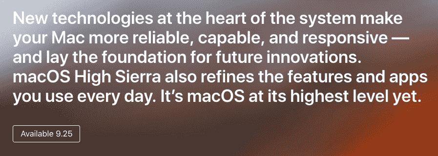

# 苹果将于 9 月 25 日发布 MAC OS High Sierra 

> 原文：<https://web.archive.org/web/https://techcrunch.com/2017/09/12/macos-high-sierra-release-date/>

# 苹果将于 9 月 25 日发布 macOS High Sierra

苹果一直在努力开发四种不同的操作系统——iOS、tvOS、watchOS 和 macOS。该公司刚刚在 iPhone 发布会后更新了网站。现在它说 macOS High Sierra 将于 9 月 25 日发行。

macOS 这次没有得到任何支持，因为该公司甚至一次都没有提到 High Sierra。也许时间不够。或者也许除了新的发布日期之外没有什么新的东西可以分享。

苹果在 6 月份的 WWDC 开发者大会上首次推出了 High Sierra。TechCrunch 的 Brian Heater [已经试用了新的操作系统](https://web.archive.org/web/20230315095319/https://techcrunch.com/2017/06/29/macos-high-sierras-best-features-are-the-ones-you-dont-see/)，并意识到大部分变化都在幕后。

照片应用程序仍在接收一些新功能，以保持与 iOS 版本的同步。有更多的编辑工具，你可以重新组织工具栏，你可以按类型过滤你的照片。

如果你是 Safari 用户，我最喜欢的变化是设置中有一个新功能，可以让你自动阻止在网络上自动播放视频。许多网站已经滥用自动播放视频，是时候停止了。

然后，如果你使用固态硬盘，有一个新的文件系统应该会让你的 Mac 更快。Mail 正在压缩消息，Metal 2 应该更好地利用你的 GPU，Spotlight 知道你的飞行状态等等。

像往常一样，macOS 高塞拉是一个免费更新。它将在苹果应用商店出售。我鼓励任何人升级只是为了获得最新的安全更新。不是印象最深刻的 macOS 更新，但还是值得更新的。

