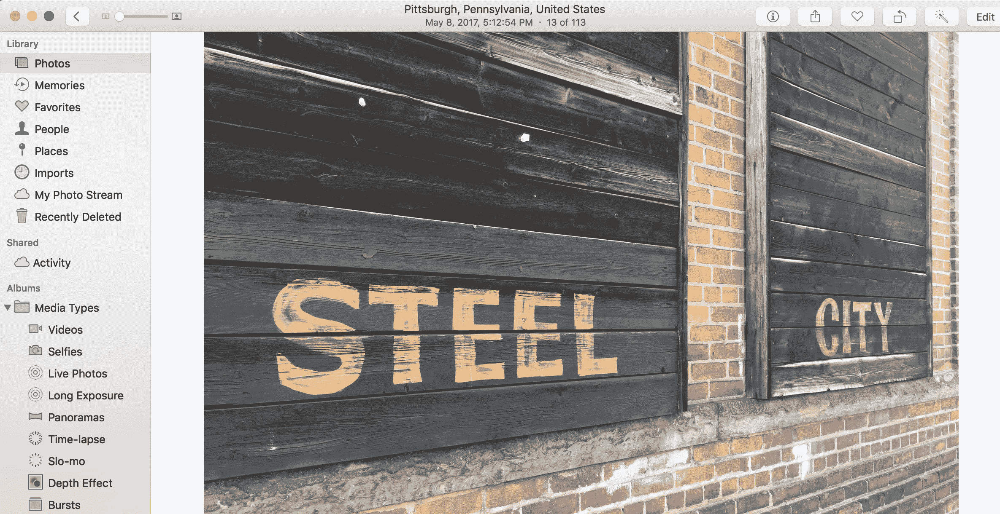
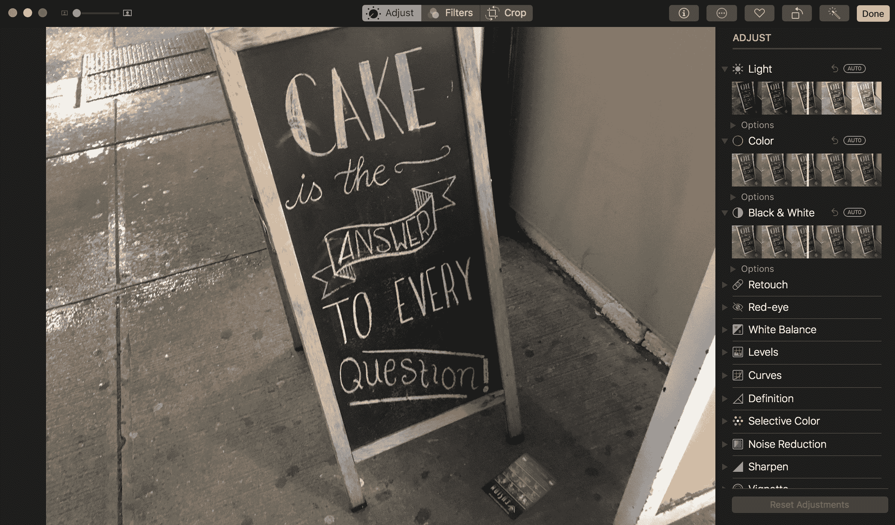
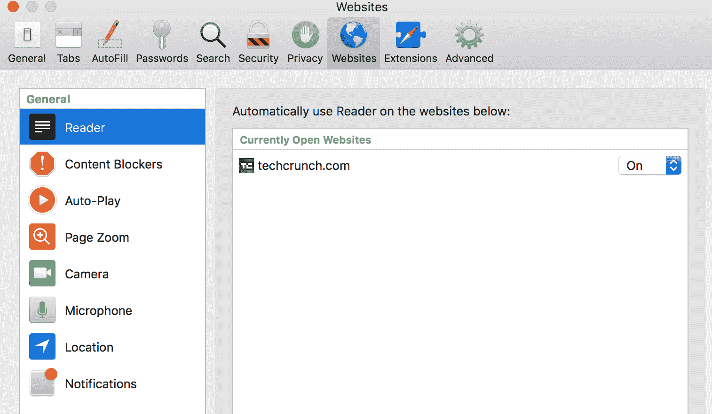
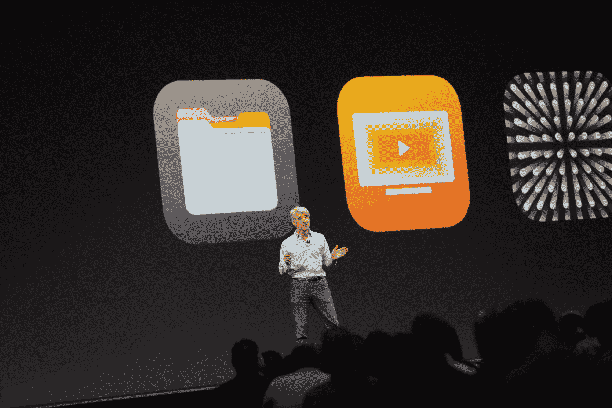
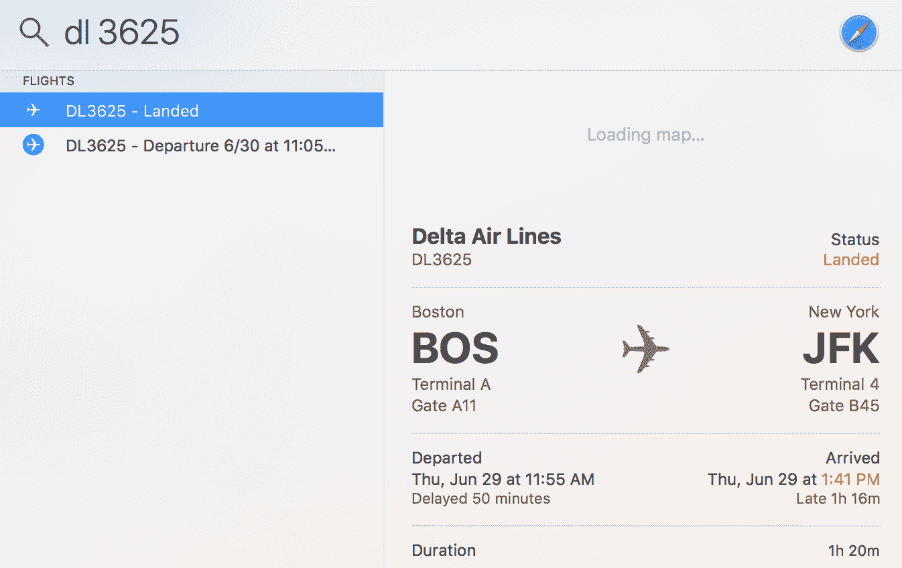

# macOS High Sierra 最好的功能是你看不到的 

> 原文：<https://web.archive.org/web/https://techcrunch.com/2017/06/29/macos-high-sierras-best-features-are-the-ones-you-dont-see/>

如果不是免费的，那么对于临时用户来说，High Sierra 可能很难被接受。最有意义的更新大多隐藏在表面之下——这是自 2009 年的[雪豹](https://web.archive.org/web/20221210023533/https://beta.techcrunch.com/2009/09/04/snow-leopard-marble-and-calamine-lotion/)以来第一次完整的 macOS 升级。今天，该操作系统的第一个公开测试版发布了，当我在一台[新的 13 英寸 macbook](https://web.archive.org/web/20221210023533/https://beta.techcrunch.com/2017/06/07/that-new-keyboard-is-the-key-to-apples-macbook-update/)上玩这个软件的时候，我发现自己一直在参考[苹果的产品页面](https://web.archive.org/web/20221210023533/https://www.apple.com/macos/high-sierra-preview/)来提醒我有什么新东西。

但苹果似乎对采用没有任何疑虑。High Sierra 的可见升级相对较少，但正如该公司可能会指出的那样，这并没有阻止人们购买雪豹——那是在你仍然必须为升级付费的时候。

新的操作系统没有太多闪亮的新功能，但它带来了旨在提高设备速度的增强功能。更重要的是，它们有助于面向未来的苹果技术，从 Mac 早期以来的第一个新文件系统，到旨在引入虚拟现实内容创作的图形和处理增强。

就像该公司最近的许多硬件升级一样，很难对新操作系统进行全面预览，而不仅仅是一系列基准测试——并且性能升级很难满足大多数用例的要求。但这里有一些明显的变化值得注意，比如 Safari 中的新搜索和照片应用程序的全面更新。同样值得讨论的是，苹果试图通过调整 Mac 的底层技术来实现什么。

为了方便起见，让我们从您将实际看到的一些特性开始。

## 照片

照片在高塞拉得到最有意义的视觉大修。这些变化主要是组织性的，对于有大量图片需要梳理的用户来说，这是个好消息。工具栏已经过改进，现在在使用应用程序时是持久的，用户可以通过重新排序部分来定制它。媒体是按内容类型组织的，包括突发事件、现场照片、全景照片、自拍和新支持的动画 gif，满足你所有与 meme 相关的需求。

苹果还带来了一系列新的编辑工具。我有一个 Photoshop 账户，所以我从来没有考虑过用照片来编辑，但是这个工具集对于一个免费的产品来说是非常强大的。除了一系列新的滤镜，照片现在还具有曲线等功能，这是一种颜色调整工具，比标准的颜色滑块提供了更微妙的改进。对于一个免费的照片应用程序来说，选择性的颜色也是相当复杂的。你可以用滴管工具选择一种颜色，然后通过色调、饱和度、亮度、范围等进行微调。

当然，对于那些一直在使用付费照片编辑应用程序的人来说，这些都不是新的，但对于业余摄影师或只想加强 iPhone 摄影游戏的人来说，这些新功能是很好的增强。对于那些使用 Photoshop 和 Pixelmator 等应用程序的人来说，你现在可以通过照片直接访问这些程序来获取给定的图像，这将省去直接导入图像的许多来回操作。

High Sierra 还为 iPhone 的实时照片功能带来了编辑工具，因此您可以在工具栏的小时间轴上过滤、裁剪和调整动画图像的颜色。

## 旅行队

苹果肯定会用 Safari 最好的新功能之一智能跟踪预防来激怒广告公司，智能跟踪预防依靠机器学习来消除跨站点跟踪。它旨在消除广告 cookies 之类的东西，因此你购买的东西不会跟随你到你访问的每个网站，但会为你实际访问的页面保存有用的上下文信息。默认情况下，该功能是打开的，但如果你是一个 cookie 怪物，可以在设置中禁用它。

与照片一样，Safari 也带来了比以前版本更多的内容细化。“设置”现在有一个“网站”面板，可让您自定与单个网站互动的方式。在那里，你可以让站点总是以阅读器模式出现(一种强调文本的框架布局)，应用内容拦截器，关闭自动播放和取消通知，位置跟踪以及麦克风和摄像头访问。单独添加它们有点麻烦，但是这种程度的定制对于有恼人的跟踪倾向的站点来说是很棒的。

## 那个奇特的新文件系统

High Sierra 这个名字不仅仅是 Craig Federighi 在 WWDC 舞台上开一些关于吸烟的爸爸玩笑的借口(“他们向我们保证这个名字是完全烤好的”)。这是指苹果试图建立和完善最新版本的操作系统。这个难题中最大的一块是 APFS(苹果文件系统的缩写)，一个苹果自上次 WWDC 以来一直在谈论的系统。

它取代了(名字更无聊的)HFS+，后者自 90 年代末以来一直是 Mac 的主要文件系统，反过来，它基于 HFS，一个可以追溯到 1985 年的系统——马蒂·小飞侠第一次回到未来的那一年。换句话说，这或多或少是一个有 30 年历史的系统，早就应该改变了。APFS 代表了一个全新设计的系统，专为 2017 年的技术而打造。

那么，新的文件系统对用户来说到底意味着什么呢？对于初学者来说，这可能是一个较长的装置，所以也许带着狗去散步，或者去你一直想去的新咖啡馆喝杯咖啡。这是因为高 Sierra 安装有效地将引导驱动器转换为新的文件系统。实际安装时间取决于许多因素，包括硬件速度和存储容量。

苹果似乎有信心这一举措将保持用户文件的完整性——毕竟，数百万 iOS 设备已经在今年早些时候升级到 10.3 版本。但是仍然建议用户在安装之前做一个完整的系统备份——这可能是一个好主意，无论你什么时候准备安装一个新的操作系统。

AFPS 比它的前辈更安全，内置 FileVault 加密。你真正能看到即时变化的地方是在复制文件的时候。事实上，这是 Federighi 在台上展示的少数几个功能之一，当时该公司以创纪录的速度浏览公告，一次复制并粘贴一组大型视频文件，而不必坐在通常的进度条前。

## 同样值得注意的是

*   Siri: Siri 的新声音即将推出，恰逢 HomePod 的到来，苹果将推出 Echo 和 Google Home 等家庭助手。
*   **Metal 2:** 正如在主题演讲中提到的，苹果的图形 API 得到了一系列增强[。对于我们这些非开发人员来说，最值得注意的是对 VR 和外部 GPU 的支持。这意味着第一代 Mac 虚拟现实游戏很可能就在眼前。](https://web.archive.org/web/20221210023533/https://beta.techcrunch.com/2017/06/05/apple-introduces-metal-for-vr-in-macos-high-sierra/)
*   **邮件:**苹果的电子邮件应用程序已经改进了搜索功能，可以显示定制的“热门”建议，这些建议使用一系列因素来区分邮件的优先级:包括阅读频率、VIP/收藏夹状态以及发件人给你发邮件的频率。该公司还以不同的方式压缩邮件，承诺它们将比以前减少 35%的空间。
*   **聚焦:** Finder 的内置搜索现在具备航班追踪功能。输入航班号，就会出现一堆相关信息，比如状态、时间、延误和登机口。Safari 也增加了这项功能。
*   **FaceTime:** 如果你正在进行 Facetiming，而另一端的人正在做一些特别值得注意的事情，你可以拍下这一瞬间的实时照片风格的动态截图。当这种情况发生时，每一方都会收到通知，即 Snapchat。
*   **信息:**关于信息的对话现在会自动存储在 iCloud 中，以改善苹果设备之间的同步，并在此过程中释放一些本地存储空间。

在一个新的文件系统和增强的开发者工具之间，High Sierra 是一个面向未来的操作系统的尝试。可见的特性相对来说很少，而且大多是关于改进现有产品的。对于大多数用户来说，这不会是最令人兴奋的升级，但最终将是重要的一次。新的操作系统现在是公开测试版，最终版本将于秋季发布。