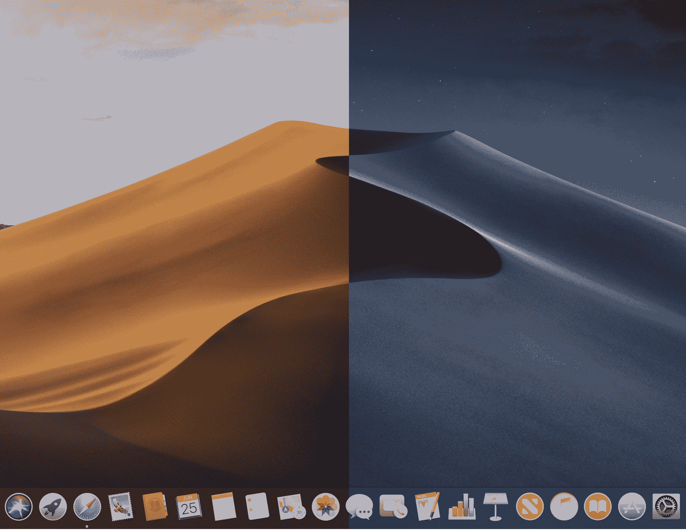
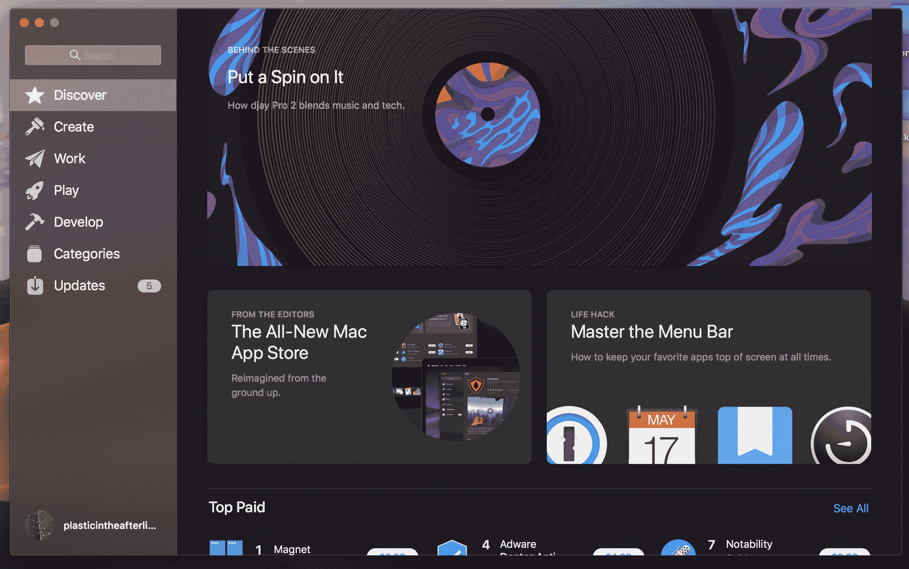
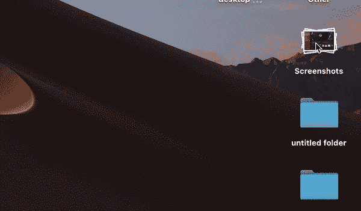
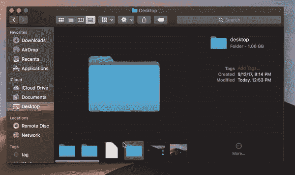
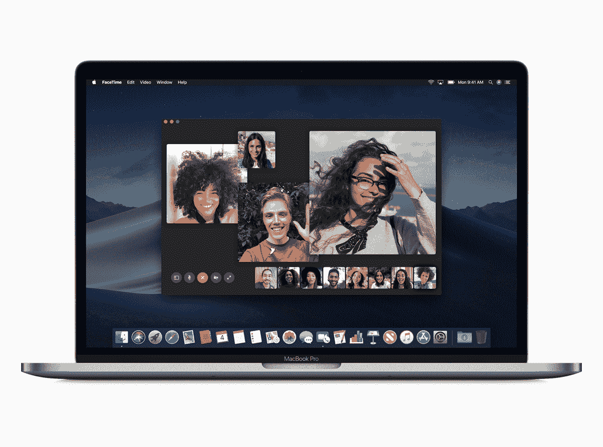
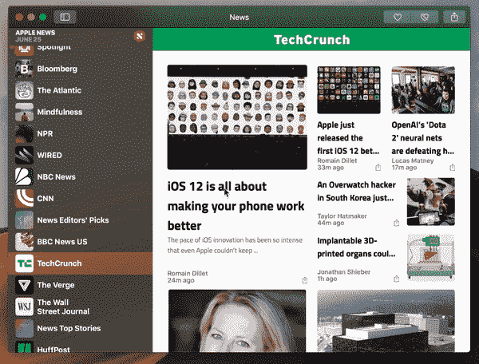
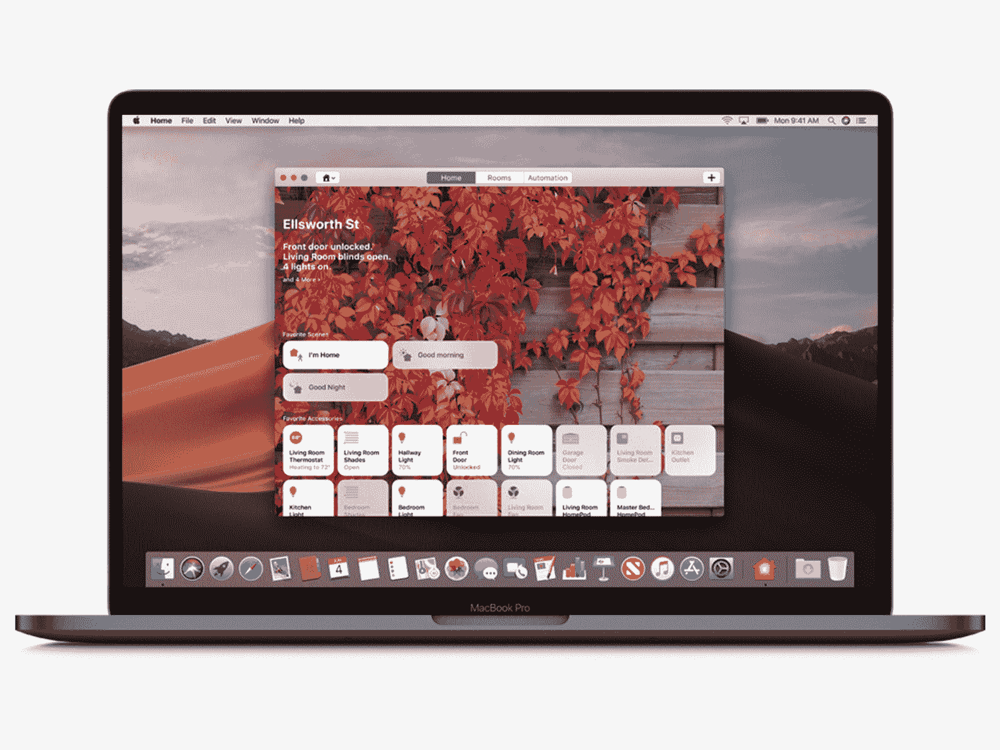
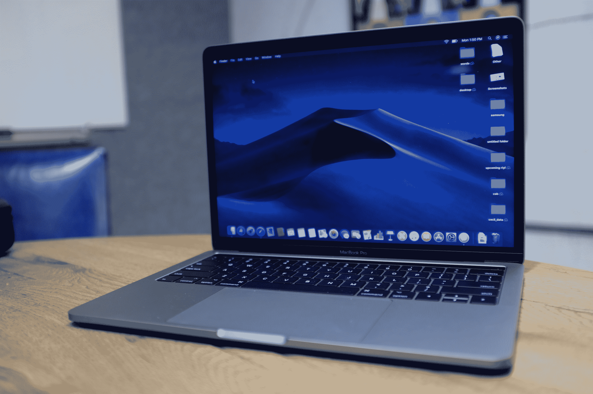

# macOS Mojave 10.14 抢先看

> 原文：<https://web.archive.org/web/https://techcrunch.com/2018/06/26/macos-mojave-10-14-first-look/>

似乎 iOS 最近得到了所有的爱。原因显而易见。智能手机长期以来一直是许多用户生活中的主导设备，而台式机/笔记本电脑类别[一直在走下坡路](https://web.archive.org/web/20230322192145/https://www.gartner.com/newsroom/id/3844572)。但是 macOS 仍然有一些生命力。

在推出更具增量的 High Sierra(它的名字就在那里)一年后，苹果公司带着一个挤满新功能的 macOS 更新回来了。与最近的其他更新不同，这里的许多重大新增内容都是针对创意专业人士的，因为苹果重新将重点放在用户群上，用户群长期以来一直是其目标市场的核心部分。在黑暗模式和画廊视图等功能的情况下，这方面也有很多喜欢的地方。

为了推动跨平台开发，iOS 应用首次被直接移植到 macOS 上，而 Stacks 应该有助于用户保持更有条理和理智。现在这个操作系统已经进入公测，下面是 Mojave 提供的最大和最好的新特性的概要。

黑暗模式

从平民主义的角度来看，Mojave 最大的新增功能也是最有趣的功能之一。苹果在本月早些时候的 WWDC 发布会上明确表示，黑暗模式是对创造性职业的礼帽。这是该公司曾经完全拥有的一个类别，但微软近年来一直在通过其 Surface 系列积极努力。

苹果的一些决策受到了抨击，这些决策被认为忽视了形成其核心用户群的一小部分忠实用户。在过去的一年里，苹果公司一直在对此进行弥补和改变，增加了 iMac Pro，并承诺将推出 Mac Pro。黑暗模式显然是对那些在黑暗的房间里长时间盯着明亮的屏幕的人的认可。

当然，这不仅仅是为了有创造力的专业人士。黑暗模式对我们这些寻求缓解眼睛疲劳的上班族来说是一个潜在的福音。它也很美观，和过去几代没有太大变化的 Mac 桌面设计有很好的视觉突破。

苹果在保持其应用程序的一致性方面做得很好。随着暗菜单和框架的出现，邮件、联系人和日历变成了黑色背景上的白色文本。默认的 Mojave 桌面上一个蜿蜒的沙丘图像也做了相应的改变。

更好的是，有一个动态版本的壁纸会变暗，根据一天中的时间，当太阳落下，星星出现在沙漠的天空中。不错的接触。然而，目前只有默认壁纸能够做到这一点。如果你想要的效果，我希望你不介意盯着沙子。

黑暗模式最大的问题是兼容性(在这个公认的早期公测阶段)。苹果表示，该模式旨在方便第三方开发者采用，假设他们的应用程序是为 macOS Mojave SDK 构建的，但不能保证你经常使用的应用程序在发布时也能兼容。这意味着你的黑色桌面很有可能会被一阵白光打断。

苹果自己的应用程序也是如此，比如 Safari(尽管 iWork 和其他未预装的苹果应用程序还没有这一功能)，它们实现了黑暗模式的一些方面，但不管怎样，在这种模式下，你都将花费大量时间来查看明亮的页面。对于我们大多数花时间进出各种应用程序的人来说，黑暗模式的实际功能非常有限，但你无疑会被迫尝试一下。至少，它很好地背离了你长期以来一直坚持的默认 macOS 配色方案。

## 大量

黑暗模式可能是在 WWDC 获得最大反响的功能，但 Stacks 是最好的。这是毫无疑问的，真的，这是来自一个相当坚持整理桌面的人。这件事值得一个 clickbait 风格的“一个组织你生活的怪异技巧”标题。

这是一个令人惊讶的宣泄行为。将鼠标悬停在失控桌面的壁纸上，用两个手指点击触摸板，然后从下拉列表中选择“使用堆栈”。噗的一声，它们全都射进了右边预定的位置。默认模式根据产品类型对文件进行分类，这可能是最直接的方法(您也可以切换到类别或标签)。如果一个文件是桌面上唯一的同类文件，它将在缩略图下保持其名称；否则，下面会显示文件种类。未分类的文件将出现在不太有用的“其他”堆栈中。

当新文件添加到桌面时，只要您处于堆栈模式，它们就会自动出现在相关的堆栈中。当启用该模式时，文件基本上像网格一样粘在这些点上。你可以将它们拖放到应用程序中，但不能在桌面上移动它们。

一旦所有的东西都被分类，点击栈顶会展开它，所以你可以再次查看所有的东西。再次点击堆的顶部，噗的一声，所有的东西都回到了堆里。您也可以将光标悬停在顶部，并用两个手指向左或向右滑动触控板来浏览列表。我发现这种方法没那么有用，但毫无疑问，有些人会更喜欢它。

如果你觉得清洁这件事不适合你，用两个手指再敲一下壁纸。点击“使用堆栈”,然后噗的一声，所有的东西都回到了桌面上原来的熵位置。苹果让用户回归疯狂，这很好。

苹果增加了许多不同的功能——从 Launchpad 到标签——旨在帮助用户更好地组织。对我来说，我很大程度上尝试过将它们融入我的日常生活，但都失败了。另一方面，Stacks 是一个真正有用的附加功能，也是苹果近年来为 macOS 带来的最有用功能的有力竞争者。

## 桌面

画廊视图是一个有趣的附加功能，原因与黑暗模式相似。该功能是熟悉的封面流的精神继承者。它不太动态，依赖于底部的滚动条，而不是顶部的大图片。它将元数据置于前所未有的重要位置。这在处理图像时尤其明显，给你一个几乎光线充足的细节层次。

这些信息包括但不限于:尺寸、分辨率、色彩空间、色彩配置文件、设备制造商、设备型号、光圈值、曝光时间、焦距、ISO 速度、闪光灯、F 数、测光模式和白平衡。对于大多数用户来说，这已经很多了。事实上，对我们大多数人来说，这可能有点过头了，但这显然是另一个迹象，表明苹果正在努力通过直接在 Finder 中构建这种密集的细节来保持其在创意专业类别中的地位。

快速操作隐藏在 Finder 窗口的右下角。有一些方便的功能可以编辑图像和 PDF 文档，包括向左旋转(在 iOS Photos 应用程序中可以找到)、标记(在 Adobe Acrobat 中可以找到)、添加密码和创建 PDF，这些功能可以像宣传的那样将文件转换为 PDF。

这是对 Adobe 文件格式的一个有趣的系统级拥抱，也使得预览的需要有些多余，因为它直接被烘焙到 Finder 中。选项取决于文件类型，因此，如果您有一个音频或视频文件，您可以直接在 Finder 窗口中修剪它。对于大多数任务，你可能想打开一个编辑应用程序，但我希望在这里看到更多个性化的操作。就我自己的需要而言，像文件裁剪和调整大小这样的功能直接内置到 Finder 窗口中会很棒，这样就省去了我去 Photoshop 或一些在线编辑工具的麻烦。我意识到我的需求与每个人的需求不尽相同——但这也是我提供某种定制方式的理由，就像苹果公司提供的 MacBook Touch Bar 一样。

## 截屏

文件预览在这里得到了很多人的喜爱。我不确定正常人多久用一次截图，但我他妈的一直都在用，所以这里欢迎任何补充。除了一般用途之外，我怀疑很多人根本不截图，因为键盘命令相当冗长。Shift-Command-5 并不比其他类似的组合更容易记忆，但它确实会弹出一个手控窗口覆盖图。

从那里，你可以选择捕捉一个全屏，一个窗口，一个你自己勾画的选择，录制一个整个屏幕的视频(我用在上面的 GIF 堆栈中)或者录制一个选择的视频。这当然省去了记忆所有不同命令的麻烦。新的截图还可以在拍照前设置 5 到 10 秒的定时器。

苹果公司借鉴了 iOS 的做法，在截屏后，在屏幕的右上角提供了一个小窗口。你可以直接点击它，或者等它消失。在那里，你可以标记文件，将它拖放到文档中，或者让它自动发送到桌面、文档、邮件、信息、预览或剪贴板，这样它们就不会出现在同一个地方。

## 连续性摄像机

不知道这个特性对大多数用户来说有多方便，但它确实是一个很酷的特性。Continuity Camera 本质上使用 iPhone 作为桌面的替代相机。这是跨设备协同的巧妙之处。

假设你在第一页。从 iPhone 前往“编辑”>“插入”,然后选择“照片”。拍一张照片，在设备上批准，它就会自动插入文档。它非常有效。扫描功能在这里也非常好用。我拍了一张皱巴巴的收据，不管怎么说，它看起来还是挺干净的。作为一个最近经历了漫长签证过程的人，我希望我几周前就能接触到这个东西。

## FaceTime

这张照片绝对让观众惊叹不已。FaceTime 的 macOS/iOS-only 是阻碍我使用这项服务的主要原因，但这里有一些非常好的补充，让我重新考虑这个决定。添加多达 32 个用户的能力无疑是最迷人的，苹果在管理这种难以控制的数字方面做得很好。

与 Google Meet 等服务类似，该系统会自动检测谁在说话，并将他们放在应用程序的前端和中心。也像 Meet 一样，你可以手动优先选择你想关注的用户。

其他用户将缩小并最终填充底部的转盘。您可以通过单击“信息”按钮获得参与者列表。并且在聊天过程中可以向更多用户发出邀请。

## iOS 应用程序

苹果公司强调要解决该公司桌面和移动操作系统融合的长期传言，在舞台上闪烁着一个巨大的“不”。也就是说，这两个操作系统获得了更多的共享 DNA。这方面最大的新闻是将三个 iOS 应用移植到 Mac 上。这显然是走向某种更大融合的第一步，但更重要的是，这是一种让应用程序开发者将其 iOS 应用程序移植到桌面的方式。

当然，macOS 有一个巨大的开端，但 iOS 近年来得到了所有开发者的喜爱。让跨系统创建应用程序变得更容易意味着开发者不必做出决定。这也意味着，通过这种方式进入 macOS 的应用程序更有可能通过 Mac App Store 进行下载——出于各种原因，苹果显然更喜欢这种分发方式，而不是更传统的下载方式。

首先，苹果带来了新闻、股票、语音备忘录和家庭。到目前为止，我在 Mojave 工作的时候，新闻是我经常使用的一个工具。我有点犹豫要不要转向一种更有围墙的新闻发布方式，但是我很感激有一个我经常访问的可信新闻来源的集中中心，再加上右边通知中心的提醒。

它可能不会取代我使用 TweetDeck 来获取与工作相关的新闻，因为，除了别的以外，它似乎更新得更慢。但这是一个很好的工具，可以在后台搅拌，每天检查一次或两次，以确保我不会错过 2018 年的恐怖秀新闻。好玩！

语音备忘录可能是其中范围最有限的。我已经不时地从我用来记录会议的各种第三方工具中切换出来，在不同设备之间分享感觉很好。学生可能会发现它对讲课也很方便，但除此之外，它可能不会对大多数用户产生太大影响。

家是这一堆东西中最有趣的。当然，这是有道理的，因为苹果在智能家居领域更努力地保持与亚马逊和谷歌等公司的竞争力。在这种情况下，Mac 并没有被设计成一个中心——就苹果电视和 HomePod 公司而言，这仍然是他们的工作。但是桌面操作系统确实提供了一个很好的控制面板，而且可以很方便地从你舒适的 MacBook 上远程查看你的住处。

鉴于它们实际上是端口，从设计的角度来看没有太大的变化。这意味着它的布局基本上与你在 iPad 上看到的布局相同，由一个个整齐的小方框组成的网格代表着你各种连接的家庭设备。很难摆脱伸手触摸东西的冲动。当然，苹果公司已经采取强硬措施反对在笔记本电脑和台式机中加入触摸功能，所以在这种特殊情况下，接触不会让你走得太远。

## 零碎东西

*   Mac App Store 在这里得到了彻底的改革，包括搜索过滤和新的内容类别。苹果还增加了在 iOS 和其他应用上的编辑管理。
*   更多的隐私权限总是好事。除了对联系人、日历照片和提醒的标准访问，苹果还为访问相机、麦克风和敏感数据的应用程序添加了通知。这意味着可以点击更多的弹出窗口，但更重要的是，可以让你更加安心。
*   系统现在做“密码审计”，以确保你不会重复使用相同的密码。
*   Siri 在桌面上增加了一些功能，包括用语音添加密码的功能。