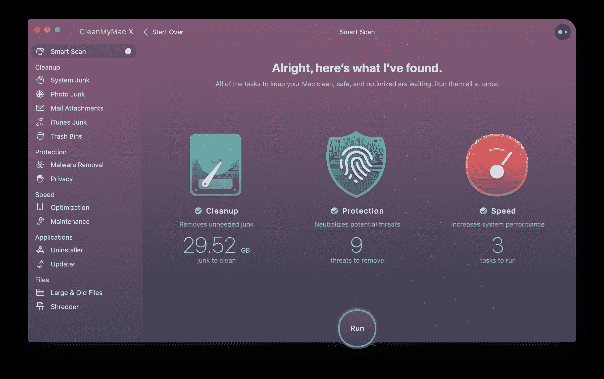
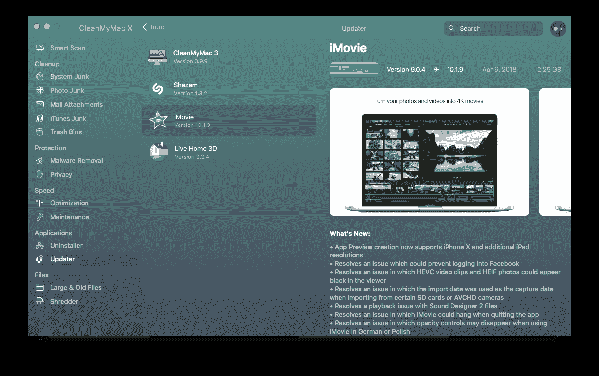

# MacPaw 发布 CleanMyMac X 

> 原文：<https://web.archive.org/web/https://techcrunch.com/2018/09/05/macpaw-releases-cleanmymac-x/>

独立应用制造商 [MacPaw](https://web.archive.org/web/20230321000450/https://macpaw.com/) 更新了其 Mac 清理软件，推出了一个新的主要版本，名为 [CleanMyMac X](https://web.archive.org/web/20230321000450/https://macpaw.com/cleanmymac) (与 [MacKeeper](https://web.archive.org/web/20230321000450/https://en.wikipedia.org/wiki/MacKeeper#Marketing_techniques) 不同)。很难相信，但 CleanMyMac 目前拥有 500 万用户。

CleanMyMac X 可帮助您删除不需要的文件，并了解降低电脑速度的原因。大多数人不需要这种应用程序。但是如果你知道你在做什么，它可以加快你的维护过程。

该应用程序现在分为四个维护任务。首先，该应用程序可以让你扫描你的硬盘，寻找巨大的缓存文件和不需要的语言文件。如果你有一个小硬盘，你可以通过清理那些大 Spotify 或 Dropbox 缓存轻松获得多个 GB。该应用程序还会查找您不需要的 iTunes 数据，并在 Mac 上发送您不需要的附件。该公司已经建立了一个规则数据库，以确保它不会删除你的任何个人文件。

第二，CleanMyMac X 现在有一个恶意软件扫描元素。它可以发现你硬盘上的广告软件、间谍软件、矿工和蠕虫，并帮助你摆脱它们。您还可以轻松删除浏览器数据和移除您不信任的 Wi-Fi 网络，这样您就不会自动连接到它们。

第三，该应用程序提供了一堆维护脚本来重建您的 Spotlight 索引，修复磁盘权限，刷新 DNS 缓存等。您还可以检查应用程序并启动在您重新启动 Mac 时自动启动的代理。

第四，CleanMyMac X 现在提供了一个更新选项卡，让您可以查看所有已安装的应用程序，以便对它们进行更新。它适用于苹果应用商店以外的应用。您也可以使用 CleanMyMac X 卸载应用程序及其相关的支持文件。

该应用程序还带有一个更新的菜单栏应用程序，这样你就可以一键查看基本的统计数据——CPU，内存使用，网络速度等。这没有 [iStat 菜单](https://web.archive.org/web/20230321000450/https://bjango.com/mac/istatmenus/)强大，但是它完成了任务。

CleanMyMac X 售价 90 美元，现有用户售价 45 美元。你也可以选择以每年 40 美元的价格订阅该应用。MacPaw 也是订阅服务 [Setapp](https://web.archive.org/web/20230321000450/https://setapp.com/) 背后的公司，CleanMyMac X 将成为你的 Setapp 订阅的一部分。

总的来说，这次更新带来了一些很好的补充，是一次很好的进化。也许你已经在使用 [DaisyDisk](https://web.archive.org/web/20230321000450/https://daisydiskapp.com/) 、 [Hazel](https://web.archive.org/web/20230321000450/https://www.noodlesoft.com/) 、Objective-See 的[安全应用](https://web.archive.org/web/20230321000450/https://www.objective-see.com/products.html)、iStat 菜单和其他完成 CleanMyMac 部分任务的实用程序。但是 CleanMyMac 仍然是一个很好的工具包来照顾你的设备。

