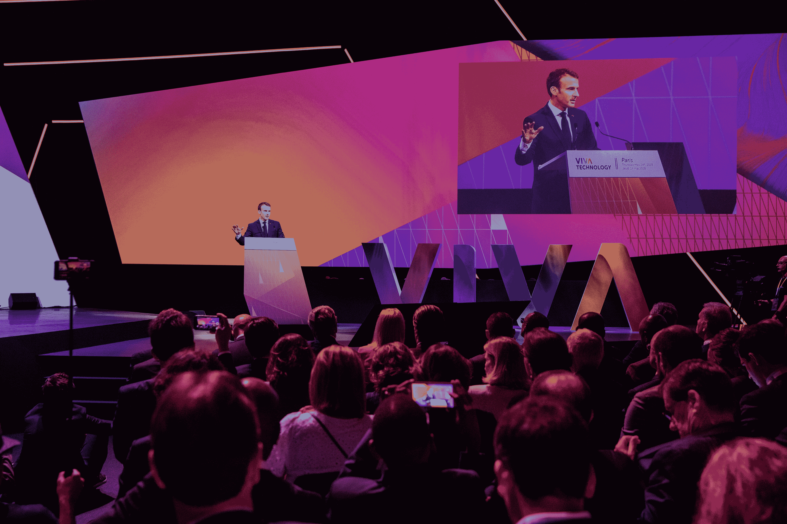

# 马克龙为欧洲的技术监管方式辩护 

> 原文：<https://web.archive.org/web/https://techcrunch.com/2018/05/24/macron-defends-the-european-way-of-tech-regulation/>

法国总统埃马纽埃尔马克龙在巴黎 VivaTech 发表演讲[，用法语和英语交替。他为监管科技公司的第三种方式辩护，这种方式不同于美国，也不同于中国。](https://web.archive.org/web/20221210070145/https://techcrunch.com/events/startup-battlefield-europe-2018/)

马克龙认为，欧洲在监管方面应该有发言权——而且不应该只涉及隐私。当然，他捍卫了 GDPR 和网络隐私，但他也谈到了税收、网络欺凌、保护独立工作者等问题。

> 利害攸关的是我们如何建立一个调和创新和共同利益的欧洲模式埃马纽埃尔·马克龙

昨天，马克龙[邀请了 50 位科技公司首席执行官](https://web.archive.org/web/20221210070145/https://techcrunch.com/2018/05/23/50-tech-ceos-come-to-paris-to-talk-about-tech-for-good/)谈论利用科技为公众谋福利，特别是在教育、劳动力和多样性方面。微软首席执行官塞特亚·纳德拉在马克龙上台前谈到了这一事件。

马克龙首先从法国科技生态系统的几个数字开始。“今天我想在这里和整个法国生态系统谈谈。我们都在做的事情对我们的国家和世界至关重要，”他说。

根据他的数据，去年法国的初创企业融资 29 亿美元(€25 亿美元)。这是 2015 年的三倍。然后他列举了最近的一些变化，从公司税到法国的开放数据政策和法国技术签证。

他对科技行业没有太多特别的话要说。你可以感觉到他现在有很多事情要做，而技术或多或少是事后才想到的。

“法国正在疯狂地变化。这就是为什么我们可以说法国回来了，”他用英语结束了他演讲的第一部分。

“我的第二个信息是给非洲的，因为你们决定邀请非洲参加今年的 VivaTech，”他说。

马克龙随后宣布，法国将向最有前途的非洲创业公司投资一些公共资金。“在过去的六个月里，法国发展署一直在努力工作，”他说。“法国发展署将在未来几周内宣布一个新的具体项目，€6500 万欧元(7600 万美元)，用于小额投资，€每个初创企业 3 万到€5 万欧元。”

玛琳·阿瓦德/彭博/盖蒂图片社

## 给大型科技公司的信息

最后，马克龙谈到了 [Tech for Good Summit](https://web.archive.org/web/20221210070145/https://techcrunch.com/2018/05/23/50-tech-ceos-come-to-paris-to-talk-about-tech-for-good/) 和一般的技术监管。“我们目前正在经历一场革命。我真的相信那场革命，我们的国家也相信它，”他说。“但你不能否认，我们国家和世界上有些人害怕变化。”

“科技公司并不总是堪称典范。一些公司没有遵守税法，这助长了不信任——甚至来自法国企业家的不信任。”

马克龙随后为法国对大型科技公司征收欧洲税[的项目进行了辩护。如果法国政府能够说服其他欧洲政府，大型科技公司将在每个欧洲国家被征收地方税收。这可能是避免税收优化计划的一种方式。公司税率较低的欧洲小国似乎还没有被说服。](https://web.archive.org/web/20221210070145/https://techcrunch.com/2018/03/05/european-union-plans-to-tax-tech-giants-on-local-revenue/)

“我是一个技术乐观主义者，这个国家确实相信创新，”他说。“但这还不够——赚钱、创造就业机会和让股东满意都很棒。就我而言，尤其是创造就业机会。”

马克龙还批评了美国对科技公司的监管，称美国政府在网络骚扰、税收、劳工等问题上做得不够。

他接着批评了中国模式，称中国政府在隐私、人权和性别平等方面做得不够。

“利害攸关的是我们如何建立一个调和创新和共同利益的欧洲模式，”他说。“我们必须共同努力来建立这个共同的框架。”

在昨天的[承诺](https://web.archive.org/web/20221210070145/https://techcrunch.com/2018/05/23/50-tech-ceos-come-to-paris-to-talk-about-tech-for-good/)之后，法国政府将每六个月追踪一次科技公司，看看他们是否真正实现了他们在科技方面的承诺。

他最后还说，科技促发展峰会应该成为一项年度倡议。明年，在 VivaTech 之前，科技公司的首席执行官将再次被邀请到爱丽舍宫。