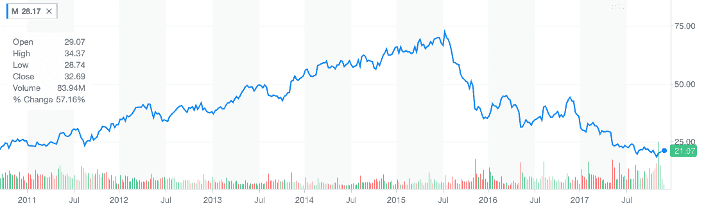

# 梅西的信用卡处理器在黑色星期五停止工作 

> 原文：<https://web.archive.org/web/https://techcrunch.com/2017/11/24/macys-credit-card-processors-stop-working-on-black-friday/>

# 梅西的信用卡处理器在黑色星期五停止工作

这是一年中最大的购物日之一，但零售巨头梅西百货公司无法让其信用卡处理器工作。

美国各地的顾客排队购买打折商品，却发现机器不接受信用卡或礼品卡。梅西百货旗下的一些布鲁明戴尔商店可能也受到了影响。

**更新:**该公司表示已经解决了这个问题，并提供了以下声明。

“我们已经完全解决了今天的系统问题。我们高度重视我们的客户，并真诚地为今天的系统变慢可能在他们的购物体验中造成的任何不便道歉。我们今天下午遇到的延迟是由于容量相关的问题，导致一些交易需要更长的时间来处理。我们预计不会出现任何额外的延误。”

感恩节后的黑色星期五已经成为一个购物假日，零售商提供大量打折商品。梅西百货公司甚至以在纽约举行的大型年度感恩节游行拉开了序幕，这一活动会在全国范围内进行电视直播。

该公司还在 2016 年黑色星期五期间[经历了网站宕机](https://web.archive.org/web/20230128095800/http://fortune.com/2016/11/25/macys-black-traffic/)。假日销售在公司的季度收益中发挥了重要作用，梅西百货的[上一季让华尔街](https://web.archive.org/web/20230128095800/https://www.reuters.com/article/us-macy-s-outlook-research/dismal-holiday-sales-at-macys-and-kohls-cast-gloom-over-sector-idUSKBN14P1G9)失望。

其股票交易价格不到一年前的一半，大约是三年前的三分之一。该公司目前的市值为 64 亿美元。

去年，时任梅西公司首席执行官的特里·伦德格伦在接受《财富》采访时表示，由于行业压力，公司在感恩节当天提前开店。他告诉《财富》杂志:“如果你不开放，而你的竞争对手开放，将会有很多顾客干脆去别处购物。”“你永远也不会收回那笔买卖。”

伦德格伦现在是执行主席。Jeff Gennette 在 3 月份从总裁晋升为首席执行官。

Gennette 周五早些时候告诉美国消费者新闻与商业频道，黑色星期五比去年有一个更好的开端。他说公司今年的折扣减少了，这将带来更好的利润。

根据全国零售联盟的数据，1 . 64 亿美国人计划在感恩节周末购物。