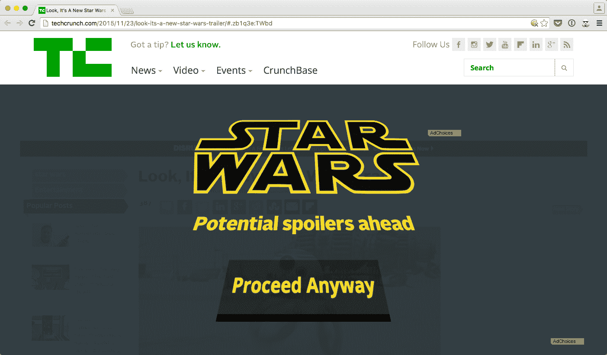

# 生这些星球大战剧透的气？安装星球大战剧透拦截器 

> 原文：<https://web.archive.org/web/https://techcrunch.com/2015/11/25/mad-at-all-these-star-wars-spoilers-install-star-wars-spoiler-blocker/>

# 生这些星球大战剧透的气？安装星球大战剧透拦截器

有两种人:一种是厌倦了所有这些[星球大战新闻废话](https://web.archive.org/web/20221209132738/https://beta.techcrunch.com/2015/11/23/look-its-a-new-star-wars-trailer/)的人，另一种是在看《星球大战第七集》之前只想避免任何剧透的人。在这两种情况下，你都很幸运，因为 [Jitbit](https://web.archive.org/web/20221209132738/http://www.jitbit.com/) 的联合创始人有东西给你——星球大战剧透阻止程序扩展。

[Alex Juma sev](https://web.archive.org/web/20221209132738/https://twitter.com/jitbit)和 [Max Al Farakh](https://web.archive.org/web/20221209132738/https://twitter.com/maxt3r) 在 [Chrome 商店](https://web.archive.org/web/20221209132738/https://chrome.google.com/webstore/detail/star-wars-spoiler-blocker/eleaenmahchceopnpofcookkbbfclokj)发布了 Chrome 扩展，它只能做一件事，但做得很好。每当你进入一个提到《星球大战》的页面时，这个扩展就会接管你的屏幕，向你显示一个警告屏幕。

“前方潜在剧透”屏幕比用你的胳膊挡住你的显示器并大喊“不要”要好得多这样你就可以避免无意中读到今年最受期待的电影的关键信息。

一旦你安装了扩展，没有任何选项或配置屏幕。你可以继续你的生活。看起来这个扩展在你加载的每一页上都做了一个快速的关键词搜索，看看它是否提到了星球大战。这可能有点反应过度，例如，一个朋友提到在脸书购买星球大战门票会触发剧透屏幕。但如果你真的想避免剧透，但又不想离开互联网几周，这是值得的。

对于《星球大战》的憎恨者来说，这个扩展可以帮助你关闭标签，这样你就不会浪费时间在另一篇《星球大战》文章上。希望你生活中还有其他让你开心的事，因为《星球大战》挺好看的。你应该试一试。

《星球大战》剧透拦截器没有[云对屁股加](https://web.archive.org/web/20221209132738/https://chrome.google.com/webstore/detail/cloud-to-butt-plus/apmlngnhgbnjpajelfkmabhkfapgnoai)那么复杂，但它完成了任务。哦，对了，史巴克会在第七集复出。抱歉剧透了…

