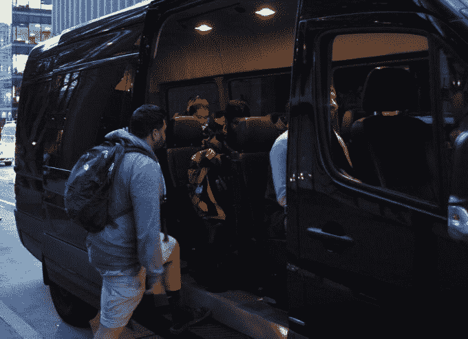

# 神奇巴士旨在通过城市间运输神奇地缓解硅谷通勤困境

> 原文：<https://web.archive.org/web/https://techcrunch.com/2016/01/18/magic-bus-aims-to-magically-ease-silicon-valley-commuter-woes-with-city-to-city-transportation/>

# 神奇巴士旨在神奇地缓解硅谷城市间交通的通勤困境

Y Combinator 旗下的一家新公司 Magic Bus 希望通过一个预定的、支持 WiFi 的私人巴士系统，结束许多湾区通勤者在 101 公路上缓慢、令人窒息的日常驾驶，将他们从旧金山一直运送到桑尼维尔。

在湾区有许多专注于拼车的创业公司——Chariot，Shuddle，甚至优步和 Lyft 都在其中，但联合创始人 Chris Upjohn 认为 Magic Bus 提供了独特的不同。他的创业公司支持城市间的乘车，而不是专注于城市内的交通。

“所以我们让人们长途跋涉，就像他们一直在开车一样，”厄普约翰在电话里向我解释道。

这方面的一个例子是，有人从太平洋高地开始工作，但每天都需要去红木城的办公室。“他们必须把市政带到卡尔特林，然后卡尔特林到雷德伍德城，然后到 MTA 或类似的地方。所以他们有这些非常痛苦的多级交通通勤，”厄普约翰说。

清晨乘坐神奇巴士的通勤者。

Lyft Line 和优步 Pool 提供了一种在城市范围内跳过公共交通 jenga 的方法，但目前没有为从一个城市到另一个城市的通勤者提供这种选择。然而，在神奇巴士上，乘客可以安排一次乘坐，并与那些走类似路线的人挂钩，连续乘坐一次，比通过各种湾区公共交通选择花费的时间更少。

厄普约翰为他的大学同学制作了一个类似的系统，但正是他自己在一份金融工作中从旧金山到门洛帕克的恼人通勤给了他创造神奇巴士的想法。

“这个问题困扰了我很久。为什么我们仍然独自开车去上班？这对我毫无意义，”厄普约翰说。

Magic Bus 相当新，但 Upjohn 告诉我，已经有“数千”人注册使用它，Upjohn 将该平台视为智能城市更大运动的一部分。

“当我们考虑如何为未来的智能城市做出贡献时，我们希望减少我们看到的拥堵，”Upjohn 说。“我们希望人们不再需要拥有汽车，不再需要使用神奇的公交车通勤，不再需要像优步和 Lyft 这样的城市服务。”

Upjohn 不想对任何未来与拼车服务的合作发表评论，但提到了“追求这一愿景”。

那些有兴趣注册魔法巴士每天在半岛上骑行的人可以在 [Magicbus.io.](https://web.archive.org/web/20230323013935/https://www.magicbus.io/) TechCrunch 的读者可以在他们的第一次旅行中使用促销代码 TCridesfree **免费试用这项服务。**