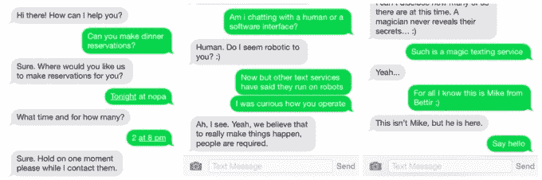
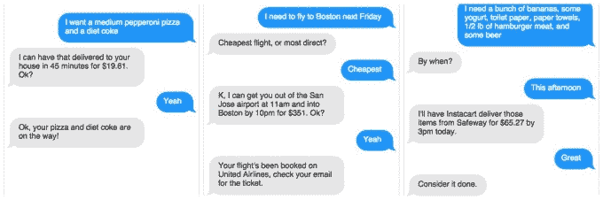

# Magic 是一家承诺给你带来任何东西的初创公司——如果你愿意为此付费的话

> 原文：<https://web.archive.org/web/https://techcrunch.com/2015/02/23/magic-is-a-startup-that-promises-to-bring-you-anything-if-youre-willing-to-pay-for-it/>

在船上吃寿司，在你的门口看到一只老虎，或者让你的停车票消失在空气中。一家雄心勃勃的新公司表示，只要合法，它将允许你发任何你想要的短信(他们确实是指任何事情)，它会神奇地来到你身边。

只需发短信 408-596-5017， [Magic](https://web.archive.org/web/20230328032847/http://getmagicnow.com/) ，一个似乎在周末火爆起来的短信服务，承诺提供服务。

Magic 只有 48 小时的历史，但是我们被告知截止到今天早上它已经收到了超过 17000 条短信。有人在周末给[产品搜索](https://web.archive.org/web/20230328032847/http://www.producthunt.com/posts/magic)加了魔法，20 分钟内[就成了黑客新闻的第一名](https://web.archive.org/web/20230328032847/https://news.ycombinator.com/item?id=9087819)。

据联合创始人迈克·陈(Mike Chen)说，请求的范围从帮助走出法庭到将老虎送到客户门口。

魔法似乎因为我所说的“产品搜寻效应”而爆炸了(类似于“ [TechCrunch 效应](https://web.archive.org/web/20230328032847/http://holykaw.alltop.com/techcrunch-effect-must-read-of-web-entreprene)”)。一个有着简单想法的小创业公司被贴在产品搜索上，它被淹没在比它知道该做什么还要多的流量中。

当我和陈说话时，他似乎不知所措。“我完全没想到事情会变成这样。你知道人们说事情发生在一夜之间，我以前不相信他们，现在它正在发生在我身上，”他在电话里告诉我。

最初的想法是创建一个使用短信的服务，而不是在一个应用程序上经过几个步骤来订购食物、司机或其他人们可能想要的东西。“像 DoorDash 或 Postmates 这样的东西，你必须管理一下，”陈说。

因此，上周六，他的团队建立了一个简单的网站，上面有一个号码，可以给你任何你想要的东西，只要是合法的，你愿意支付价格。

那个想法似乎很受欢迎。此后，他不得不关闭注册流程，将新的申请人列入等候名单，并请朋友和家人来帮助他处理数量。

陈和他在 Magic 的联合创始人是 Y Combinator 的最后一批成员，他们拥有一款名为 Bettir 的血压监测应用。魔术是团队在周末仓促完成的一个附带项目。

目前还不清楚陈的其他创业公司会发生什么——Bettir 和 [Made in Space](https://web.archive.org/web/20230328032847/http://www.madeinspace.us/) ，一家专注于太空 3D 打印的创业公司。现在，陈说他的全部注意力都在魔术上。

许多公司专注于按需交付。湾区至少有 12 家送餐服务。就连优步也在玩食品和其他配送服务的主意，而 TaskRabbit 不仅提供食品配送，还承诺通过外包给它的“兔子”来让 T4 完成任何你想做的事情

> 只要合法和可能，我们就可以这样做。这可能很贵，你可能想要一架直升机去拉斯维加斯，但如果可能的话，我们会这样做。麦克·陈，魔术联合创始人

目前，Magic 的定价要宽松得多。陈承认，这只是他和他的团队认为交付应该花费的猜测。“我们刚刚开始，所以现在什么都没有真正定义，”他说。

陈把支付过程比作使用优步的方式。收费多少取决于你走多远。魔术也是如此。如果你的要求成本很高或者很麻烦，那你的成本会更高。

价格确定后，该服务将向您发送一个链接，以便您进行购买。交易在 Stripe 上运行，目前将接受信用卡和比特币。

Chen 不确定有多少请求已经被满足，或者有多少人实际上完成了他们所请求的订单的购买过程。“这在我的任务清单上，但我现在还没有时间研究任何分析，”他告诉我。

与优步、Postmates、TaskRabbit 和其他按需服务不同，Magic 实际上没有工作人员来处理递送本身。它只是处理请求，并计算出实现这些请求的成本。请求者不知道交付来自哪里或如何进行；他们只知道，只要他们愿意支付 Magic 标明的交货价格，Magic 就会承诺交付他们所要求的东西。

一个人昨天要求把寿司和鲜花送到他的船上。第一家送餐服务最终无法完成订单，因此魔术队不得不匆忙寻找另一家寿司服务公司。陈说，接受订单的那个人只知道他的订单已经完成了。

还有其他的短信服务，但是没有一个能和这种承诺相提并论。Cloe 是一种运行在人工智能上的短信服务，它会为你提供食物，但不会预订或给你带来，比如说，一只老虎(我问过了)。伊森是一个发短信的人工智能，它不会满足请求。他只是回你短信。魔法完全由人类掌控。当我问他们是不是机器人时，电话那头的人似乎受到了侮辱。

有人告诉我，Magic 只有 10 个人，联合创始人在这一点上处理一切。陈说，他希望保持服务质量，但也希望让尽可能多的人尽快使用这项服务。为此，他不得不放弃一切，包括贝蒂尔的工作。

这似乎有点可笑，我们太懒了，以至于宁愿让别人来处理按需食品、杂货、汽车等任何交付应用，而不是直接处理服务。但是魔术似乎告诉我们，很多人喜欢点他们想要的任何东西，并且愿意付钱让其他人来处理这些麻烦。

陈说，魔术运营商过滤的要求，似乎是笑话，并强调，只有合法的命令将得到履行。他也不确定一旦团队发来价格，有多少人会真的购买他们的请求。

如果 tiger 交付被视为合法，并且请求者支付尚未确定的价格，魔术队打算履行该订单。

“只要合法可行，我们就可以这么做。这可能很贵，你可能想要一架直升机去拉斯维加斯，但如果可能，我们会这样做。”陈说。