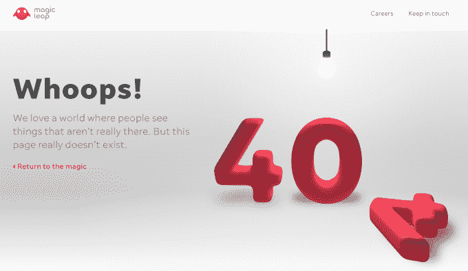
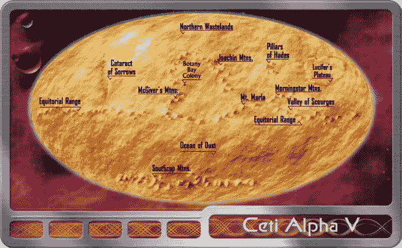

# Magic Leap 的新网站有一些奇怪的复活节彩蛋供你解密 

> 原文：<https://web.archive.org/web/https://techcrunch.com/2017/09/27/magic-leaps-new-website-has-some-bizarre-easter-eggs-for-you-to-decipher/>

Magic Leap 很可能是一个巨大的、资金充足的行为艺术作品。

今天，这家增强现实公司(尽管筹集了大量资金，但仍未推出产品或分享产品的任何细节)推出了一个新的[网站](https://web.archive.org/web/20221005130336/https://www.magicleap.com/)。

网站很不错。它很现代，非常简洁，有一个新的红色版本的标志和一个“保持联系”的注册页面。有趣的是，该网站不再有任何渲染的视频演示或首席执行官罗尼·阿博维茨的任何奇怪的，杂乱无章的博客帖子。不要太疯狂。

但其中隐藏着一些奇怪的东西，这些东西让人想起这位首席执行官 2012 年在佛罗里达州萨拉索塔发表的一次奇怪的(老实说，令人难以置信的讨厌)新达达主义者 TEDx“演讲”。你只需要看看，就能开始相信它来自一家由谷歌、阿里巴巴、安德森·霍洛维茨和其他科技巨头提供数十亿美元支持的公司。

[https://web.archive.org/web/20221005130336if_/https://www.youtube.com/embed/w8J5BWL8oJY?feature=oembed](https://web.archive.org/web/20221005130336if_/https://www.youtube.com/embed/w8J5BWL8oJY?feature=oembed)

视频

呀。所以，今天我们有了这个新网站，它有一系列的复活节彩蛋，Redditors(当然)的目标是找到它的底部。

就像我说的，这个网站非常简单，所以没有太多的页面可以浏览，第一个关键似乎是找到一个不存在的网页。这里有一个[链接](https://web.archive.org/web/20221005130336/https://www.magicleap.com/#/blog/the-mom-rule)的例子，链接到 Abovitz 的一个更奇怪的博客帖子，同样，不再有了。

404:未找到产品

当你到达一个不存在的 URL 时，你会被带到一个看起来像标准的 404 页面，但在图形中有一个灯泡，一个慢慢开始闪烁的灯泡。事实证明，这些闪烁不是随机的，而是事实上的莫尔斯电码，一旦你对其进行分类，就会拼出“关键词”这个词。

如果你能设法看完上面的整个 TEDx 视频，你会注意到穿着太空服的 Abovitz 在整个演示过程中只说了几个短语。其中之一是他简要地谈到了一个“古老而神奇的关键词”，那就是单词“phydre”Phydre 是一个绝对的胡言乱语词，取自希腊字母中单词“fudge”的语音表示，出于不清楚的原因，它在 TEDx 演讲中占据了突出的位置。

如果你在同一个 404 页面上输入单词“phydre ”,你会得到一串二进制代码，后面跟着一个笑脸。

> 00110000 00110011 01101000 00100000 00110000 00110010 01101101 00100000 00110001 00110110 00101110 00110111 00110111 00110011 00110000 00110111 01110011 0001010 00101011 00110000 00110100 10110000 00100000 00110000 00110101 10000000110010 00100000 00110010 00110011 00101110 00110000 00110101 00111001 00110110 10000000110011 :)

将它输入到二进制文本生成器中，你会得到坐标“03h 02m 16.77307s+04 05 ' 23.0596”，这是阿尔法鲸鱼座的准确坐标，阿尔法鲸鱼座是塞特斯星座中的第二大恒星，也被称为海怪或鲸鱼星座。

这就是复活节彩蛋线索目前结束的地方，Magic Leap 在营销中大量使用鲸鱼，所以这本身可能是一个目的，但许多 Redditors 认为这颗星星指向 Magic Leap 第一款产品的 12 月发布，因为这是一年中这颗特别的星星最明显的时候。

可汗和他的船员被流放的地方。

有趣的是，在《星际迷航》的一集和电影*星际迷航 II:可汗之怒中，出现了一个不存在的阿尔法鲸鱼座星球。谁知道这一切意味着什么，但别担心，Reddit 正在处理。*

我不知道这是怎么回事，除了这是一个来自一个似乎有很多实际问题要解决的初创公司的很多分心。也许他们做得很好，所以他们正在放松享受。

我所知道的是，Magic Leap 肯定不会消除佛罗里达是一个发生奇怪事情的地方的刻板印象。