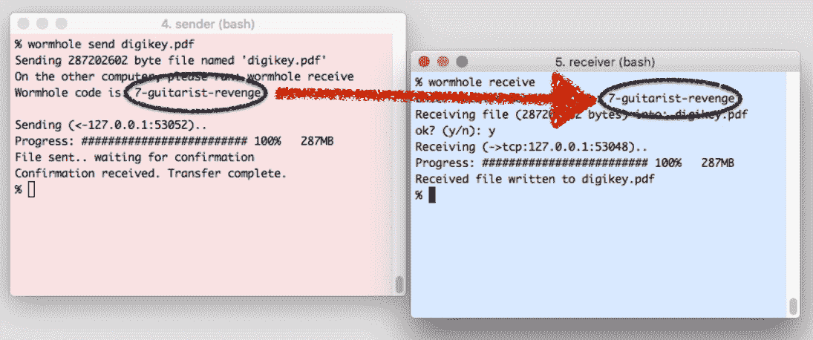

# 魔法虫洞是一种轻松安全地发送文件的聪明方法

> 原文：<https://web.archive.org/web/https://techcrunch.com/2017/06/27/magic-wormhole-is-a-clever-way-to-send-files-easily-and-securely/>

# 魔法虫洞是一个聪明的方式来发送文件容易和安全

如果你需要向全国各地的同事或朋友转几百兆，你并不缺乏选择。事实上，各种选择比比皆是，而且都有各自的问题。难道你不希望你能说几句神奇的话，直接给他们发送东西，没有中间上传，没有网络界面，没有登录？开发者布莱恩·华纳创造的魔法虫洞是一个聪明的方法。

假设你和你的朋友都在线，并且安装了最低限度的软件，步骤非常简单:

*   用你想发送的文件通过命令行调用一个虫洞(还没有 GUI)
*   服务器(公共或私人)给你一个简单的，可口述的，一次性使用的密码，如 8-horse-happy 或 vile-4-content
*   你通过电话、聊天或其他方式告诉你的朋友密码
*   他们进入虫洞控制台，交换密钥
*   加密下载直接在您的计算机之间开始，密码被丢弃

好吧，这可能比把文件放入 Slack 要复杂一点。但它避免了第三方工具、中间服务器、登录和密码、制作快捷链接、担心文件临时“公开”或篡改权限等所有复杂问题。

实际上，正确使用它会比其他任何事情都简单。一旦它出现在你桌面上的一个脚本或其他东西中，你只需把一个文件放在上面，它就会弹出密码，然后你把密码告诉那个人。他们可以直接安全地获得它，您再也不用担心了。

 想象一下，你正在和某人打电话，听到“哦，让我把那个文件发给你吧。”会是 Dropbox 链接吗？你需要登录什么吗？你会等着 Gmail 扫描一些巨大的附件吗？会不会是——*颤抖*——通过 FTP？还是他们只会说“鳄鱼威武 7”然后嘣，你就有了？我个人会喜欢的。

我不知道为什么我会对一个文件传输系统如此着迷！我只是觉得很棒。

您可以在 [GitHub 项目页面](https://web.archive.org/web/20230223103948/https://github.com/warner/magic-wormhole)下载所有组件或贡献您自己的代码。