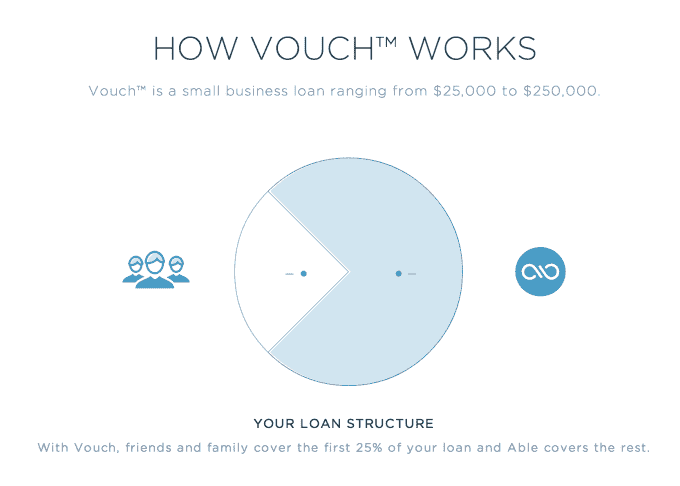

# 邮件数字化初创公司 Outbox 重新推出 As Able，这是一家小型企业合作贷款提供商 

> 原文：<https://web.archive.org/web/https://techcrunch.com/2014/06/30/mail-digitization-startup-outbox-relaunches-as-able-a-collaborative-small-business-loan-provider/>

今年 1 月，令人感兴趣但最终失败的初创公司 [Outbox](https://web.archive.org/web/20230129221303/http://blog.outboxmail.com/) 宣布，将关闭其将美国邮政邮件数字化的服务。然而，该团队当时表示，他们还没有完成——去年夏天刚刚筹集了 500 万美元的 A 轮融资，创始人们解释说，他们将把精力集中在新产品上。现在我们知道这种新产品是什么了:它被称为[能力](https://web.archive.org/web/20230129221303/https://www.hiable.com/)，一种“合作贷款人”，帮助小企业从朋友、家人和朋友那里获得信贷。

发件箱，作为一个提醒，会代表你收集和扫描你的邮件，允许你在线查看。这项服务首先在奥斯丁推出，然后在 2013 年[扩展到三藩市](https://web.archive.org/web/20230129221303/https://techcrunch.com/2013/02/25/outbox-digitizes-sf-snail-mail/)。虽然这是一个有趣的实验，但该公司难以增加用户数量，这表明对其服务的需求不足。

因此，该团队决定在今年早些时候停止运营。

新公司 Able 目前尚未启动，但预计将于今年夏天晚些时候推出。与此同时，联合创始人埃文·贝尔和威尔·戴维斯在博客上分享了他们的愿景。

他们解释说，通过 Able，他们希望为“财富 500 万人——代表美国经济支柱的 580 万家小企业”服务。“这些公司创造了数十亿美元的收入，雇佣了我们 49%的劳动力，但它们中的大多数无法找到可靠和负担得起的信贷来源，”它继续说道。

Able 将通过一种他们称之为“合作承销”的风险定价方法，帮助向小型企业提供信贷。虽然它的名字听起来像是在利用所谓的“群众的智慧”进行 P2P 贷款，但事实并非如此。相反，帖子说，他们“在信息层创新，而不仅仅是资本层。”换句话说，他们在利用大众的智慧为贷款定价，而不是完全为贷款提供资金。

这一过程将涉及通过 Yelp 评论、签到和社交媒体联系等方式分析企业数据。然后，Able 会要求借款人召集三到五个支持者(家人、朋友、客户)为贷款的前 25%提供资金，然后 Able 再为其余部分提供资金。之后，Able 定期向借款人收取款项，然后将收益分配给支持者。

虽然方法不同，但 Able 将在更广阔的市场上与其他一些专注于借贷的初创公司竞争，包括谷歌支持的 [Lending Club](https://web.archive.org/web/20230129221303/https://techcrunch.com/2014/03/19/google-backed-lending-club-brings-peer-to-peer-lending-to-business-loans/) 、 [CAN Capital](https://web.archive.org/web/20230129221303/https://techcrunch.com/2014/01/08/can-capital-raises-33m-from-meritech-and-accel-to-loan-small-businesses-working-capital/) 、 [OnDeck](https://web.archive.org/web/20230129221303/https://techcrunch.com/2014/03/06/ondeck-raises-77m-from-tiger-global-to-loan-smbs-working-capital/) 、 [Zidisha](https://web.archive.org/web/20230129221303/https://techcrunch.com/2014/01/23/zidisha-launches-a-kickstarter-style-micro-lending-platform-for-low-income-entrepreneurs-in-developing-countries/) 、 [Prosper](https://web.archive.org/web/20230129221303/https://techcrunch.com/2014/05/04/peer-to-peer-lending-marketplace-prosper-raises-70m/) 、 [SoFi](https://web.archive.org/web/20230129221303/https://techcrunch.com/2014/04/03/sofi-closes-on-80-million-to-expand-its-lending-business/) 等。

在公开推出之前，Able 已经向 40 家成长型企业提供了 5000 至 15 万美元的贷款。