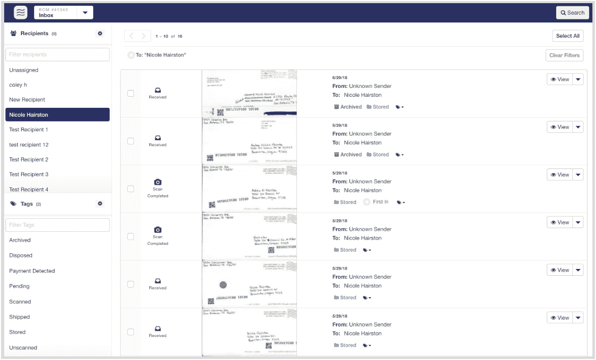

# 邮件数字化服务地球级邮件获取收据数字化服务 shoe boxed 

> 原文：<https://web.archive.org/web/https://techcrunch.com/2018/08/22/mail-digitizing-service-earth-class-mail-acquires-receipt-digitizing-service-shoeboxed/>

# 邮件数字化服务地球级邮件获取收据数字化服务鞋盒

[Earth Class Mail](https://web.archive.org/web/20221209231824/https://www.earthclassmail.com/) ，一家将你的实体邮件数字化的公司，这样你就不用每天去邮箱了，今天[宣布](https://web.archive.org/web/20221209231824/https://blog.shoeboxed.com/shoeboxed-acquired-earth-class-mail-make-paperless-office-reality/10497/?platform=hootsuite)它已经收购了收据扫描和费用跟踪服务 [Shoeboxed](https://web.archive.org/web/20221209231824/https://www.shoeboxed.com/) 。

考虑到这两家公司都致力于减轻处理纸张的痛苦，地球邮件公司对 Shoeboxed 感兴趣的原因是显而易见的。这两个服务将继续照常运行，尽管随着时间的推移，我们可能会看到两者之间的一些深度集成。

Shoeboxed 于 11 年前推出，目前每年为 90 个国家的 100 多万客户数字化 500 多万份文档。它的主要市场是美国的小企业，占其用户的 50 万。

“当我们在 2008 年开始将第一个 iPhone 应用程序放在 app store 中扫描收据时，还有另一个帮助小企业数字化的动力——地球级邮件，”该公司的首席执行官兼联合创始人 Tobias Walter 告诉我们。“我们两家公司的联合力量将为小型企业带来巨大的转变，最终实现无纸化，告别耗费他们数小时生产力的旧工作流程。我对我们为公司、团队和客户找到的新家感到无比高兴！”

地球类邮件与美国邮政署​的[通知递送](https://web.archive.org/web/20221209231824/https://informeddelivery.usps.com/)服务的不同之处在于，它不仅扫描你即将收到的信封的外部，而且你还可以允许公司扫描里面的所有文件(你为这项服务支付的价格主要取决于你每月想要多少次这种全面扫描)。2015 年，俄勒冈州的 Earth Class Mail 不得不[申请破产保护](https://web.archive.org/web/20221209231824/https://www.oregonlive.com/silicon-forest/index.ssf/2015/03/earth_class_mail_once_a_highly.html)，其新的领导团队扭转了公司的局面。该公司表示，其年运营率现在是 1000 万美元，自杰斯·加尔扎去年 12 月成为其[新任首席执行官以来增长了 20%。](https://web.archive.org/web/20221209231824/https://www.earthclassmail.com/blog/earth-class-mail-ceo-jess-garza)

沃尔特还指出，用户偶尔也会发送未开封的信封，但公司不允许打开它们。这些客户现在可以很容易地成为地球级邮件用户。

在其存在的过程中，Shoeboxed 只筹集了适量的资金，2008 年由 Novak Biddle Venture Partners 领投了 58 万美元的 A 轮融资(当时 A 轮融资规模仍远小于今天)，2011 年获得了 140 万美元的 B 轮融资。今天收购的财务细节没有披露。