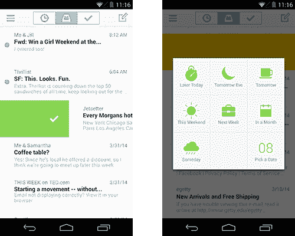
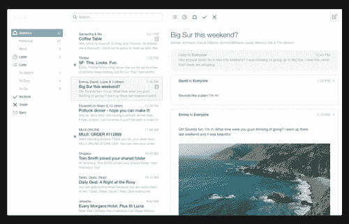

# Dropbox 推出安卓自动刷邮箱，桌面预览邮箱 

> 原文：<https://web.archive.org/web/https://techcrunch.com/2014/04/09/mailbox-android-desktop/>

# Dropbox 推出安卓自动刷邮箱，桌面预览邮箱

在[收购](https://web.archive.org/web/20221001151259/https://beta.techcrunch.com/2013/03/15/mailbox-cost-dropbox-around-100-million/)移动第一电子邮件管理 iOS 应用[邮箱](https://web.archive.org/web/20221001151259/http://www.mailboxapp.com/)一年后，今天 Dropbox 推出了安卓的[邮箱，并预览了一个桌面测试版。它还展示了一个新的“自动刷”功能，让你不仅可以存档一封不想要的电子邮件，还可以自动存档你未来收到的类似电子邮件。](https://web.archive.org/web/20221001151259/http://www.mailboxapp.com/blog/#/posts/82209350462)

Dropbox 在旧金山的大型新闻发布会上发布了新邮箱，宣布现在拥有 2.75 亿用户，并与 Microsoft Word、Excel 和 Powerpoint 进行了新的协作集成，名为 Project Harmony。

在安卓系统上，Mailbox 的工作方式[很像它的 iOS 姐妹](https://web.archive.org/web/20221001151259/https://beta.techcrunch.com/2012/12/13/omg-mailbox-is-amazeballs/)，而且它现在已经可以在 Google Play 中使用了(尽管它还没有完全填充)。

在全尺寸电脑上，Mailbox 允许您使用触控板进行手势控制，并且采用了极其简约的设计。你可以在触控板上滑动来归档电子邮件，就像你在手机上滑动触摸屏一样。想要注册早期桌面访问的用户可以去 http://www.mailboxapp.com/

下面是邮箱在桌面上的样子:

一名邮箱团队成员演示了自动刷卡功能，他解释说:“只需轻轻一点，我明天收到的邮件就会比今天少。”大多数人最终会日复一日地存档同样令人讨厌的垃圾邮件，但他们太忙或太懒，以至于没有真正找到退订按钮并完成这个过程。

邮箱的自动刷屏功能使得驱逐营销人员和其他干扰变得更加容易。它从你的档案中学习，判断你不想看到或想隐藏的模式。然后，它可以先发制人地将该模式应用到未来的电子邮件中，以便在您看到它之前就处理好。Dropbox 会同步您推断出的偏好设置，因此它们会在邮箱界面和设备上跟随您。Auto-swipe 正在 Android 上推出，很快会在 iOS 上推出，当该版本首次推出时，应该会出现在桌面上。

电子邮件本质上是跨平台的。无论是在家还是在旅途中，我们都会尽可能地照顾它。缺少桌面版本可能会阻碍一些人使用邮箱。不过，很快它将无处不在，而且它可以接受真正的挑战:击败 Gmail。