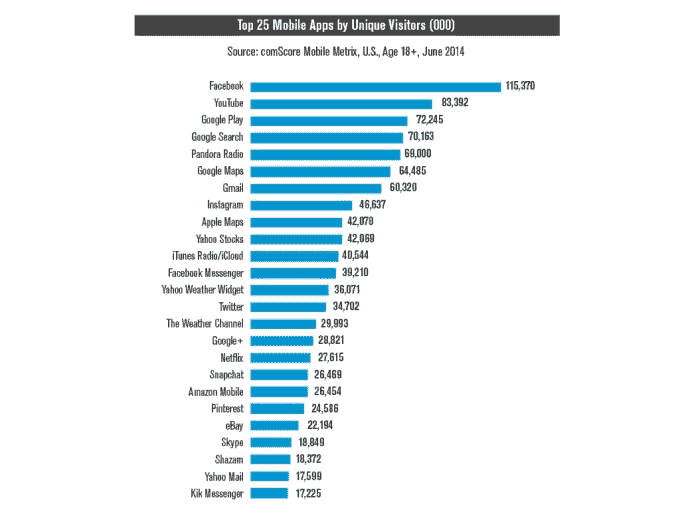

# 现在，大多数数字媒体消费都发生在移动应用程序中

> 原文：<https://web.archive.org/web/http://techcrunch.com/2014/08/21/majority-of-digital-media-consumption-now-takes-place-in-mobile-apps/>

根据 comScore 今天早上发布的一项新研究,美国用户现在将大部分时间花费在移动应用程序中的数字媒体上。这意味着移动应用程序，包括排名第一的最受欢迎的应用程序脸书，比桌面使用或移动网上冲浪占用了我们更多的时间，占使用数字媒体时间的 52%。结合移动网络，移动使用占总使用时间的 60%，而基于桌面的数字媒体消费占剩余的 40%。

该报告称，如今应用程序正在推动大部分的媒体消费活动，目前在移动设备上每 8 分钟的媒体消费中，应用程序就占了 7/4。在智能手机上，应用程序的活跃度甚至更高，使用率为 88%，而在平板电脑上为 82%。

## 应用程序用户

该报告还详细介绍了几个有趣的数字，这些数字与美国应用程序用户如何与这些移动应用程序互动有关，并指出超过三分之一的人每月至少下载一个应用程序。智能手机用户平均每月下载 3 个应用程序。

然而，之前可能没有被很好理解的是，大部分下载活动都集中在一小部分智能手机用户中:前 7%的智能手机用户占*某个月所有下载活动的近一半*。很明显，这些人都是超级用户。

但是，无论消费者多频繁地主动下载应用程序，他们肯定会对它们上瘾。超过一半(57%)的人每天都使用应用程序，而 26%的平板电脑用户每天都使用应用程序。79%的智能手机用户几乎每天都使用应用程序，称他们每月至少使用 26 天，而平板电脑用户的这一比例为 52%。

[gallery ids="1047008，1047007，1047006，1047005，1047004，1047003，1047002，1047001，1047000，1046999，1046998，1046997"]

## 脸书仍然排名第一

这里还有一个值得注意的花絮:智能手机上 42%的应用时间发生在个人最常用的应用上。4 分钟中有 3 分钟花在个人排名前 4 的应用上。前十大最常用应用中有 9 个是顶级品牌，包括脸书、谷歌、苹果、雅虎、亚马逊和易贝。

脸书是使用最多的应用程序，无论是在受众规模还是在每个人群中花费的时间份额方面。

社交网络、游戏和广播占了应用总使用时间的近一半，表明移动使用主要集中在娱乐和通信上。

在 iPhone 上，用户更喜欢花时间消费媒体，新闻应用、广播、照片、社交网络和天气是排名最高的类别，而 Android 用户在搜索(谷歌)和电子邮件(Gmail)上花的时间更多。

## 安卓与 iPhone

ComScore 的报告还加剧了 Android 与 iPhone 之间的战争，再次指出 iPhone 用户的收入中值高出 40%，并使用更多的应用程序。(每月多 9 个小时)。

更多详情请见完整报道[此处](https://web.archive.org/web/20230316001141/http://www.comscore.com/Insights/Presentations-and-Whitepapers/2014/The-US-Mobile-App-Report)。