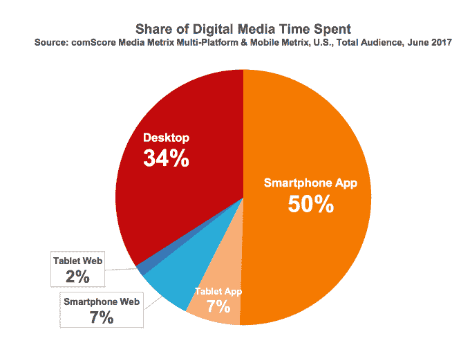
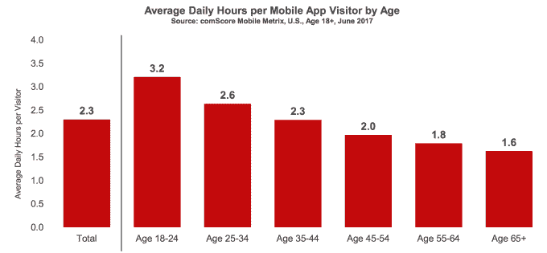
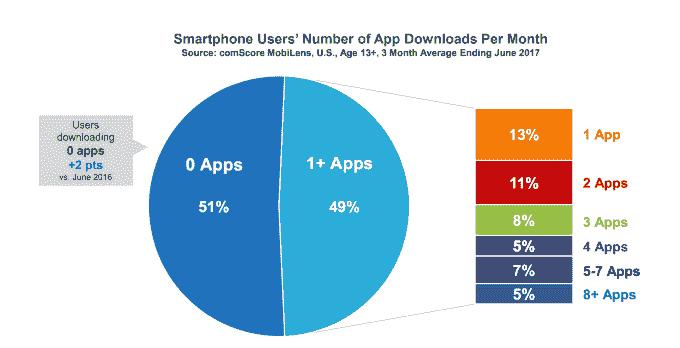
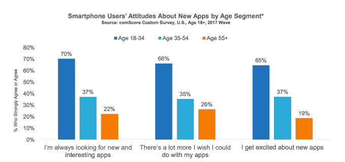

# comScore TechCrunch 表示，大多数美国消费者每月仍然下载零应用程序

> 原文：<https://web.archive.org/web/https://techcrunch.com/2017/08/25/majority-of-u-s-consumers-still-download-zero-apps-per-month-says-comscore/>

应用程序正在主导消费者的数字媒体习惯，但让人们尝试新的应用程序仍然很难。这是 comScore 最新发布的 [2017 年美国移动应用报告](https://web.archive.org/web/20230210004735/http://www.comscore.com/Insights/Presentations-and-Whitepapers/2017/The-2017-US-Mobile-App-Report?cs_edgescape_cc=US)的最新数据，该报告发现，消费者使用数字媒体的时间中有 57%发生在移动应用中。其中，50%发生在智能手机应用程序中，而平板电脑上的应用程序仅占 7%。

桌面平台进一步落后，占花费时间的 34 %,而移动网络占另外的 9%。

年轻用户使用移动应用参与数字媒体的比例甚至更高。comScore 发现，在 18 至 24 岁的人群中，三分之二的数字媒体时间都花在了单独使用智能手机应用上。毫不奇怪，随着用户年龄的增长，这一比例稳步下降，例如，只有 27%的 65 岁及以上的老年人将数字媒体时间花在智能手机应用上。

除了数字媒体时间，更年轻的千禧一代——也就是 18 岁至 24 岁的人——总体上大量使用应用程序。例如，他们每天花在应用程序上的时间超过 3 小时，相比之下，25 至 34 岁的人每天花 2.6 小时，35 至 44 岁的人每天花 2.3 小时。

与这些关于应用程序持续受欢迎和频繁使用的发现相反，用户似乎并不急于尝试新的应用程序。

comScore 说，大多数用户(51%)在一个月内仍然没有下载任何应用程序。

在平均每月下载一个或多个应用程序的人中(49%)，13%的人只下载一个应用程序，11%的人下载 2 个应用程序，8%的人下载 3 个应用程序，5%的人下载 4 个应用程序，7%的人下载 5 到 7 个应用程序，5%的人下载 8 个或更多。

报告还发现，千禧一代(18-34 岁)是新应用下载兴趣的主要驱动力。70%的人说他们总是在寻找新的应用程序来尝试，并且他们愿意付费。五分之一的人平均每月下载一个付费应用，近一半的人每年进行五次或更多的应用内购买。

其他年龄段的人对新应用没什么兴趣，例如，在 35 岁至 54 岁的人群中，只有 37%的人对有趣的新应用感兴趣。

大多数人(66%)每月购买零付费应用，58%的人每年购买零应用内服务。更糟糕的是，他们还经常删除他们设备上已经有的应用程序。

[gallery ids="1531623，1531622"]

虽然 57%的千禧一代表示，他们下载新应用的频率高于删除旧应用的频率，但在 35 岁至 54 岁的人群中，只有 30%的人会这么说。

人们说，他们删除应用程序是因为他们不再使用它们，他们的兴趣已经减弱，他们的手机需要清理，或者因为他们需要更多的存储空间。

[gallery ids="1531626，1531625"]

这不是第一份发现大多数用户不下载新应用的报告。comScore 早在 2014 年就发现了这一趋势[;](https://web.archive.org/web/20230210004735/https://qz.com/253618/most-smartphone-users-download-zero-apps-per-month/)去年九月发布的一份报告再次提到了这个问题。

这一点没有随着时间的推移而改变。就日常使用而言，它指向了应用程序的一种饱和点。脸书和谷歌在前 10 名中占有 8 个应用，这对大多数人来说已经足够了。

今天，大多数应用程序用户每月访问 20 个或更少的应用程序，他们最常用的应用程序占他们使用应用程序时间的一半。他们最常用的 10 个应用几乎占据了他们在应用上花费的所有时间。这给新来者留下了很小的空间。

似乎就连 Snapchat 这样的热门产品也没有在老年用户的手机上找到吸引力。这些应用在 18 至 24 岁的人群中排名第三，在 25 至 34 岁的人群中排名第六，但在 34 岁以上的用户中没有进入前八。

[gallery ids="1531627，1531628"]

这些数据几乎让人觉得，为除了千禧一代以外的任何人开发新应用都没有太大意义，因为他们是唯一一个对下载更多应用表现出浓厚兴趣、愿意付费并有能力大规模采用新应用的群体。

该报告还更深入地研究了这一年轻群体的其他习惯，甚至注意到了一些奇怪的琐事，如他们如何删除带有糟糕标志的应用程序，他们如何将应用程序组织到文件夹中，以及他们如何将应用程序放置在设备上以便用拇指轻松访问等。

完整的报告可以从 comScore 的网站[这里](https://web.archive.org/web/20230210004735/http://www.comscore.com/Insights/Presentations-and-Whitepapers/2017/The-2017-US-Mobile-App-Report?cs_edgescape_cc=US)获得。