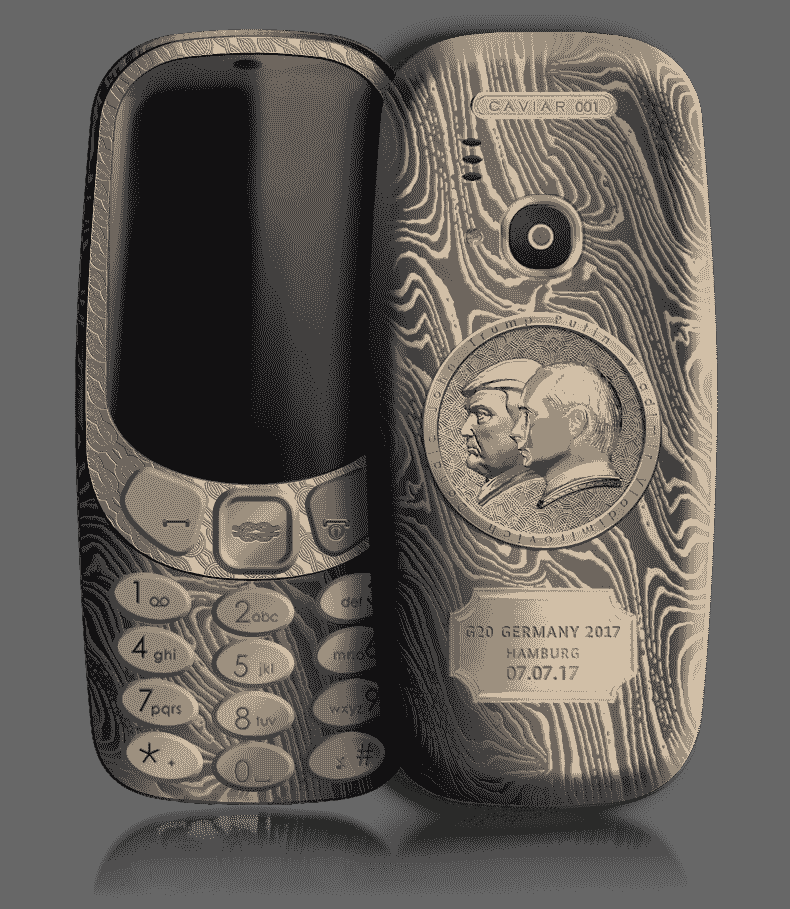

# 购买价值 2，500 美元的普京-特朗普黄金和钛版 TechCrunch，让您的诺基亚 3310 再创辉煌

> 原文：<https://web.archive.org/web/https://techcrunch.com/2017/07/06/make-your-nokia-3310-great-again-with-a-special-2500-putin-trump-gold-and-titanium-edition/>

# 购买价值 2，500 美元的普京-特朗普黄金和钛金特别版，让您的诺基亚 3310 再次焕发光彩

汉堡 G-20 峰会的时间到了，俄罗斯手机定制商 Caviar 用一款非常特别的诺基亚 3310 ( [新款](https://web.archive.org/web/20221210021418/https://beta.techcrunch.com/2017/02/26/nokia-3310-returns-as-hmd-reimagines-a-classic-and-snake/))来纪念这一时刻。包裹在最好的金属，钛和黄金中，背面有一个感人的特朗普和普京的双重侧面。只有 14.9 万卢布，约合 2500 美元。

“等等，”你说。“新的 3310 难道不是一个笨拙的尝试，利用人们对耐用的旧 3310 的怀旧情绪，我们在糖果酒吧手机的年轻时代都购买并喜欢它。”是的，它是。不，Caviar 没有想到要更新收音机，使它能达到超过边缘速度。

但除此之外，它还是这个设备的一个重要部分:

【T2

Caviar 网站阐述了这一豪华升级[的象征意义。](https://web.archive.org/web/20221210021418/http://caviar-phone.ru/nokia/supremo-putin-trump-summit/)

*   两位总统都面向一个方向，这表明他们意见一致。但是他们为什么朝左呢？没有解释。
*   硬化钛的使用强调了力量，原则和坚定，更不用说固执，是为了保护正义和国家所必需的。
*   使用大马士革钢图案是因为它看起来很酷。

有人建议把这件独一无二的物品送给“对当代历史和政治并非漠不关心”的人，这是一个明智的建议。描述末尾的一句神秘警句要么是智慧的金块，要么是特别的俄罗斯威胁:套用一句话，“如果你不参与政治，政治就会与你接触。”一个快乐的想法！

还有[一个 iPhone 7 one](https://web.archive.org/web/20221210021418/http://caviar-phone.ru/caviar-iphone-7/putin-trump-summit/) ，不过没那么惊艳。 [RT 指出](https://web.archive.org/web/20221210021418/https://www.rt.com/viral/395500-putin-trump-meeting-customized-phones/)如果你真的喜欢这一对，你也可以得到刻有它们的牙冠。