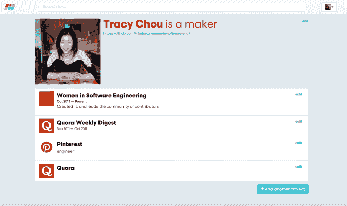
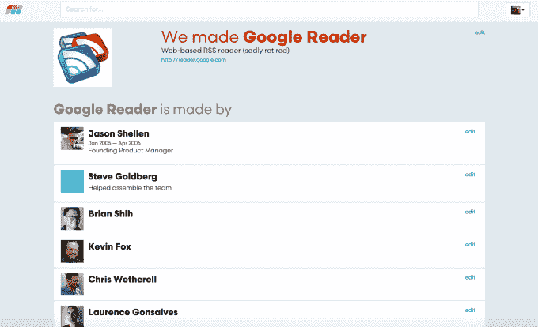

# Makerbase 是一个 IMDb，记录了你最喜爱的应用程序和网站的开发者 

> 原文：<https://web.archive.org/web/https://techcrunch.com/2015/08/11/makerbase-is-an-imdb-of-who-made-your-favorite-apps-and-websites/>

一项名为 [Makerbase](https://web.archive.org/web/20221005150658/https://makerba.se/) 的新服务希望让任何人都能更容易地发现人们日常使用的一些最受欢迎的网站和应用程序的开发者。这个被称为软件开发者的“IMDb”的想法是来自 [ThinkUp 的创始人](https://web.archive.org/web/20221005150658/https://beta.techcrunch.com/2012/03/26/thinkup-app-company-gina-trapani-anil-dash/)——life hacker 的创始编辑[吉娜·特拉帕尼](https://web.archive.org/web/20221005150658/http://www.crunchbase.com/person/gina-trapani)和早期博客和企业家[阿尼尔·达什](https://web.archive.org/web/20221005150658/http://www.crunchbase.com/person/anil-dash)的最新项目。

从本质上来说，Makerbase 是一个可编辑的目录，与初创公司目录 CrunchBase 并非完全不同，但它不一定关注谁创建了一家公司，投资了这家公司，或者谁在那里担任了高管角色，而是关注谁是我们最喜欢的在线和移动工具背后的实际构建技术的人。

“从表面上看，看看我们每天使用的应用和网站是谁开发的很有趣，黑客和创作者能够列出他们所有的工作也很有趣，”Dash 解释道。“但在更大的层面上，这是一个打开行业机会的强大工具，因为它显示了人与人之间的网络和联系，甚至可能让那些不在这个行业的人一瞥谁在制造东西，并有机会获得机会，”他说。

要使用这项服务，该网站的访问者可以登录 Twitter 建立一个账户，然后可以通过添加电子邮件来跟踪页面的变化。

在 Makerbase 的主页上，有一个搜索框，可以让你通过制造商或项目在数据库中进行搜索，还有一个特色制造商的列表，例如 Pinterest 的 Tracy Chou、Locavore 的 Buster Benson、MKBHD 的马克斯·布朗利和 littleBits 的 Ayah Bdeir，以及一个特色项目的列表。

该网站还显示了当天的主要贡献者，并显示了最近的活动，包括新的条目和变化。每个项目条目还包括自己的活动提要，因此您可以看到随着时间的推移添加了谁以及其他更新。

要创建条目，首先要在搜索框中输入它。如果它尚未出现，您可以单击“创建此 Maker”或“创建此项目”来添加它。Makerbase 随后会自动从 Twitter 或 App Store 获取信息来填写详细信息。之后，如果你愿意的话，你可以通过添加从事这项工作的制作者的名字以及他们所做工作的描述来继续充实这个条目。这项服务还显示出创客倾向于与之合作的人，这很有帮助。

Dash 表示，在今天发布之前，该网站已经与数百名用户进行了测试，它将在有史以来第一次白宫[演示日活动中首次向公众亮相。](https://web.archive.org/web/20221005150658/https://www.whitehouse.gov/demo-day)这个活动让来自全国各地的企业家展示他们的项目，而不是像典型的展示日那样向投资者推销。就 Makerbase 而言，它希望为那些希望进入科技行业的人提供资源，并希望找到他们应该认识的人。

“我们推出 Makerbase 作为活动的一部分，因为我们认为让创作者的网络可见确实有助于崭露头角的企业家——特别是那些来自代表性不足的社区的企业家——获得机会，”Trapani 解释说。“我们经常与进入科技行业的年轻人交谈，比学习编程更常见的问题是，他们根本不知道该与谁一起喝咖啡，或者如何了解谁制作了他们愿意帮助开发的应用程序。”

虽然 Makerbase 更多的是作为一个辅助项目，但它确实内置了一个赞助模式来帮助它赚钱——这项服务让你可以识别你用来制作项目的“工具”。发布时，你可以从 Slack、MailChimp 和 Hover 中选择，但该公司计划从明年开始增加更多赞助商。从长远来看，这可能成为一个同样有价值的资源，如果这个功能被进一步开发的话，因为它不仅能让你看到谁做了什么，还能让你看到他们过去是怎么做的。

虽然与 CrunchBase、LinkedIn 甚至 Github 等服务有一些重叠，但 Makerbase 是一种更简单的目录类型，至少目前是这样。用户的个人资料页面相当简单——它们并不总是包括在公司工作的日期或职位，尽管可以添加日期范围以及项目描述，其中可能包括职位。换句话说，它不一定是任何东西的资源，除了谁构建什么和他们喜欢与谁一起工作。

但这本身就有价值，因为它让项目贡献者能够突出他们在网站、应用和服务的一些最佳开发中的作用。这也有助于你发现谁在大型科技公司从事软件工作，在这些公司里，工程师、领导和设计师的名字常常被公司本身的名字所掩盖。

例如，[Google Reader 的一个页面，](https://web.archive.org/web/20221005150658/https://makerba.se/p/50807q/googlereader)现在已经退休(但仍然很受欢迎)的 Google RSS 阅读器，包括一长串以某种形式参与该项目的人的名字。

“CrunchBase 非常关注资金和创始人，”特拉帕尼指出。“我们非常刻意地想让团队中的每一个人都参与进来，包括可能制作了一个标志、或帮助公关、或(做了)其他工作的独立承包商。”

另外，她补充道，“我们认为大多数有创造力的人都有很多不是创业的项目，甚至不一定是他们日常工作的一部分。即使有人创建了一家初创公司，我们也经常发现，他们的联合创始人是几年前与他们一起做周末项目的人，Makerbase 对旧的周末项目和新的初创公司一样关心。”