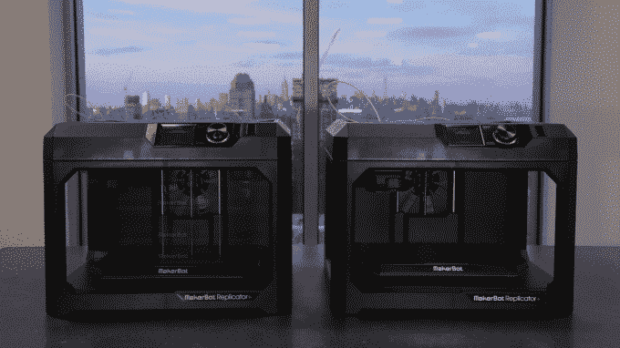
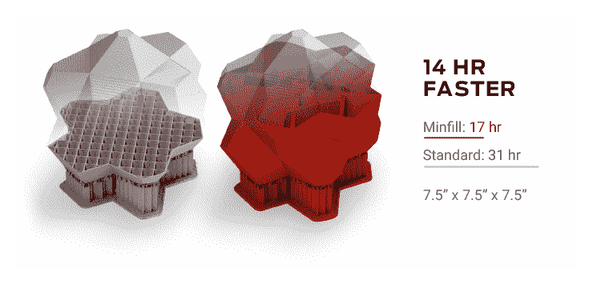

# MakerBot 表示，其新的打印流程将时间和成本降低了约 30% 

> 原文：<https://web.archive.org/web/https://techcrunch.com/2017/03/20/makerbot-print-process/>

MakerBot 的 MinFill 昨晚悄悄到来，作为现有客户的固件升级，该公司已经称其为“3D 打印速度和广泛采用的一大基准。”可以理解的是，许多人对这一领域玩家的这种浮夸声明有点谨慎，特别是当涉及到填充物这样毫不掩饰的不性感的东西时——模型内部防止其倒塌的支撑结构。

然而，在最低限度上，新发布的 MinFill 设置拥有一些潜在的令人印象深刻的数字。这项技术是为该公司的打印软件内部设计的，它运行一种算法，可以确定为模型创建足够填充所需的最少材料量，从而节省材料和打印成本——这两者都是该技术采用的主要症结。

“你可以想象，当你打印一个复杂的形状时，你会得到许多有趣的内部几何图形，这些几何图形在正确的位置支持这个形状，”该公司的工程副总裁 Dave Veisz 告诉 TechCrunch。“最终结果是，它将减少使用的灯丝数量，并缩短打印时间。所以，你可以少印刷一些来得到你的成品。”

当然，由于物体的大小和形状不同，每个项目节省的时间和成本也不同，但 Veisz 表示，两者平均节省了 30%左右，有效地将打印一个物体所需的材料量减少了近三分之一。另一方面，真正几何形状复杂的物体可以节省 80%到 90%的能量。

将该功能想象为桌面 3D 打印技术未来采用的真正驱动力是一个相当大的挑战，但很容易看到它如何为现有用户消除流程中的一个主要痛点，以及当与 3D 打印硬件的未来进步相结合时，如何能够证明桌面 3D 打印体验的一个相当大的升级。

MinFill 是用户在开始印刷之前检查的简单设置，它将印刷过程从简单的重复点阵或交叉影线结构改变为针对特定印刷定制的独特设计。“根据几何形状，”该公司的原始材料说，“它建立了物体内部所需的最小可能的支撑结构，例如开始变窄并分支到需要支撑的区域的柱子，以及用于锚定和支撑这些柱子的极低密度填充物。”

[https://web.archive.org/web/20221025222526if_/https://www.youtube.com/embed/lUITOk56Nic?feature=oembed](https://web.archive.org/web/20221025222526if_/https://www.youtube.com/embed/lUITOk56Nic?feature=oembed)

视频

“这相当复杂，”维斯说。“这是一件很容易概念化但很难执行的事情。有很多方法可以通过大量的手动工作来完成，但简单地通过选择打印模式来让它为可变几何图形工作是非常困难的。”

这是一个很小但潜在重要的进步，因为在围绕该技术的第一波炒作之后，公司近年来一直在经历一个相当重要的过渡阶段。经过相当长一段时间的沉默后，MakerBot 在九月发布了新产品，加倍了其对教育部门的承诺。

当时，该公司告诉媒体，该领域约占其业务的 60%，截至 2015 年(这是该公司最后一次公开发布数据)，已向 5000 所学校发货。

对于 MakerBot 来说，MinFill 是在专业领域的一次尝试——这个领域占该公司购买基础的 30%左右(消费者占 10%左右)。用这种背景制作的模型并不特别耐用。相反，它的设计考虑到了原型。

“我们实际上看到桌面 3D 打印正在扰乱工业市场，”该公司媒体关系团队的 Josh Snider 说。“因此，那些原本会外包非常昂贵的 Objet 打印或从我们的母公司[Stratasys]购买 10 万至 100 万美元机器的公司，我们看到他们越来越多地使用桌面 3D 打印。”