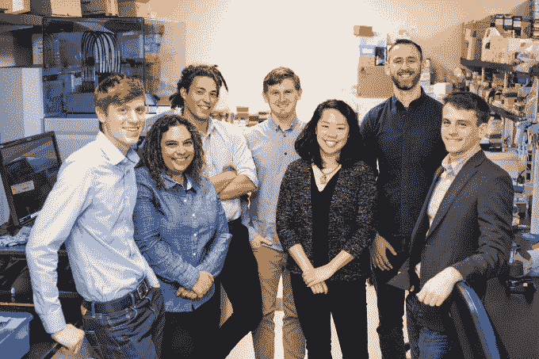

# Mammoth Biosciences 为其基于 CRISPR 的疾病检测引擎 TechCrunch 筹集了 2300 万美元

> 原文：<https://web.archive.org/web/https://techcrunch.com/2018/07/31/mammoth-biosciences-funding-crispr-doudna/>

# Mammoth Biosciences 为其基于 CRISPR 的疾病检测引擎筹集了 2300 万美元

猛犸生物科学公司是一家生物技术公司，它与 CRISPR 传奇人物 Jennifer Doudna 建立了密切的关系，已经在一轮强劲的 a 轮融资中筹集了 2300 万美元。猛犸之前从 NFX 筹集了 12 万美元，该公司在 2018 年 4 月退出隐形模式的过程中继续悄悄筹集资金。本轮由梅菲尔德牵头，NFX 和 8VC 参与其中。

个人投资者也对猛犸象颇感兴趣。苹果公司的蒂姆·库克(Tim Cook)和早期癌症筛查公司 Grail(Grail)的前首席执行官杰夫·胡伯(Jeff Huber)也悄悄地参与了这一轮融资，金额不详。

众所周知，CRISPR 的发现是一项革命性的科技突破，对许多人来说意义重大，但对猛犸生物科学公司来说，最重要的是搜索功能。

“CRISPR 首先是生物学的搜索引擎，”猛犸象联合创始人兼首席执行官特雷弗·马丁在接受 TechCrunch 采访时表示。这意味着使用指导 RNA 来指导 CRISPR 蛋白质搜索任何特定的 DNA 或 RNA 序列。这一过程为基因分型、肿瘤学、传染病甚至农业等领域提供了一个实用的世界。

[https://web.archive.org/web/20221207134641if_/https://www.youtube.com/embed/8Q1PFt2IiOg?feature=oembed](https://web.archive.org/web/20221207134641if_/https://www.youtube.com/embed/8Q1PFt2IiOg?feature=oembed)

视频

Mammoth 计划利用这笔资金进行关键招聘，充实其知识产权组合，但公司的大部分资源将用于开发平台，使公司的合作伙伴能够插入并搜索他们自己的生物标记。马丁补充说，这笔资金也将使 Mammoth 教育人们 CRISPR 如何在诊断中发挥强大的作用。

Mammoth 由两位斯坦福大学博士 Trevor Martin(首席执行官)和 Ashley Tehranchi(首席技术官)以及两位伯克利大学博士 Lucas Harrington 和 Janice Chen 领导。詹妮弗·杜德纳也是猛犸公司的联合创始人和顾问委员会主席。除了资金消息，Mammoth 还在其科学顾问委员会中增加了蛋白质工程专家 Dave Savage 和传染病专家 Charles Chui。

未来的合作伙伴关系是 Mammoth 业务的核心，该公司的目标是使其 CRISPR 支持的搜索引擎成为疾病检测的首选平台。该公司尤其热衷于在制药和农业领域建立合作伙伴关系，尽管它也有在发展中国家提供负担得起的即时检测的长期计划。

“Mammoth 开发了一个变革性的平台，能够在没有相关设备的情况下检测 DNA 和 RNA 的核酸分析，”Mayfield 的 Ursheet Parikh 谈到该公司的使命。“这有可能显著降低诊断成本，而诊断是医疗保健变革的基本驱动力。”