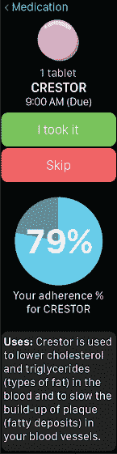
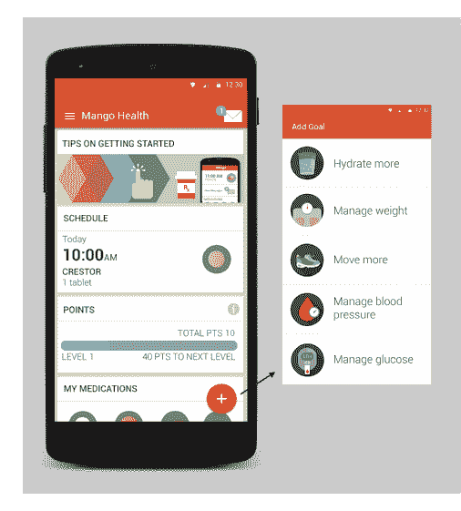

# Mango Health 的药物处方、健康应用程序关注 Apple Watch 上的理想位置 

> 原文：<https://web.archive.org/web/https://techcrunch.com/2015/03/16/mango-health-smartwatch-app/>

# 芒果健康的药物处方，健康应用程序关注苹果手表上的理想位置

与来自移动和社交游戏行业的高管一起， [Mango Health](https://web.archive.org/web/20221225054649/http://www.mangohealth.com/) 一直在研究让游戏上瘾的行为机制，并将它们应用于医疗保健领域更棘手的问题。

两年前，[他们推出了一款手机应用](https://web.archive.org/web/20221225054649/https://techcrunch.com/2013/04/02/mango-health-2/)，帮助患者坚持服药，或者是否每天都在服药。

据首席执行官 Jason Oberfest 称，自该应用程序推出以来，该公司已经与该国最大的医院系统之一进行了为期一年的临床试验，他说他们的合作伙伴目前不能公开分享。与 Oberfest 之前在移动游戏领域的职业生涯相比，这项研究的参与者总数很少，在该领域，游戏拥有数千万活跃玩家。

但是坚持率和参与度都很高。芒果健康的移动应用程序的一年回报率为 34%。这意味着三分之一报名的人在*一年*后仍会回来。(手机游戏一般会看到*一个月*百分之三十左右的回报率。)

他们还发现每个用户平均每周有 17.1 次会话，这表明芒果健康的客户群可能每天至少打开该应用两次。然后，DAU/MAU 比率，这是游戏世界中常用的统计数据，用于衡量每天回来的每月活跃用户的百分比，约为 77%。这意味着芒果健康每月大约有四分之三的用户每天都会回来。

有了这些数据，Oberfest 说该公司现在正将其注意力扩展到整体健康，而不仅仅是药物处方的坚持。Mango Health 的目标是 Zynga 和其他游戏公司在 21 世纪头十年追求的“Farmville 人口统计”——基本上是中年妇女。

他们正在扩展该应用程序，以跟踪水合作用、身体活动，然后监测血糖和血压。

他们还为苹果手表带来了一个应用程序。虽然我对通过可穿戴设备将更多分散注意力的应用程序通知捆绑到自己身上感到犹豫，但健康和保健绝对是一个有意义的领域。吃药、喝水或者因为久坐不动而被提醒运动，这些都是低接触活动，可穿戴设备感觉设计得很好。

该应用程序将在需要服药的时候发送通知，并显示迄今为止你遵守处方的情况。