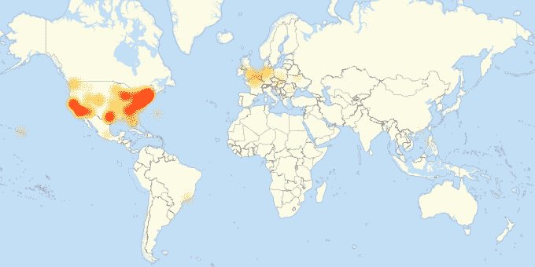

# 大型 DDoS 攻击导致 Twitter、Spotify 和其他网站中断

> 原文：<https://web.archive.org/web/https://techcrunch.com/2016/10/21/many-sites-including-twitter-and-spotify-suffering-outage/>

今天，针对互联网目录服务的几波主要网络攻击导致数十个热门网站离线，中断一直持续到下午。

许多用户全天都无法访问 Twitter、SoundCloud、Spotify、Shopify 和其他网站。该公司[证实](https://web.archive.org/web/20230403221059/https://www.dynstatus.com/incidents/nlr4yrr162t8)这些中断是对 DNS 提供商 Dyn 的几次分布式拒绝服务(DDoS)攻击的结果。T2 黑客新闻首先报道了这次中断。

“我们正在积极参与这次攻击的第三个侧面，”Dyn 的首席战略官凯尔·约克(Kyle York)在美国东部时间今天下午 4 点 30 分左右告诉记者。“这是一次非常聪明的攻击。当我们缓解时，他们会做出反应。”

Dyn 的总法律顾问戴夫·艾伦补充说，在其他基础设施公司 Akamai 和 Flashpoint 的帮助下，Dyn 已经确定，攻击中使用的一些流量来自 Mirai 未来组合僵尸网络，这是一个受感染的物联网设备网络，用于最近的其他大规模 DDoS 攻击。

Dyn 和其他 DNS 提供商充当您在浏览器中键入的 URL 和相应 IP 地址之间的链接。DDoS 攻击经常被用来审查特定的网站，用垃圾流量淹没它们并使它们离线。然而，通过攻击 Dyn，有可能淹没该目录功能，并导致大范围互联网的中断和加载问题。

其他遇到问题的网站包括 Box、波士顿环球报、纽约时报、Github、Airbnb、Reddit、Freshbooks、Heroku 和 Vox Media properties。欧洲和亚洲用户遇到的问题可能比美国用户少——根据 [DownDectector 的中断地图](https://web.archive.org/web/20230403221059/http://downdetector.com/status/level3/map/)，针对 Dyn 的 DDoS 攻击主要影响美国用户。

对 Dyn 的 DDoS 攻击始于今天早上。美国东部时间上午 9 点 30 分左右，服务暂时恢复，但第二次攻击在中午左右开始，再次使网站离线。DNS 提供商表示，工程师们正在努力“缓解”这个问题，但第三波问题在美国东部时间下午 4 点 30 分左右开始，大约两个小时后才得到解决。

“攻击的复杂性让我们的工作变得更加复杂。它是如此分散，来自全球数千万个源 IP 地址。Dyn 公司的约克解释说:“他们所做的就是随着每次袭击在世界各地移动。约克说，DDoS 攻击最初的目标是该公司在东海岸的数据中心，然后转移到国际数据中心。他补充说，这次攻击包含“我们部分基础设施的具体细节”。

白宫新闻秘书今天早上告诉媒体成员，国土安全部正在调查这次袭击。Dyn 员工表示，该公司正在与执法部门合作调查这些攻击，并获得了客户、竞争对手和国务院的支持。

Dyn 表示，它尚未将此次攻击归咎于任何组织或国家，DDoS 流量来自全球数千万个分散的 IP 地址。尽管 DDoS 攻击有时会伴有勒索信，要求公司交出比特币以换取停止攻击，但 Dyn 表示，它尚未收到攻击者的任何消息。“我们正在与执法机构和基础设施机构一起努力工作，”约克在谈到归属过程时说。“没人想成为下一个。”

对 Dyn 的 DDoS 攻击紧随历史上最大的 DDoS 攻击之后，该攻击使用 Mirai 未来组合僵尸网络来攻击独立网络安全记者 Brian Krebs 的网站。虽然 DDoS 攻击历史上一直使用被称为僵尸网络的大型受损计算机网络向网站发送垃圾流量，淹没它们并使合法用户无法访问它们，但 Krebs 攻击通过使用安全摄像头等受损的物联网设备来构建僵尸网络，从而扩大了规模。物联网设备制造成本低廉，而且不安全是出了名的，这使得它们很容易受到攻击。

在 Krebs 网站遭到攻击后，用于构建僵尸网络的[代码在网上泄露，使得更多大规模 DDoS 攻击不可避免。](https://web.archive.org/web/20230403221059/https://krebsonsecurity.com/2016/10/source-code-for-iot-botnet-mirai-released/)

“全球有 34 亿互联网用户和 100 亿至 150 亿台物联网设备。这是个复杂的世界。我们所能做的就是齐心协力，看看我们如何纠正这种情况，”约克说。

安全研究员 Bruce Schneier [在 9 月份报告](https://web.archive.org/web/20230403221059/https://www.schneier.com/blog/archives/2016/09/someone_is_lear.html)称，几家互联网基础设施公司已经成为 DDoS 攻击的目标，尽管它们并没有造成今天所经历的大范围中断。施耐尔写道，这些攻击似乎是为了测试公司的防御能力:

> “这些攻击比他们过去看到的要大得多。它们持续的时间更长。他们更老练。它们看起来像探针。一周内，攻击会以特定的攻击级别开始，然后慢慢增加，最后停止。下一周，它将从那个高点开始并持续下去。诸如此类，就像攻击者在寻找确切的失败点一样。”

“有人正在广泛测试提供关键互联网服务的公司的核心防御能力，”施奈尔补充说。

如果你遇到连接问题，你可以尝试更改你的 DNS 设置(关于如何在 Mac 和 Windows 上这样做的说明是[这里](https://web.archive.org/web/20230403221059/http://vodafone.intelliresponse.com/index.jsp?id=1754&question=Changing+your+computerrsquo%3Bs+DNS+settings+to+automatic&requestType=NormalRequest&source=100#osx))。有趣的是，我们的员工已经使用了 OpenDNS(208.67.222.222 和 208.67.220.220)和 [OpenNIC 服务器](https://web.archive.org/web/20230403221059/https://www.opennicproject.org/nearest-servers/)，并且看到了连接性的改善。

*发展中…*