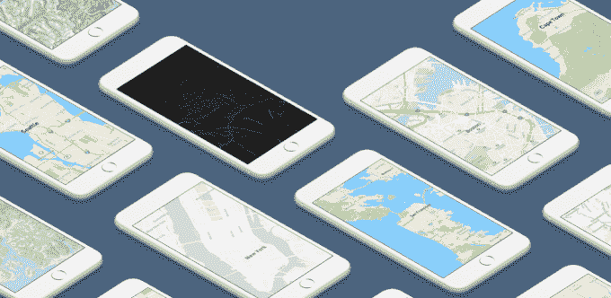
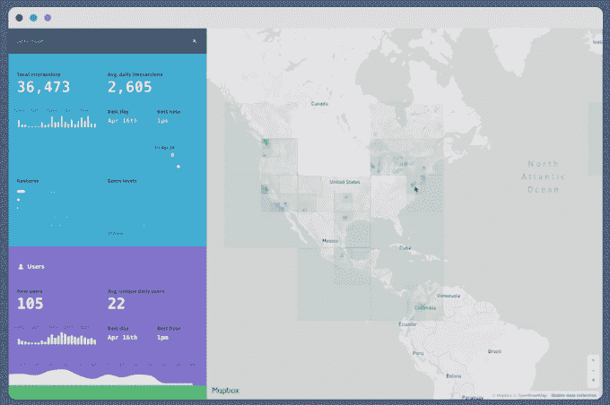

# Mapbox 通过 SDK 将地图放入 iOS 应用程序中挑战苹果 

> 原文：<https://web.archive.org/web/https://techcrunch.com/2015/05/21/mapbox-takes-on-apple-with-an-sdk-to-put-maps-into-ios-apps/>

诺基亚地图部门 Here mapping 的即将出售，将人们的注意力集中到了位置尤其是地图在移动世界中扮演的角色上。虽然我们看到许多知名公司成为潜在的追求者，包括百度、优步、脸书等，但旧金山的一家新贵公司希望提供自己可行的——而且它认为更好的——替代选择。

基于开源的 OpenStreetMap 和其他一些聪明的资源的地图和位置数据开发者 Mapbox ，正在为移动应用开发者推出一个免费的[SDK](https://web.archive.org/web/20230213072435/https://www.mapbox.com/mobile/)来代替本地地图系统，只需替换一行代码。

它今天将在 iOS 上发布，用 Mapbox 首席执行官埃里克·贡德森的话说，“API 与(苹果的)Mapkit 完全匹配，非常容易切换。”他称 iOS Mapbox 为“海滨”，但补充说 SDK 也将“很快”登陆 Android。

目前，贡德森表示，新 SDK 的定价将对多达 50，000 名月活跃用户免费。“暂时”是这里的关键词。“老实说，我们不确定如何最好地为 MAUs 收费，所以我们只是想‘嘿，让我们启动这个并与开发者展开对话，以帮助我们指导我们应该如何改变，’”他说。

Mapbox 不打算做的一件事是推出自己面向消费者的应用程序，与这些开发者展开潜在竞争。

换句话说，Mapbox 将自己定位于“位置提供商即资产”这一仍然较新的类别，Waze 等公司在这一领域发展了业务，Foursquare 等其他初创公司也希望在这一领域找到更长期的市场价值。four square 也是一家提供详细位置(但不是地图)数据的公司。

但它不会建立自己的面向客户的服务来实现这一目标。“我们永远不会有一个应用程序，”贡德森说。“我们只是要为其他应用的定位部分提供动力。”

#### Mapbox 是如何发展到今天这个地步的

到目前为止，Mapbox 已经成为一家非常详细的地图提供商，能够从谷歌或苹果的典型原生地图中调出不同种类的细节，例如，不仅考虑道路方向，还考虑道路是向上还是向下的地形，这对于规划步行或骑自行车的路线非常有用。到目前为止，很多这样的东西已经通过更长的项目集成到应用程序中。

现在，Mapbox 将提供四种不同的风格——除了地形之外，还为那些想要覆盖文本的人提供非常详细的街道和明暗风格，设计师也将很快选择在原始数据的基础上建立自己的风格。所有这些都是使用视频游戏图形技术构建的，并以每秒 60 帧的速度渲染。

在后端，Mapbox 还提供了一个仪表板——如下图所示——显示人们如何使用基于 Mapbox 的应用四处移动。这反过来使他们能够深入查看热门街区和其他基于位置的趋势数据。

苹果在 2012 年做出了一个重大决定，要建立自己的地图服务，取代谷歌，这一决定遭到了很多批评，因为该公司迄今为止处理这个不小的任务的方式非常好。

苹果已经进行了几次[收购](https://web.archive.org/web/20230213072435/https://techcrunch.com/2015/05/17/apple-is-mapping-out-better-navigation-with-the-acquisition-of-gps-firm-coherent-navigation/)，为自己的位置和地图库增加更多的人才；与像 TomTom 这样的地图数据提供商续签关键合同；并且还在寻找更多的人来填补这个领域的空缺；但是仍然有许多工作要做。

贡德森公开嘲笑苹果迄今为止在这项任务上的表现，他认为这为像他这样的公司创造了一个机会。

“苹果不仅不擅长地图，也不重视位置，”贡德森说。“苹果的分析看起来像 2007 年的谷歌分析。我们的地图不仅更好更漂亮。每个开发者都应该知道人们是如何使用他们的应用的。”

除了在地图数据中使用 OSM 之外，Mapbox 一段时间以来一直在研究 T2，以及其他获得更具体、更准确信息的方法。

虽然像[谷歌](https://web.archive.org/web/20230213072435/http://www.google.com/maps/about/behind-the-scenes/streetview/)、[苹果](https://web.archive.org/web/20230213072435/http://www.cultofmac.com/312720/mysterious-apple-minivans-are-mapping-vehicles/)和诺基亚这样的公司使用漫游的实体车辆来帮助记录他们服务的位置数据，但 Mapbox 开发了一种不同的、基于软件的方法来建立其数据集。

这有点类似于公共 WiFi 网络如何成为基于位置的信息库。它利用一个安装了来自约 5000 个平台的应用程序的设备网络——现有的付费地图框客户包括 Foursquare、Pinterest、Github、Evernote 和英国《金融时报》——剥离了除地图数据之外的所有内容，并利用这些数据继续增强其基础数据集。

“随着人们的使用，我们的地图变得越来越好，”贡德森说。“数据在收集时会被聚合和匿名，并通过添加新的道路、显示交通状况、最佳估计到达时间等来帮助我们制作更好的地图。”它通过与 EFF 合作，对隐私和透明度采取了相当强硬的态度。

但有趣的是，除此之外，Mapbox 还在考虑拾取这种数据背后的硬件机制。具体来说，Mapbox 一直在研究能够在不耗尽手机电池的情况下获取和传递位置信息的方法[——这也是位置服务经常被关闭的主要原因之一。](https://web.archive.org/web/20230213072435/https://www.mapbox.com/blog/optimizing-battery-ios/)

“我们花了几个月的时间破解 iPhones，”贡德森说。“我甚至不想承认我们在测试中打破了多少。”

即使这一成本对 Mapbox 来说可能是一个相对较高的项目(这家初创公司迄今为止只从 Foundry Group 和 Knight Foundation 筹集了大约 1000 万美元)，贡德森认为这远远比不上大公司仍在使用的老方法的成本。

“诺基亚在这里只是做错了，”他谈到该公司现在待售的地图部门是如何构建其数据集的。“他们每年花费超过 5 亿美元来驾驶汽车和处理这些数据。这就是你 10 年前制作地图的方式——就像回到你拥有这些诺基亚的小笨手机的时候。这些家伙不理解为移动设备开发和为开发者开发工具的想法——如果他们理解，他们将能够获得实时数据流并拥有更好的地图。未来是关于开放数据、开发人员的优秀工具以及来自用户的实时数据，这些数据将反馈到更好的地图中。”

所有这些都可能是真的，但有趣的是，长期开发者是否会对这里提供的额外功能足够感兴趣，或者受到它们的新启发，要么从现有的地图 API 进行转换，要么创建新的应用程序。

在平台方面，就目前而言，苹果、谷歌和其他公司对于开发者在应用中使用自己的原生地图还是其他人的地图持灵活态度。但是，随着收集和提供位置数据的价值增长，这种开放的方法是否会继续下去，不受限制，这是值得怀疑的。

