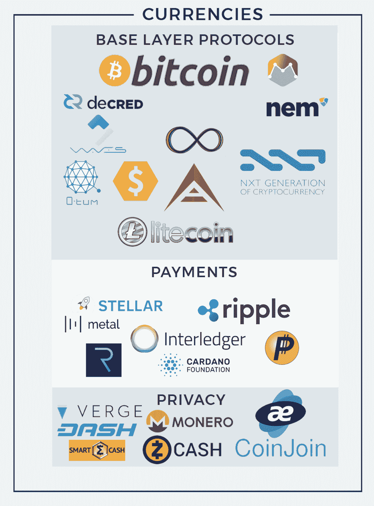
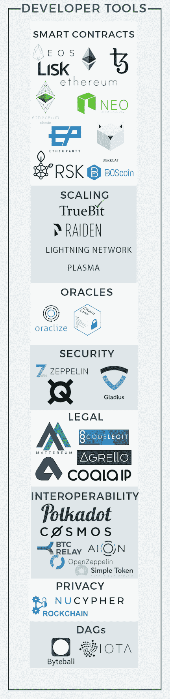
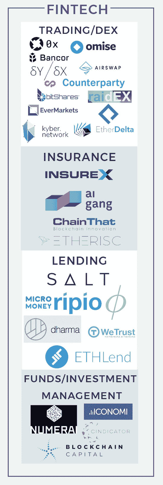
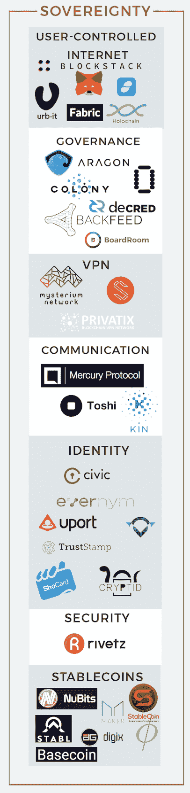
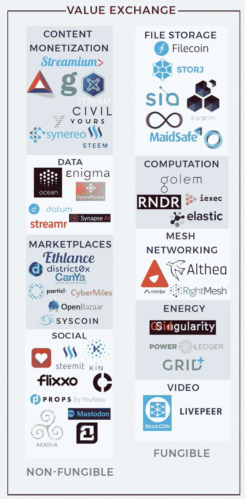
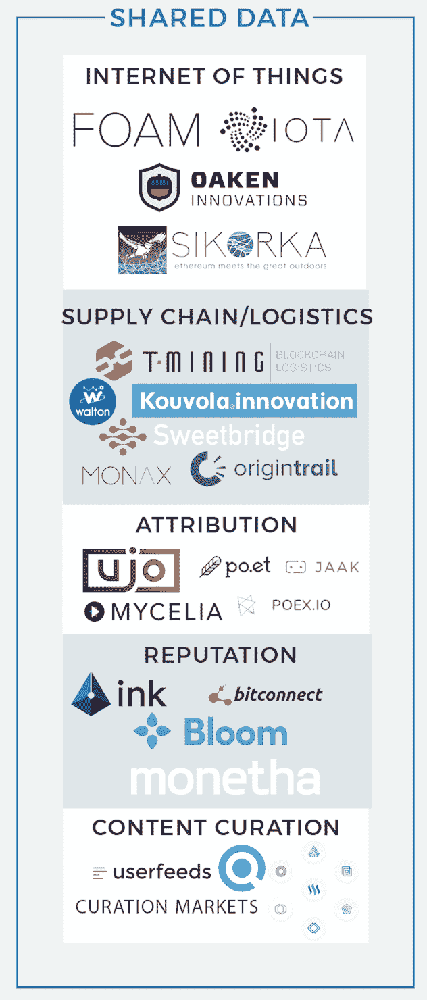
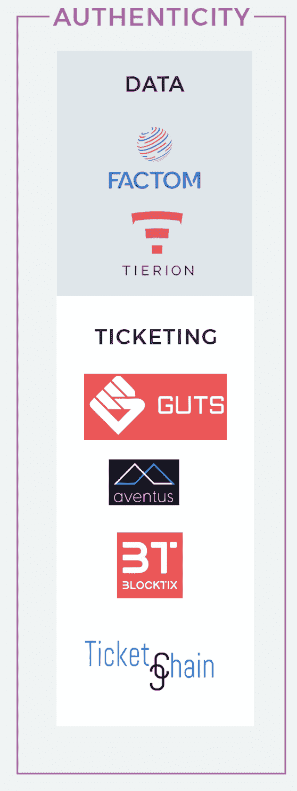

# 描绘区块链项目生态系统

> 原文：<https://web.archive.org/web/https://techcrunch.com/2017/10/16/mapping-the-blockchain-project-ecosystem/>

乔希·娜斯鲍姆撰稿人

约书亚·娜斯鲍姆是纽约风险投资公司的合伙人，

[Compound](https://web.archive.org/web/20230306102925/https://compound.vc/)

.

[区块链技术、加密货币和代币销售](https://web.archive.org/web/20230306102925/https://medium.com/@josh_nussbaum/the-ico-bubble-6cadefaf8cbc)现在风靡一时。在我从事风险投资行业的 5 年多时间里，就新公司(或项目)的形成而言，这是我见过的技术领域中发展最快的一次。

就在不久前，创始人和风投还主要专注于集中式交易所、企业或私人区块链解决方案、钱包以及其他几个受欢迎的区块链初创公司创意，这些创意在 2012 年至 2016 年左右主导了市场。

然而，正如我几个月前所写的那样，以太坊的兴起及其图灵完全脚本语言和开发人员在每个块中包含状态的能力，为智能合约开发铺平了道路。这导致了建设分散项目的团队涌入，寻求利用区块链最有价值的财产——在没有中介或中央权威的情况下达成每个人都同意的共享真理的能力。

在改进现有区块链功能和消费者体验方面，有许多令人兴奋的开发即将上市。然而，鉴于项目进入市场的速度很快，我发现很难跟踪每个项目以及每个项目在生态系统中的位置。

此外，如果对众所周知的森林没有一个全面的了解，就很容易因为树木而错过森林。

因此，[这是我一直在关注的所有分散的区块链项目的汇总清单](https://web.archive.org/web/20230306102925/https://imgur.com/a/xvTjM)，并通过研究挖掘出来，以及生态系统中朋友的建议。

快速声明:虽然很难将多个项目归入一个类别，但我尽了最大努力来确定每个项目的主要目的或价值主张，并将其归类。当然，有许多项目属于灰色区域，可以归入多个类别。最难的是“fat 协议”,它在多个领域提供功能。

下面是我所确定的每一个大类的概述，涉及到组成它们的一些子类:

### 货币

在很大程度上，创建这些项目的目的是为各种用例建立一种更好的货币，而 ***要么代表价值储存、交易媒介，要么代表记账单位*** 。

虽然比特币是该类别中第一个也是最突出的项目，但许多其他项目都是为了改善比特币协议的某个方面，或者针对特定的用例进行调整。

隐私子类别可能属于支付或基础层协议类别，但鉴于匿名、不可追踪的加密货币(特别是 Monero 和 ZCash)对于那些因为这样或那样的原因不愿公布某项购买的用户或不想泄露商业秘密的企业来说是多么重要，我决定将它们分开。

***开发者工具***

这一类别中的项目主要由开发人员用作分散式应用程序的构建块。为了允许用户通过应用程序接口直接与协议交互(除了金融用例之外的用例)，这里的许多当前设计需要被大规模验证。

围绕伸缩性和互操作性的协议设计是活跃的研究领域，将是 Web3 开发栈的重要部分。

在我看来，无论是从求知欲还是从投资角度来看，这都是目前比较有趣的类别之一。

***为了实现我们承诺的许多区块链用例，例如完全分散的自治组织或用户可以控制自己的数据的脸书替代方案，基础的、可扩展的基础设施需要发展和成熟*** 。

这些项目中的许多都旨在做到这一点。

此外，这些项目不属于“赢家通吃”的领域，不像加密货币那样可以作为价值储存手段。

例如，构建一个分散的数据市场可能需要许多开发人员工具子类别，例如用于智能合约的 [【以太坊】](https://web.archive.org/web/20230306102925/https://ethereum.org/)；用于更快计算的[true bit](https://web.archive.org/web/20230306102925/https://truebit.io/)；用于代理重新加密的[NuCypher](https://web.archive.org/web/20230306102925/http://www.nucypher.com/)；用于安全性的[ZeppelinOS](https://web.archive.org/web/20230306102925/https://zeppelinos.org/)；以及用于安全性的

由于这些是协议而不是集中的数据孤岛，因此它们可以相互通信，这种互操作性使新的用例能够通过在单个应用程序中共享来自多个协议的数据和功能而出现。

[Preethi kasi Reddy](https://web.archive.org/web/20230306102925/https://twitter.com/iam_preethi)在这里 很好地解释了这种动态 [。](https://web.archive.org/web/20230306102925/https://medium.com/swlh/the-synergies-gained-from-building-on-ethereums-decentralized-app-ecosystem-22a709a675d2)

### 金融科技

这个类别相当简单。当您与许多不同的协议和应用程序进行交互时(例如上面的开发人员工具示例)，许多协议和应用程序可能有自己的本地加密货币，因此出现了许多新的经济。

在任何有多种货币的经济体中，都需要将一种货币单位兑换成另一种货币单位的工具，以促进借贷、接受投资等。

分散交易(DEX)子类可以被归类为开发者工具。

许多项目已经开始集成 [0x 协议](https://web.archive.org/web/20230306102925/https://0xproject.com/) ，我预计这种趋势在不久的将来还会继续。在一个有可能出现过多令牌的世界里，只有当使用令牌的复杂性被抽象出来时，使用多个令牌的应用程序的广泛采用才是可能的——这是去中心化交换所提供的好处。

贷款和保险子类别都通过风险聚集受益于规模经济。

***通过开放这些市场，允许人们在更大的池中或在差异化的基础上(取决于他们的风险状况)定价，成本可以降低，因此理论上消费者应该会赢*** 。

区块链既是有状态的，也是不可变的，因为以前的交互存储在链上，用户可以确信组成他们个人历史的数据没有被篡改。

### 主权

正如团队在 [碉堡](https://web.archive.org/web/20230306102925/https://blockstack.org/) 在他们的 [白皮书中所描述的:](https://web.archive.org/web/20230306102925/https://blockstack.org/whitepaper.pdf)

***“在过去的十年里，我们看到了从桌面应用(在本地运行)到基于云的应用(在远程服务器上存储用户数据)的转变。这些集中式服务是黑客的主要目标，并且经常遭到黑客攻击。”***

主权是我目前觉得最有趣的另一个领域。

虽然区块链仍然面临可扩展性和性能问题，但当处理敏感数据时，其不可信架构提供的价值可以取代性能问题；今天我们不得不依靠第三方来保管它。

***通过密码经济学，用户不需要信任任何个人或组织，而是相信当受到正确激励时，人类会理性行事的理论。***

这一类别的项目为这个世界提供了必要的功能，在这个世界里，用户不必相信任何个人或组织，而是相信通过加密和经济学实现的激励。

### 价值交换

比特币协议的一个关键设计是能够在几个不同的方之间建立信任，尽管这些方在区块链境外没有关系或信任。交易可以由各方以不可改变的方式创建和共享数据。

人们普遍认为，当通过市场协调生产的成本高于单个企业内部的成本时，人们就开始组织成企业。

但是，如果人们可以组织成这个众所周知的“公司”,而不必相互信任，那又会怎么样呢？

***通过区块链和密码经济学，发展信任的时间和复杂性被抽离，这允许大量的人协作并分享这种协作的利润，而没有传统公司的层级结构*** 。

如今，为了维持秩序、维护安全和执行 P2P 市场规则，中间商和寻租者是必不可少的恶魔。但在许多领域，这些密码经济系统可以取代这种信任，而切断中间商及其费用将允许用户以低得多的成本交换商品和服务。

子类别中的项目可以分为两大类:可替代的和不可替代的。允许用户交换可替代商品和服务的市场将使存储、计算、互联网连接、带宽、能源等东西商品化。如今，销售这些产品的公司在规模经济上竞争，而规模经济只能被更好的规模经济所取代。

通过开放潜在供应，允许任何人加入网络(通过[1 协议](https://web.archive.org/web/20230306102925/https://1protocol.com/) 等项目，这将变得更容易)，这不再成为一项令人生畏的任务，再次将利润率降至零。

不可替代市场没有同样的好处，尽管它们仍然允许供应商赚取他们的商品或服务的实际价值，而不是中间商在抽取他们的份额后认为它的价值。

### 共享数据

考虑共享数据层模型的一种方法是看看航空业的全球分销系统(GDS 的)。GDS 是一个集中的数据仓库，所有的航空公司都将库存数据放在这里，以便最好地协调所有的供应信息，包括航线和价格。

这使得 Kayak 和该领域的其他公司能够通过在这些系统上建立用户可以交易的前端来取代传统的旅行社。

通常，对中介集成商最有吸引力的市场是那些直接竞争存在明显进入壁垒的市场，但技术进步创造了一种催化剂，使中介能够整合现有服务提供商、相关元数据和消费者偏好(如 GDS 的情况)。

***通过区块链项目提供的财政激励，我们正在见证一个最具影响力的技术催化剂，它将打开无数市场，只是价值不再归聚合者，而是归提供数据的个人和公司。***

2015 年，Hunter Walk [写道](https://web.archive.org/web/20230306102925/https://hunterwalk.com/2015/07/20/a-is-ebays-reputation-system-a-hidden-gem/) 过去十年错过的最大机会之一是易贝未能向第三方开放他们的信誉系统，这将使他们成为 P2P 商务的中心。

我甚至会更进一步，认为易贝最有价值的资产是长期积累的信誉数据，这迫使用户锁定，并赋予易贝向用户征收高额税款的权力，让他们安心地与优秀的演员交易。在共享数据区块链协议中，当其他应用程序与共享数据协议挂钩时，用户可以随身携带这些类型的数据集，从而降低准入门槛；竞争加剧，最终加快了创新的步伐。

考虑共享数据协议的另一种方式可以最好地用一个集中的公司来描述，例如 [前提数据](https://web.archive.org/web/20230306102925/https://www.premise.com/) 。Premise Data 部署了网络贡献者，他们从 30 多个国家收集从特定食品/饮料消费到特定地理区域所用材料的各种数据。

该公司使用机器学习来提取见解，然后将这些数据集出售给一系列客户。 ***与其寻找和雇佣人员来收集这些数据集，不如启动一个项目，让任何人都可以收集和分享这些数据，对数据进行注释，并构建不同的模型来从数据中提取见解*** 。

贡献者可以获得代币，随着公司使用代币购买网络的数据集和见解，代币的价值将会增加。理论上，结果将是更多的贡献者和更高质量的数据集，因为市场设定了信息的现行价格，并根据参与者的贡献给予相应的补偿。

有许多类似的可能性，因为“开放数据平台”已经成为一个流行的创业想法好几年了，有几家公司发现这种模式非常成功。我预见的挑战将是销售和业务发展。

这些公司中的大多数将他们的数据集出售给更大的组织，看看未来分散项目如何分配他们的数据集将会很有趣。考虑到私营公司的经济状况，作为一个独立的私营组织，也有一些以前不可能或无法盈利的机会。

### 真实性

最终，加密货币只是特定区块链本地的数字资产，该类别的项目使用这些数字资产来代表真实世界的商品(如门票)或数据。

***公共区块链的不变性使网络参与者确信，写入其中的数据没有被篡改或以任何方式更改，并且在未来很久仍将可用和可访问*** 。

因此，对于敏感数据或传统上充斥着欺诈的商品市场，使用区块链向用户保证其完整性是有意义的。

### 外卖

虽然在所有这些类别中都出现了许多创新，但我最感兴趣的是刚刚起步的项目，它们通过提供不同用例所需的功能、通过用户数据访问控制的主权以及可替换的价值交换来支持 web3 开发堆栈。

除了金融投机，我们还没有看到主流加密货币用例，基础设施开发和用例在极其微妙的领域(如身份、信用评分、VPN 等)在成本、隐私和/或安全性方面对用户来说都非常优越，似乎最有可能获得重大价值。

从长远来看，我对让整个生态系统受益于共享数据和网络自举(不可替代的价值交换)的项目感到兴奋。我很确定还有其他几个地方我没有看对或者还没有想出来！

一如既往，如果你正在构建符合这些标准的东西，或者有任何意见、问题或争论点，我很乐意听到你的意见。

*感谢 [杰西·瓦尔登](https://web.archive.org/web/20230306102925/https://twitter.com/jessewldn)[拉里·苏克尼克](https://web.archive.org/web/20230306102925/https://twitter.com/lsukernik)[布伦丹·伯恩斯坦](https://web.archive.org/web/20230306102925/https://twitter.com/BMBernstein)[郭凯文](https://web.archive.org/web/20230306102925/https://twitter.com/kevinakwok)迈克·邓普西*

***免责声明:Compound 是 Blockstack 和本文提到的另外两个尚未公布的项目的投资者。***

**本文首次出现在[媒体](https://web.archive.org/web/20230306102925/https://medium.com/@josh_nussbaum/blockchain-project-ecosystem-8940ababaf27)上，经乔希·娜斯鲍姆许可，现已再版。*