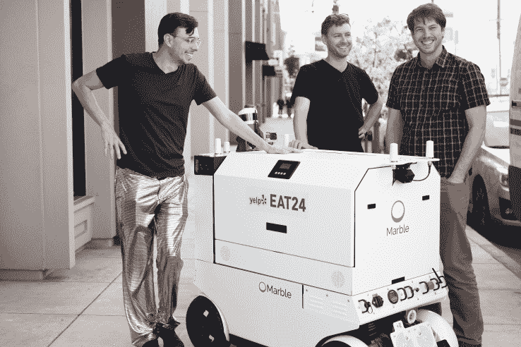
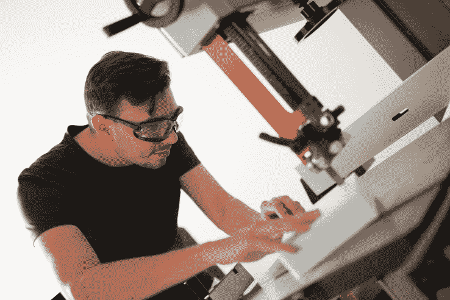

# Marble 和 Yelp Eat24 在旧金山开始机器人送餐

> 原文：<https://web.archive.org/web/https://techcrunch.com/2017/04/12/marble-and-yelp-eat24-start-robot-food-delivery-in-san-francisco/>

管理送餐机器人使用的规则在美国仍有待观察。但是主要的食品企业已经在调查这种可能性了。在最近的交易中， [Yelp Eat24](https://web.archive.org/web/20230316161133/https://eat24hours.com/) 已经开始与 [Marble](https://web.archive.org/web/20230316161133/http://www.marble.io/) 合作，在旧金山选定的社区测试机器人送货。

本月早些时候，TechCrunch 发现了贴有 Yelp Eat24 标志的 Marble[送货机器人](https://web.archive.org/web/20230316161133/https://techcrunch.com/2017/03/19/yelp-eat24-marble-delivery-robot/)。但是这些公司今天正式宣布了他们的机器人送货服务。

Marble 是少数几家开发地面机器人的企业之一，这些机器人可以自主导航到客户的地址。他们的机器看起来像一个巨大的厨房设备和一辆火星探测车。

用户像平常一样通过 Yelp Eat24 网站或应用程序订购。他们被问及是否对机器人送货感到满意。如果他们选择加入，他们的手机会收到一个 pin 码，当他们的大理石快递到达时，他们可以用它来打开机器人的货舱。取回食物后，他们关上门，机器人返回大理石总部或另一家餐厅。

这家旧金山初创公司的首席执行官兼联合创始人马特·德莱尼(Matt Delaney)表示，“我们从吃饭开始，但我认为从长远来看，我们的机器人将用于从食品杂货到药房和包裹递送的所有事情。”德莱尼补充说，Marble 的机器人被设计成“在城市环境中彬彬有礼”。

借助[车载激光雷达、](https://web.archive.org/web/20230316161133/https://techcrunch.com/2017/02/12/wtf-is-lidar/)摄像头和超声波传感器，以及 Nvidia 的 Jetson TX1 AI 超级计算机，Marble 的机器人感知周围的环境。他们可以利用该公司提供服务的社区的人行道、建筑物等的高分辨率三维地图，白天或晚上都可以运营。

从结构上来说，大理石传送机器人的整个后部都可以更换。虽然 Marble 还没有建立这一功能，但它计划有一天提供“温度控制”，将其机器人变成一种流动的冰箱或烤箱。目前，Marble 将依靠 Yelp Eat24“热袋”在从餐馆到顾客家门口的短距离旅行中保持食物温暖，通常在一英里内。

Marble 联合创始人(L-R):杰森·加莱罗、马特·德莱尼和凯文·皮特森。

Yelp 的用户生成评论长期以来一直影响着餐饮业，但该公司只是在 2015 年初[收购 Eat24](https://web.archive.org/web/20230316161133/https://techcrunch.com/2015/02/10/yelp-gulps-eat24/) 后才开始促进食品配送。Yelp Eat24 的送货业务负责人沙林·谢斯(Shalin Sheth)表示，如今该公司与大约 4 万家不同的餐厅合作。大多数人自己送货上门。但是 Yelp 提供了一个[合作伙伴项目](https://web.archive.org/web/20230316161133/https://eat24hours.com/join)，将他们与需要时可以运送食物的车队联系起来。

他说，与 Marble 的合作主要是实验性的。“经营餐馆的人会想知道，当这些技术上线时，我是否应该开始使用它们？我们需要为他们找到答案。我们需要找出有效的方法。”

Yelp Eat24 向 Marble 付款，就像向任何其他送货伙伴付款一样。因此，Marble 获得了每次送货的费用，以及订购的人愿意给他们的小费。不过，人们不太可能会觉得有必要给机器人小费。

Marble 的产品负责人 [Harrison Shih](https://web.archive.org/web/20230316161133/https://www.crunchbase.com/person/harrison-shih#/entity) 说，目前，Marble 将派一名人类“伴侣”陪同其在旧金山的每一个送货机器人。这部分是为了告诉好奇的路人他们的机器人，但也是为了收集社区反馈。此外，通过公司总部的监视器可以观察到大理石机器人。

Marble 在三藩市的硬件铸造厂[莱姆诺斯实验室](https://web.archive.org/web/20230316161133/http://lemnos.vc/)开发了它的机器人。该公司目前已经在由 [Eclipse Ventures](https://web.archive.org/web/20230316161133/http://eclipse.vc/) 牵头的一轮融资中筹集了 400 万美元的种子资金，参与融资的还有 [Maven Ventures](https://web.archive.org/web/20230316161133/http://www.mavenventures.com/) 、 [Amplify Partners](https://web.archive.org/web/20230316161133/http://www.amplifypartners.com/) 和 [Lemnos' venture fund](https://web.archive.org/web/20230316161133/https://techcrunch.com/2017/03/07/lemnos-labs-raises-50-million-third-fund-to-mostly-focus-on-hardware/) 。

Eclipse 的合作伙伴 Greg Reichow 表示，Marble 的团队拥有构建空间级系统的背景，这使他们在构建用于正常重力的机器人方面具有优势，即使是将在不可控环境中运行的自动驾驶汽车。他说，“他们专注于解决人际交往和如何成为社区的一名好成员，这将是他们长期成功的关键因素。”

Marble 面临着送货机器人制造商 [Starship Technologies](https://web.archive.org/web/20230316161133/https://techcrunch.com/2017/01/18/postmates-and-doordash-are-testing-delivery-by-robot-with-starship-technologies/) 和 [Dispatch.ai](https://web.archive.org/web/20230316161133/https://techcrunch.com/2016/04/06/self-driving-delivery-vehicle-startup-dispatch-raises-2-million-seed-round-led-by-andreessen-horowitz/) 的直接竞争。更广泛地说，它面临着来自新兴无人机送货业务的竞争，如 [Flirtey](https://web.archive.org/web/20230316161133/https://techcrunch.com/2017/01/18/drone-delivery-startup-flirtey-raises-16-million-to-become-a-next-gen-ups/) ，以及老牌送餐公司，包括拥有[陷入困境的自动驾驶汽车](https://web.archive.org/web/20230316161133/https://techcrunch.com/timeline/waymo-v-uber-everything-you-need-to-know/)技术和 [UberEATS](https://web.archive.org/web/20230316161133/https://techcrunch.com/2017/03/02/ubereats-debuts-restaurant-manager-to-give-food-businesses-actionable-data/) 送餐平台的优步。

[gallery size = " TC-article-featured-image-wide " type = " slide show " ids = " 1475808，1475812，1475815，1475792，1475814，1475809"]