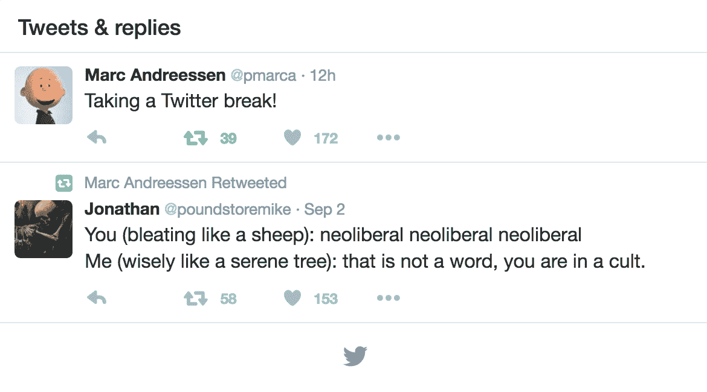

# 马克·安德森突然删除了他所有的推文，在 Twitter 上休息

> 原文：<https://web.archive.org/web/https://techcrunch.com/2016/09/25/marc-andreessen-suddenly-deletes-all-his-tweets-goes-on-twitter-break/>

# 马克·安德森突然删除了他所有的推文，开始推特休息

推特风暴之父马克·安德森昨晚离开平台后，推特圈今天早上稍微安静了一点。虽然他或其他人没有明确回答他为什么决定休息一段时间，但安德森并不是第一个突然离开这项服务的硅谷知名人士。

今年夏天早些时候，Y Combinator 集团总裁萨姆·奥特曼[在推特平台](https://web.archive.org/web/20230328164124/https://twitter.com/sama/status/743141870335733760)上以社区问题为由离职。他认为，社交网络“奖励消极和尖刻”，他“在使用 Twitter 后感觉更糟。”

与奥特曼不同，安德森没有留下解释他退出的推特风暴，但有可能许多相同的原因可能会暂时迫使他离开平台。目前，在他的个人资料上唯一可见的推文是一篇关于休息一下的四字帖子和一条关于新自由主义的转发，但当安德森在所有四个燃烧器上发推文时，他经常与其他用户进行有争议的政治辩论。

当然，即使是奥特曼，在短暂的缺席后，也无法抗拒重返 Twitter 的冲动。鉴于安德森将他的行为描述为一种“突破”，它很可能会以同样的方式最终回归。Twitter 作为一个平台，越来越多地受到批评，因为它对网站上一些麻木不仁和喜欢钓鱼的用户允许的有毒文化不屑一顾，尽管安德森通常不会从分裂性的对话中退缩。

你也可以推测，安德森希望他的一些旧观点消失，但在这一点上，这是非常不可能的。如果他的 feed 中隐藏了他害怕的东西，他不可能仅仅通过删除他的帐户就从互联网上删除它——尽管从他的个人资料中删除它肯定会使它不太可能浮出水面。互联网上充满了机器人，它们被设置来转发他的每一条推文。即使是软件也不能吃掉马克·安德森在世界上所有的推文。

这些相同的机器人也可以解释为什么安德森删除了他所有的帖子，只有一个奇怪的转发。从机器人上看，转发似乎不是在接近昨晚事件的任何时候发布的。这条推文的最初创建者也指出了同样的问题，原因可能是与之前停用的个人资料有关的错误。

安德森机器人的存在也意味着这个可怜的家伙可以继续他的博士论文。

当我们联系他的公司，询问安德森为什么删除这些推文时，他们回答说这只是“与 Twitter 的决裂”。