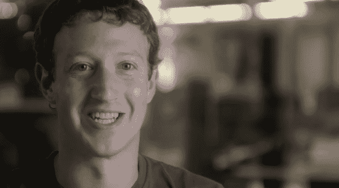

# 马克·扎克伯格和约翰·杜尔登捐赠 100 万美元扩大“代码一小时”活动 

> 原文：<https://web.archive.org/web/https://techcrunch.com/2014/10/29/mark-zuckerberg-and-john-doerr-donate-1m-to-expand-the-hour-of-code-campaign/>

# 马克·扎克伯格和约翰·杜尔登捐赠 100 万美元扩大“代码一小时”活动

在该活动在 IndieGogo 上线[的三周里，](https://web.archive.org/web/20221007161440/https://www.indiegogo.com/projects/an-hour-of-code-for-every-student/)[Code.org](https://web.archive.org/web/20221007161440/http://code.org/)努力为教师培训众筹资金，以增加参与[小时代码](https://web.archive.org/web/20221007161440/http://hourofcode.com/us)的学生数量，已经筹集了大约 29.4 万美元，占该活动宣称的 500 万美元目标的 6%。

随着脸书首席执行官马克·扎克伯格和他的妻子陈慧娴捐赠了 50 万美元，这个数字将会得到大幅提升。约翰和安·多尔也投入了 50 万美元，Code.org 还告诉 TechCrunch，连续企业家里奇·巴顿将捐赠 2.5 万美元。

Code.org 给了自己足够的时间来实现目标 IndieGogo 的活动将于 12 月 14 日结束。还剩 47 天，现在已经远远超过了 100 万美元的大关，这还是在比尔·盖茨和微软、雷德·霍夫曼、Salesforce、谷歌和其他人的对等捐款到来之前。Code.org 表示，如果达到 500 万美元大关，它可以将代码小时扩展到 1 亿学生。这似乎是一个非常崇高的目标，尤其是考虑到非营利组织称该活动将帮助培训约 10，000 名教师，但考虑到大多数学生在 K-12 学校缺乏对计算机科学的接触，即使部分胜利也会令人印象深刻。