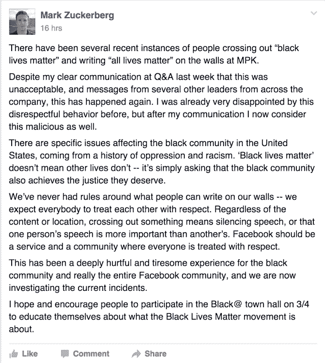

# 马克·扎克伯格要求员工停止在脸书的墙上划掉“黑人的命也是命”

> 原文：<https://web.archive.org/web/https://techcrunch.com/2016/02/25/mark-zuckerberg-asks-employees-to-stop-crossing-out-black-lives-matter-on-facebooks-walls/>

# 马克·扎克伯格要求员工停止在脸书的墙上划掉“黑人的命也是命”

脸书首席执行官马克·扎克伯格要求他的员工停止无知和种族主义(我的话，不是他的)。

在 Gizmodo 获得的一份内部备忘录中，扎克伯格说他对“最近几起有人划掉‘黑人生命很重要’并在 MPK 的墙上写下‘所有生命都很重要’的事件”感到失望 MPK 是脸书在加州门洛帕克的建筑之一，有一面让人想起脸书早期的的[墙，供员工写下他们的想法。](https://web.archive.org/web/20221224192137/https://www.flickr.com/photos/repkarenbass/5476449117/in/album-72157626135987502/)

这是备忘录，由 [Gizmodo](https://web.archive.org/web/20221224192137/http://gizmodo.com/mark-zuckerberg-asks-racist-facebook-employees-to-stop-1761272768) 提供:

脸书是一个众所周知的白人聚集地。根据其 2014 年 EEO-1 报告，脸书去年在美国雇用了 36 名黑人和 73 名西班牙裔人，而白人为 603 人。总的来说，脸书的劳动力中只有 2%是黑人，3%是西班牙裔，而——这并不奇怪——55%的脸书是白人。

除了这很糟糕的事实之外，考虑到这是黑人历史月*和*，考虑到几名来自旧金山湾区的非裔美国学生计划明天去脸书旅行，这是一个特别糟糕的时机。

正如扎克伯格指出的，脸书正在调查这些事件，并鼓励员工参加即将在脸书举行的市政厅会议，了解黑人的命也是命是怎么回事。我已经联系了脸书，但该公司拒绝进一步置评。