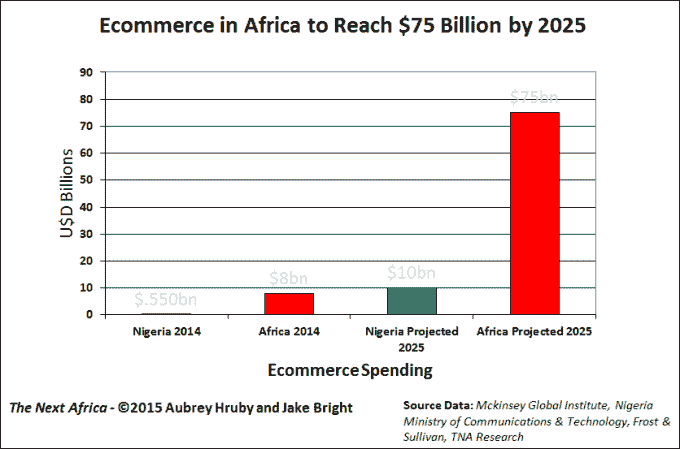

# 马克·扎克伯格在尼日利亚之旅中会见非洲科技领袖

> 原文：<https://web.archive.org/web/https://techcrunch.com/2016/08/31/mark-zuckerberg-meets-with-african-tech-leaders-on-nigerian-tour/>

脸书首席执行官马克·扎克伯格在尼日利亚。周二他突然造访拉格斯创新中心的社交媒体照片[公布了他的行程。](https://web.archive.org/web/20230315095317/https://twitter.com/oviosu/status/770644436036517888)

扎克伯格随后拜访了软件开发加速器[安德拉](https://web.archive.org/web/20230315095317/https://www.crunchbase.com/organization/andela)，他和他妻子的基金会在今年早些时候投资了[2400 万美元](https://web.archive.org/web/20230315095317/https://andela.com/blog/series-b-announcement/)。

根据 CcHub 首席执行官孙波·蒂贾尼的说法，扎克伯格的旅行似乎有点像总统。“几周前，脸书告诉我们，合作伙伴经理将会来访。几天前他们告诉我们可能是马克，但直到今天都是最高机密，”他告诉 TechCrunch。

扎克伯格在 CcHub 的合作空间会见了编码人员，然后参观了孵化空间，在那里他与预订初创公司 Hotels.ng 和 LifeBank 应用程序的代表进行了交谈，life bank 应用程序是一个数字献血者数据库。

那么，是什么把世界上最知名的科技高管之一带到了尼日利亚呢？“我将会见开发者和企业家，了解创业生态系统……”扎克伯格在《脸书邮报》上说。

至于任何新的非洲商业承诺，“我们不会宣布任何事情，”脸书发言人 Sally Aldous 通过电子邮件告诉 TechCrunch。在他访问的剩余时间里，几位尼日利亚初创企业的负责人表示，他们被邀请到脸书市政厅，并在周三与扎克伯格进行问答。

奥尔德斯没有证实这一事件，但他说，“这是一次关于倾听、学习和理解挑战的旅行。”

从博科圣地到政府腐败，尼日利亚有其众所周知的挑战，但正如我们去年所报道的那样，它也成为了技术活动和投资的温床。扎克伯格第一次访问的拉各斯 Yaba 区已经成为吸引 IT 企业家、初创公司和孵化器的磁石，吸引了成千上万的会员。

非洲大陆资金最雄厚/最知名的三家电子商务企业——Jumia、Konga 和 MallforAfrica——的总部都设在拉各斯。随着瑞士荣格收购在线交易初创公司 DealDey，尼日利亚产生了 2016 年非洲最引人注目的退出事件之一。

今年 3 月，当 Jumia Group(前身为 A.I.G .)通过一轮包括高盛和安盛保险在内的 3.26 亿美元投资成为非洲第一家创业独角兽时，尼日利亚成为了全球科技头条。五月，尼日利亚获得了脸书的优先权，它宣布与 Airtel 合作，名为 Internet.org 免费基础([在印度被拒绝](https://web.archive.org/web/20230315095317/http://www.balancingact-africa.com/news/en/issue-no-827/internet/facebook-and-airtel/en))，允许尼日利亚人在手机上免费使用某些互联网服务。六月，易贝宣布尼日利亚为其非洲扩张的开放国家。

与肯尼亚或南非等其他非洲 IT 亮点相比，尼日利亚科技的这种重心转移背后是经济和人口因素。尼日利亚有双重身份:非洲人口最多的国家(1.83 亿)和产出达 5 万亿美元的最大经济体。

诚然，尼日利亚的市场和货币在过去 6 个月中遭受了打击，这些人口和商业因素为科技企业家和投资者创造了一个令人信服的投资主题，即首先在尼日利亚扩大规模，然后向外扩张。

脸书显然注意到了这一点。这些主题很可能会在扎克伯格周三的市政厅会议上以及他剩余的尼日利亚之行中得到回应。在商业层面，脸书在非洲有 1.2 亿用户，其中 8400 万在撒哈拉以南非洲。

据发言人 Aldous 称，尼日利亚拥有 1700 万用户，是该公司最大的撒哈拉以南非洲市场，其次是南非(1400 万)和肯尼亚(570 万)。脸书在非洲的一项特别举措将是利用在线广告市场，该市场正随着非洲大陆向数字商务的转变而崛起。到 2025 年，非洲的在线销售额预计将超过 750 亿美元，其中 100 亿美元来自尼日利亚。

在 2014 年《脸书商业周刊》的一篇文章中，该公司强调其在非洲的增长是“为人们和广告商带来价值的新机遇”2015 年，当脸书在南非开设其在 T2 的第一个非洲办事处时，它任命奥美广告公司的高管 Nunu Ntshingila 为非洲负责人。

无论脸书的长期非洲战略是什么，即使没有新的承诺，扎克伯格的访问对尼日利亚和尼日利亚以外的地区都有着巨大的意义。“在 Yaba，我们一直在努力从零开始建立一个技术生态系统。他来到这里是对我们所做的一个很大的肯定，”CcHub 的蒂贾尼说。

蒂贾尼认为，也许扎克伯格访问的最大受益者可能是 60 名年龄在 5 至 18 岁之间的“[代码之夏”](https://web.archive.org/web/20230315095317/https://www.google.com/webhp?sourceid=chrome-instant&ion=1&espv=2&ie=UTF-8#q=cchub%20summer%20of%20code)学生，脸书的首席执行官坐下来和他们一起练习编程。“今天是他们的毕业日，他们要和马克·扎克伯格一起毕业。很难估计这会产生什么影响，”他说。