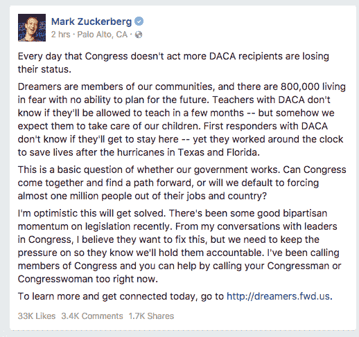
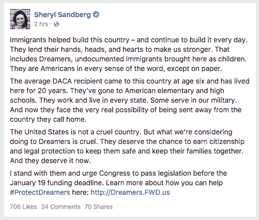

# 马克·扎克伯格希望你给你的国会议员打电话，支持 DACA

> 原文：<https://web.archive.org/web/https://techcrunch.com/2018/01/17/mark-zuckerberg-wants-you-to-call-your-congressperson-in-support-of-daca/>

# 马克·扎克伯格希望你给你的国会议员打电话，支持 DACA

脸书首席执行官马克·扎克伯格希望你打电话给你的国会议员对 DACA 采取行动(儿童抵达延期行动)。自 2012 年以来，80 万无证移民获得了 DACA 身份。

“国会不采取行动的每一天，就会有更多的 DACA 获奖者失去他们的身份，”扎克伯格今天早上在《脸书邮报》上写道。

如果唐纳德·特朗普总统如愿以偿，DACA 将会终结。昨天，司法部表示将要求最高法院审查一名 T2 联邦法官的裁决，该裁决命令政府继续保护 DACA 并重启该项目。

“这是一个关于我们的政府是否有效的基本问题，”扎克伯格写道。:国会能否团结起来，找到一条前进的道路，还是我们将默认迫使近 100 万人离开他们的工作和国家？"

扎克伯格不是唯一公开支持 DACA 的脸书高管。脸书·首席运营官·雪莉·桑德伯格今天早上也发布了关于 DACA 的帖子，他说“移民帮助建设了这个国家——并且每天都在继续建设。”

本周早些时候，亚马逊首席执行官杰夫·贝索斯和他的妻子麦肯齐向 TheDream 捐赠了 3300 万美元。美国，梦想家奖学金基金。