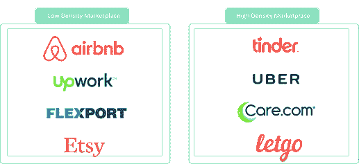
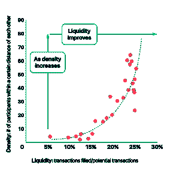
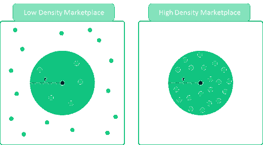
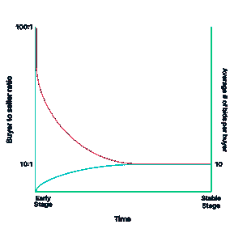
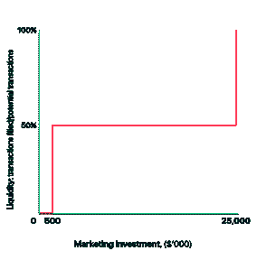
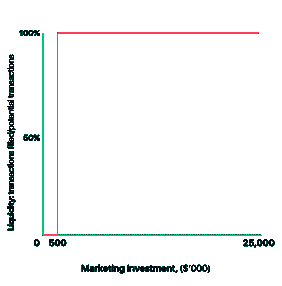
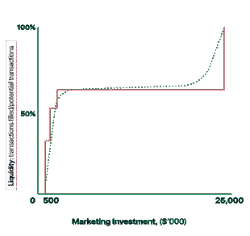

# 市场流动性

> 原文：<https://web.archive.org/web/https://techcrunch.com/2017/07/11/marketplace-liquidity/>

流动性是所有市场的关键指标。但是我们如何真正评估这种流动性呢？回答这个问题的三个关键是密度、适当平衡的需求和供应以及品类集中度。

## 对应方之间的密度、地理范围和距离

分析市场潜在流动性的第一步是理解其地理范围。例如，Upwork 将看到全球各地自由职业者和雇主之间的交易，而 Tinder(通常)只会看到同一城市的两个人约会。因此，Tinder 需要一个城市一个城市的推出和一个城市一个城市的流动性分析。

在当地市场，密度和流动性之间有很强的相关性。相关半径内的参与者数量越多，市场的流动性就越高。我们将流动性定义为市场中全部潜在交易中完成的交易数量。我们称密度为特定地理区域内的参与者数量。

我们以 Tinder 为例。如果在特定的一周内，Tinder 在芝加哥获得 1000 名女性参与者，在纽约获得 1000 名男性参与者，那么 Tinder 的总用户数量会增加，但其流动性保持不变。现在，如果 Tinder 获得 1000 名女性参与者和 1000 名男性参与者，他们都位于布鲁克林区，这种更高的用户密度(来自市场的双方)将导致更高的流动性。

为了确定一个市场的密度，你需要首先定义一个地理区域的界限，在这个范围内可以完成交易。这个距离阈值(下图中的“r”)在每个市场都是不同的，你可以通过了解你的客户愿意走多远来完成他们的交易。例如，Letgo 的卖家可能不愿意花 30 分钟去卖 30 美元的二手滑板，但 Care.com 的保姆可能会花 30 分钟去做一天的保姆，赚 150 美元。

一旦定义了距离阈值“r ”,就需要最大化密度。但是怎么做呢？

你首先要优化你的营销策略，在既定的距离阈值内获得最多的客户。因此，您将最大限度地增加彼此之间距离内的活跃参与者，从而最大限度地提高密度，从上面的低密度市场图移动到高密度市场图。

## 平衡市场的演变

保持市场供求的最佳平衡对于实现流动性至关重要。如果一个市场没有合适的买家数量，或者没有合适的买家数量，交易就会落空。

怎样才能分析出什么是需求和供给的正确平衡？通过观察几个比率:

*   完成一笔交易所需的平均买方数量与卖方数量之比
*   完成交易所需的每位买家的出价数量
*   每位卖家完成交易所需的平均物品数量

让我们以二手家具市场为例，在这个市场中，完成交易所需的每件物品的平均出价比率是 100 比 1。所以，列出的每件商品都需要 100 次出价才能卖出。现在，从这个比率到买家卖家比率的转换是由每个买家的平均出价数和每个卖家出售的平均物品数决定的。这是分析的关键。

为了简单起见，让我们假设每个卖家发布的平均商品是 1，每个买家的平均出价是 10。这意味着买家和卖家的比例是 10:1；每一个卖家需要 10 个买家来完成交易。然而，每个买家的平均出价数达到这么高通常需要时间，只有当公司达到稳定的流动性阶段时才会发生。

在早期阶段，可能的情况是每个买家的平均出价数为 1 或更少，这意味着买家与卖家的比例最初更像是 100:1。因此，每一个卖家需要 100 个买家来完成交易。买家和卖家的比例会像这样演变:

每个买家的平均出价随着时间的推移而增加的第一个原因是，当新买家第一次体验市场时，他们会犹豫是否出价。买方在准备出价之前需要信任市场。信任需要时间。此外，在稳定阶段，市场上库存的多样性将增加买家找到他们感兴趣的东西的可能性。

然而，这里的结论不仅仅是每个买家的出价随着时间的推移而增加，而且这决定了一个平衡市场的演变。那就是，你需要密切监控二级 KPI(比如每个买家的出价和每个卖家的列表)，以了解如何调整你的策略，从而随着时间的推移保持市场的平衡。同样，每个买家的平均出价通常会随着时间的推移而增加，每个卖家列出的平均项目也会随着时间的推移而变化。

## 品类集中和边际收益递减

一旦您定义了距离阈值，您的市场将在该阈值下完成交易，您需要细分市场内每个类别的流动性。例如，如果我们的二手家具市场在某个时间点有 100 万活跃买家，他们中有多少人想买一张桌子？有多少人在找椅子？多少人想要沙发？在 100 万活跃买家中，只有一小部分人会对每个类别感兴趣。这意味着你不能只评估市场的整体流动性，你需要在每个类别的基础上进行评估。

通常情况下，大多数参与者只对市场提供的几个类别感兴趣。这意味着，当你花费营销资金来获取用户时，集中度较高的类别将比其他类别更快产生流动性。在大多数情况下，低集中度类别将需要更大的营销投资来实现流动性。

让我们回到我们的家具市场示例，通过以下假设来说明这一点:

*   50%的买家对购买沙发感兴趣，而另外 50%的买家平均分布在 50 个其他家具类别中
*   我们在营销上花了 100 美元
*   我们的 CAC 是 1 美元
*   每个类别的流动性阈值是 50 个买家(流动性阈值是交易需要满足的买家数量)

我们将有 50 个沙发类别的新买家，其他 50 个类别各有一个新买家。沙发类别中的 50 个新买家将大大增加其类别中达成交易的可能性，而任何剩余类别中的额外一个参与者几乎不会增加其在各自领域中达成交易的机会。

如果我们把这个例子放大，我们假设:

*   50 万美元的营销预算
*   每个类别的流动性阈值为 250，000 名参与者

只有沙发类会达到流动性。即使我们在市场营销上投资 100 万美元，只有沙发类别会达到流动性，因为所有其他领域每个都只能达到 10，000 名参与者。同样的情况也会发生，直到投资额超过 2500 万美元。这意味着，从流动性的角度来看，这种营销策略会导致边际收益递减:

同样，解决这个问题的最佳方法是将营销策略与品类集中度保持一致。换句话说，将大部分营销投资分配给最主要的类别(在我们的例子中是沙发类别)。在这种情况下，流动性图表如下所示:

这当然是一个极端的例子。

一个更现实的案例会有几个集中的类别和一个由几十个其他类别组成的长尾。为了说明这一点，让我们假设 30%的买家想买沙发，20%的买家想买椅子，10%的买家想买桌子，剩下的 40%分散在其他 40 个突出的类别中。这一次，流动性图表看起来像这样(这更现实):

密度、供需平衡和品类集中度是市场流动性的关键驱动因素。为了最大化你的营销投资回报，你需要调整你的营销和流动性策略。为了监控你的流动性变化，你需要跟踪你的二级关键绩效指标。

在评估市场投资机会时，风投也应该深入研究这三个原则。