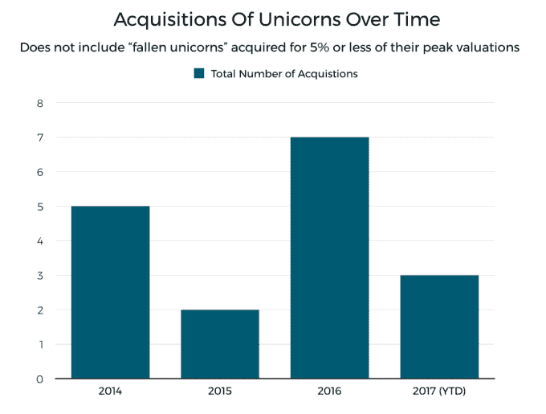

# 市场表现强劲，但大型初创企业 M&A 交易却没有发生

> 原文：<https://web.archive.org/web/https://techcrunch.com/2017/08/05/markets-are-strong-but-big-startup-ma-deals-just-arent-happening/>

乔安娜·格拉斯纳撰稿人

More posts by this contributor

公开的[市场正在高涨](https://web.archive.org/web/20221209155238/http://news.crunchbase.com/news/techs-5-biggest-players-now-worth-3-trillion/)，许多大型科技收购者现金充裕。然而，对于私人科技公司的大型收购来说，这是非常平淡的一年。

2017 年已经过去 7 个月了，我们只看到了一桩大型独角兽 M&A 交易:[思科以 37 亿美元收购 AppDynamics](https://web.archive.org/web/20221209155238/https://www.crunchbase.com/acquisition/2e8a799c6cc9ce9f567e7b62c212143f) 。那是在一月份。今年收购的另外两家曾经的独角兽企业，数据管理技术提供商 SimpliVity 和中东在线零售商 Souq.com，以远低于其峰值私人估值的价格出售。

与去年相比，独角兽 M&A 市场看起来尤其低迷，估值面临挑战。2016 年，收购者以高于或大约等于其私人估值的价格收购了五家科技独角兽公司(以下是[名单](https://web.archive.org/web/20221209155238/https://www.crunchbase.com/app/lists/2016-unicorn-acquisitions/2d1994ce-0071-4883-859d-094eb17c303d/identifier?new=false))。这些公司中没有一家像 AppDynamics 那样，首先不得不以即将上市的前景为诱饵，该公司在计划上市前几天就出售了股票。

不仅仅是独角兽领域没有大的交易发生。今年到目前为止，[只有 17 家资金雄厚的民营科技公司](https://web.archive.org/web/20221209155238/https://www.crunchbase.com/app/lists/2017-m-a/69146a87-2966-4e63-9ee5-fc010df5415b/identifier?new=false)(这里的定义是那些在风险投资中筹集了 2000 万美元或更多的公司)被收购，披露或报告的估值超过 1 亿美元。与此同时，2016 年，估值在 5 亿美元或以上的几乎有这么多[。](https://web.archive.org/web/20221209155238/https://www.crunchbase.com/app/lists/big-m-a-deals-2016/83b16846-be33-4409-8692-76a19a6bbae8/identifier?new=false)

尽管如此，2017 年新的大规模融资仍在继续。根据 Crunchbase 的数据，超过 450 家除生命科学(主要指科技)以外的公司已经筹集了 2000 万美元或更多的资金。其中，至少有 94 笔科技风险投资达到或超过 1 亿美元，高于去年同期的 75 笔。一个投资者，[软银](https://web.archive.org/web/20221209155238/https://www.crunchbase.com/organization/softbank)，今年已经投资了 14 家融资超过 1 亿美元的公司。

## 这是什么意思？

这是怎么回事？对于大型风险投资支持的 M&A 来说，这是否可以被认为是一个缓慢的时期？是估值问题吗？还是说，正在发生的结构性变化解释了收购者对大额收购的谨慎态度？

早期公司[布隆伯格资本](https://web.archive.org/web/20221209155238/https://www.crunchbase.com/organization/blumberg-capital#/entity)的管理合伙人[大卫·布隆伯格](https://web.archive.org/web/20221209155238/https://www.crunchbase.com/person/david-blumberg)说:“这可能是偶然事件，或者一些行业可能由于高倍数而遇到阻力。他补充说，收购者可能也在观望拟议的税收改革会发生什么。

特朗普政府计划大幅降低汇回国内收入的税收，这可能是推迟并购的一个因素。目前，大型科技公司在海外账户中持有数千亿美元，以逃避美国税收。据估计，仅苹果一家就持有超过 2500 亿美元的现金储备，其中大部分都在非美国账户中。据报道，特朗普的提案将把上市公司的所得税税率从 35%下调至 15%。它还将把汇回海外收入的税率削减至 10%。

快速增长、有风险投资支持的公司也发现更容易保持更长时间的私有，这使得它们不太容易接受次优的收购要约。毕竟，当软银出价 2 亿美元时，谁还需要退出呢？

独角兽和准独角兽也在寻求通过向早期投资者和员工提供一些回报来延长他们的退出时间表。Rohit Kulkarni 是私营公司市场 [SharesPost，](https://web.archive.org/web/20221209155238/http://www.sharespost.com/)的私人投资研究负责人，他告诉 Crunchbase 新闻，他看到“早期投资者和员工寻求流动性的活动明显增加。”

库尔卡尼说，通常情况下，早期投资者希望出售 10%至 15%的股份，而员工的持股比例会更高。这种出售无法替代收购或 IPO 退出，但它可以帮助公司留住关键员工，让利益相关者满意，并将退出时间推迟一年或更长时间。

虽然大型 M&A 交易没有发生，但公司仍可以进入一个相当容易接受的 IPO 市场。上周，专注于科技的房地产经纪公司 [Redfin](https://web.archive.org/web/20221209155238/http://news.crunchbase.com/news/redfin-surges-44-7-first-day-trading-shaking-off-blue-apron-led-ipo-worries/) 的上市首日表现良好，表明散户投资者需求强劲——即使是在更广泛的 IPO 市场遭遇困境的[也有一些最近上市的科技公司。](https://web.archive.org/web/20221209155238/http://news.crunchbase.com/news/morning-report-fourth-2017-tech-ipos-underwater/)