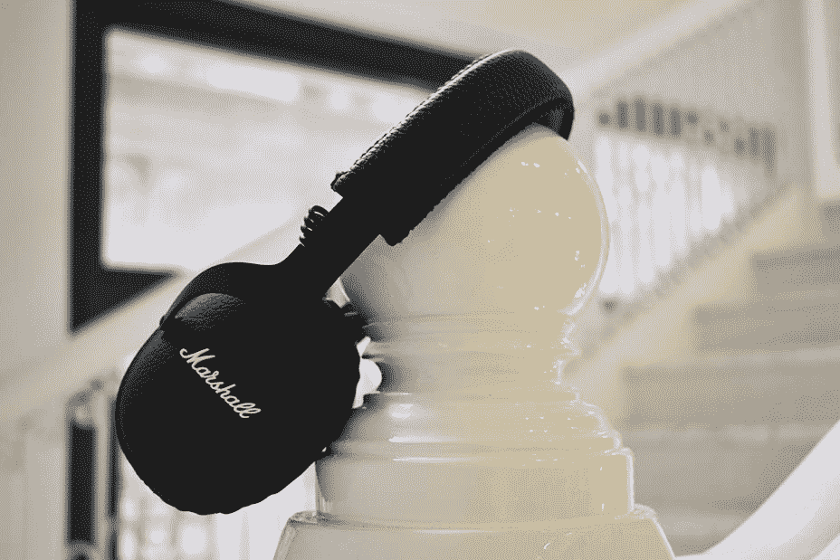
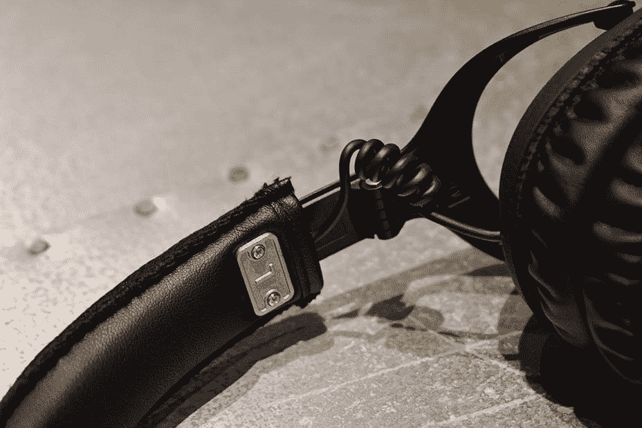
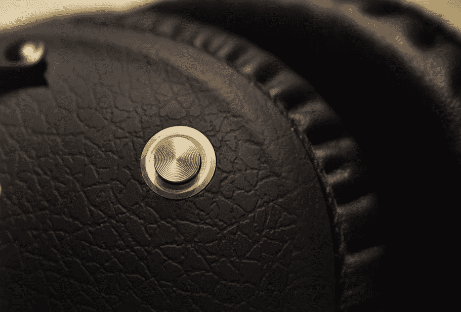

# 马歇尔的监听蓝牙耳机清脆但不舒服

> 原文：<https://web.archive.org/web/https://techcrunch.com/2017/04/04/marshalls-monitor-bluetooth-headphones-are-crisp-but-uncomfortable/>

如果你喜欢摇滚，那么你可能以前就见过马歇尔的音频设备。

这是“摇滚明星的品牌”，类似于 Beats 如何被营销为嘻哈艺术家的耳机。但是如果你了解耳机的话，你就会知道营销从来不代表真正的性能。如果你想知道:这些耳机不会让你成为摇滚明星。

## 基础

*   40 毫米驱动器
*   10Hz-20kHz 频率响应
*   28ω阻抗
*   92dB SPL 灵敏度
*   蓝牙 4.1+aptX/3.5 毫米音频插孔连接
*   30 小时电池寿命(马歇尔的统计，个人使用约 24 小时)

## 使用它

马歇尔监听蓝牙耳机非常简单易用。一个按钮/操纵杆控制播放，电源和音量，按住它五秒钟打开耳机并开始配对模式。

一旦配对，马歇尔说你有 30 小时的电池寿命——这对于无线耳机(即使是耳挂耳机)来说是一个相当稳定的数据。实际上，我听了一整天的黑键、佛利伍麦克乐队、洛德和北极猴子乐队的歌曲。

我选择这些艺术家是因为他们的歌曲在低音、中音和高音上有明显的不同。总的来说，它们听起来清脆而“接近”，但声音不像生活，也没有足够的深度给你低音头。

用它们来玩*彩虹* *六* : *围攻*，我处在一个场景中，我可以听到一个敌方玩家在隔壁房间给步枪重新上膛——这听起来像一个微妙的咔哒声——这让我成功了。但是，这绝不是游戏耳机。

除了操纵杆之外，马歇尔显示器没有太多突出之处。它们都是全黑的，有不同的皮革纹理，耳朵上有一个包裹，感觉舒适而紧绷——灌输了一种虚假的舒适感。声音泄漏不是问题，但是佩戴超过两个小时会让你感到疲劳。

根据你的头和耳朵的大小/形状，它们在你头上的平衡方式会有所不同。但是，好像我太阳穴上的压力持续了两个小时后变得无法忍受。

撇开听力疲劳不谈，我主要支持监听蓝牙，因为它比我习惯于在低于 500 美元的耳机中看到的质量更好。缝线、皮革、金属装饰甚至耳罩都非常注重细节。尽管长时间使用会不舒服，但耳杯可以拆卸下来进行维护，这是一件好事，但不是一个可挽回的特性。

关于连接性和稳定性:在纽约市的户外佩戴时，蓝牙连接从未跳过一拍，那里的无线干扰非常猖獗，往往会干扰许多耳机。我在走路的时候，在助力板上，在地铁里都戴过，跳过不结巴。

Marshall 的储物袋中还包括 3.5 毫米 aux 和充电电缆，以防你想走有线收听路线或只是给耳机充电。

## 结果

如果你是一个狂热的摇滚迷，或者一般来说只是倾向于更多的中高音的音乐，就买这些吧。但也有森海塞尔、拜尔动力等整体更好的耳机，舒适度更高，声音轮廓更多样，适合更广泛的音乐。

就个人而言，马歇尔的监测蓝牙不是我的节拍，但它可能是别人的。

*点评价格:马歇尔耳机*249 美元