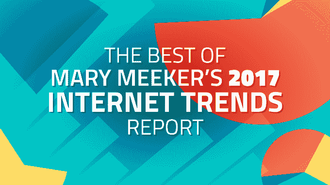

# 阅读玛丽·米克尔 2017 年互联网趋势报告 

> 原文：<https://web.archive.org/web/https://techcrunch.com/2017/05/31/mary-meeker-internet-trends-2017/>

# 阅读玛丽·米克尔的 2017 年互联网趋势报告

这是跟上科技发展的最好方式。凯鹏华盈(Kleiner Perkins)风险合伙人玛丽·米克尔的年度互联网趋势报告实质上是科技行业的现状。广受期待的幻灯片汇编了最翔实的研究，内容涉及哪些项目获得了资助、互联网的采用进展如何、哪些界面引起了共鸣，以及接下来会有什么大的发展。

你可以查看下面嵌入的 [2017](https://web.archive.org/web/20221208174306/http://www.kpcb.com/internet-trends) 报告，[这里是去年的报告供参考](https://web.archive.org/web/20221208174306/https://beta.techcrunch.com/gallery/internet-trends-report-2016/)。

最简单的阅读方式就是我们的集锦套牌: **[“最佳米克 2017 互联网趋势幻灯片及其含义”](https://web.archive.org/web/20221208174306/https://beta.techcrunch.com/gallery/internet-trends-2017/)**

[scribd id = 349976485 key = key-teio 9 dbemaitudgaosd 7 mode = scroll]

以下是一些初步要点:

*   智能手机销售和互联网普及率增长都在放缓
*   这与其说是“向移动设备的转移”,不如说是“移动设备的增加”,因为在美国，台式机的使用量并没有下降多少，而移动设备的使用量却飙升至每人每天 3 小时以上
*   花在手机上的时间仍然比花在广告上的时间多，这表明手机广告平台将会有意外收获
*   谷歌和脸书控制了 85%的在线广告增长
*   互联网广告支出将在六个月内超过电视广告支出
*   以 Spotify 为首的流媒体音乐超过了实体音乐的销售额，使录制音乐的收入 16 年来首次增长
*   电子竞技正在爆发，观看时间同比增长 40%，同样数量的千禧一代强烈喜欢电子竞技而不是传统体育
*   随着云使用的增加，带有恶意附件的垃圾电子邮件正在激增，所以请小心您点击的内容
*   科技公司推动了中国的财富创造，人们为直播付费，自行车共享的使用正在飙升
*   数据成本的下降正在推动印度互联网的普及，但智能手机的价格仍然过高
*   美国 60%最有价值的科技公司是由第一代或第二代美国人创建的，而 50%的顶级私人创业公司是由第一代移民创建的

要了解关于 355 页幻灯片中最重要内容的更多分析，请阅读我们的精彩内容:

