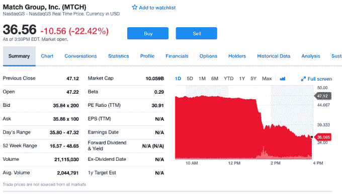

# 由于脸书的约会游戏 TechCrunch，火柴股票正在下跌

> 原文：<https://web.archive.org/web/https://techcrunch.com/2018/05/01/match-stock-tank/>

# 鉴于脸书的约会游戏，火柴股票正在下跌

紧随脸书[宣布打算在其平台](https://web.archive.org/web/20221025222016/https://techcrunch.com/2018/05/01/facebook-dating/)上增加一个约会元素之后，约会公司 Match 的股票正在下跌。Match 是 Tinder、Match、OK Cupid 和 fully Fish 等约会服务背后的品牌。

在本文发表时，Match 的股价下跌了约 22%。

脸书进入这一领域，使其与 Match 的主营业务直接竞争。据脸书首席执行官马克·扎克伯格称，约会功能将成为一个独立的功能，专注于合法的长期关系，而不仅仅是勾搭。

不过，Match Group 首席执行官曼迪金斯伯格表示，她对脸书进入其领域感到受宠若惊。

金斯伯格在给 TechCrunch 的一份声明中说:“随着 Tinder 继续飙升，脸书进入我们的空间，看到了我们所看到的全球机遇，我们感到很荣幸。”“考虑到这个领域带来的大量个人和敏感数据，我们对这个时机感到惊讶。无论如何，我们将继续通过产品创新和对关系成功的不懈关注来取悦我们的用户。我们比任何人都了解这一类别。脸书的加入只会让我们所有人感到振奋。”

与此同时，Match 的母公司给脸书投下了阴影。在提供给 TechCrunch 的一份声明中，IAC 首席执行官乔伊·莱文说，

> 进来吧。水是温暖的。他们的产品可能对美俄关系大有裨益。

Bumble 是另一个可能受到脸书新服务影响的竞争对手，但该公司表示对今天的消息感到“兴奋”。

“我们的执行团队已经联系了脸书，探索合作的方式，”Bumble 发言人在给 TechCrunch 的一份声明中说。“也许邦布尔和脸书可以联手，让互联空间变得更加安全和强大。”