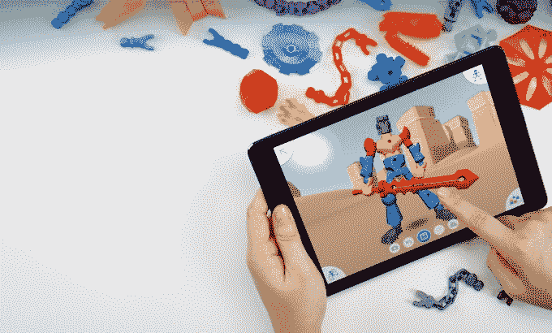
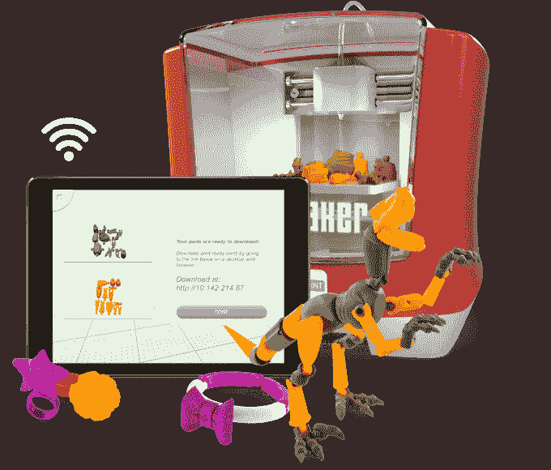

# 美泰推出 ThingMaker，这是一款 300 美元的 3D 打印机，可以让孩子们制作自己的玩具

> 原文：<https://web.archive.org/web/https://techcrunch.com/2016/02/15/mattel-unveils-thingmaker-a-300-3d-printer-that-lets-kids-make-their-own-toys/>

在周末的纽约玩具展贸易展上，美泰[展示了](https://web.archive.org/web/20230313101738/http://www.prnewswire.com/news-releases/mattel-reimagines-thingmaker-allowing-families-to-become-toy-makers-with-at-home-3d-printing-300219357.html)其新的 300 美元的 3D 打印机“ThingMaker”，这将允许孩子们在家里打印他们自己的玩具。该设备与 Autodesk 合作开发的 3D 打印应用程序协同工作，该应用程序提供了一个简单的界面，用于设计可以通过 Mattel 的 ThingMaker 以及市场上已有的其他标准 3D 打印机实现的项目。

附带的应用程序实际上是让更多受众更容易获得美泰 3D 打印体验的关键。

虽然现在有[价格实惠的](https://web.archive.org/web/20230313101738/https://techcrunch.com/gallery/five-good-3d-printers-you-can-buy-before-the-holiday/)3D 打印机，但与之配套的软件有时会有一个学习曲线，这可能会阻碍采用。随着[新应用](https://web.archive.org/web/20230313101738/http://thingmaker.com/design)现在在 [iOS](https://web.archive.org/web/20230313101738/https://itunes.apple.com/us/app/thingmaker-design/id1078356242) 和 [Android](https://web.archive.org/web/20230313101738/https://play.google.com/store/apps/details?id=com.mattel.thingmakerdesign) 上上线，目标是让任何人都可以轻松设计自己的玩具——甚至是更小的孩子。

Autodesk 负责开发这款应用，早期的测试人员，包括那些在 [Toyland](https://web.archive.org/web/20230313101738/http://toyland.gizmodo.com/mattel-is-making-a-300-3d-printing-toy-studio-for-kids-1759078152) 的测试人员，已经用“快速”、“易于导航”和“荒谬的直观”来形容它。

这款名为 [ThingMaker Design](https://web.archive.org/web/20230313101738/http://thingmaker.com/design) 的应用包括各种内置的角色模板和易于使用的教程，可以帮助新手入门。但是一旦孩子们掌握了窍门，它也允许从头开始设计角色。这些玩具可以定制不同的颜色和纹理，并且可以在应用程序中弯曲和扭曲，这样你就可以感受到它们在打印后的工作方式。这些作品可以作为图像保存到移动设备的相机胶卷中，或者上传到 Google Drive 或 Dropbox。

当一个设计完成时，该应用程序可以让你将 STL 打印文件无线导出到你的家用打印机，无论是 Mattel 的还是其他的。

然而，这个想法不仅仅是打印一个物体并完成——相反，孩子们将打印可以组装成更大作品的部件，例如娃娃、机器人、恐龙、蝎子、骨骼、手镯或项链。

[gallery ids="1277196，1277195，1277194，1277193，1277192，1277191，1277189，1277185，1277184"]

有趣的是，美泰有可能与它已经拥有或授权的其他儿童品牌捆绑在一起，通过 3D 打印赋予它们生命。该公司表示，这是路线图中的一部分，[表示](https://web.archive.org/web/20230313101738/http://www.prnewswire.com/news-releases/mattel-reimagines-thingmaker-allowing-families-to-become-toy-makers-with-at-home-3d-printing-300219357.html)将在晚些时候推出“额外的设计内容，包括品牌选项”。然而，没有宣布实际的品牌名称，但是有迹象表明像芭比和风火轮这样的品牌已经在计划中了。

实体零件批量打印，然后通过球窝接头组装在一起。这个过程对于一个小件物品可能需要 30 分钟，对于一个较大的玩具可能需要一整夜(例如 6-8 小时)。

美泰表示，其 ThingMaker 3D 将使用硬 PLA 细丝，但也尚未宣布将提供的颜色。然而，根据玩具展的报道，展出了大约 24 种颜色。一位发言人表示，该公司未来可能会发布其他材料。

当打印开始时，为了安全起见，打印机的门会自动锁上，但孩子们可以通过前面的透明窗口观看过程。此外，打印头在不使用时也会缩回，这将有助于防止儿童因意外(或有意)接触加热部件而烫伤手指。

据《今日美国》报道，虽然打印玩具似乎会吸引更小的孩子，但美泰从责任的角度为自己开脱，称设备是“为 13 岁及以上的用户设计的”。但应用程序和打印机设计的简单性，加上其涉及玩具打印的目的，很可能会看到年幼儿童的父母将设备带回家。

[gallery ids="1277188，1277186"]

如果“ThingMaker”这个名字听起来耳熟，那是因为它参考了美泰公司 20 世纪 60 年代的原始家用 Maker 设备。当时，该公司致力于激发孩子们的创造力，让他们通过将液态塑料状材料 Plastigoop 倒入加热后冷却的模具中来制作像花或“令人毛骨悚然的爬虫”这样的玩具。

现在，该公司表示，它已经重新构想了 21 世纪的 ThingMaker 体验。

美泰公司高级主管阿斯兰·阿普曼在一份声明中说:“在当今的数字时代，家庭超越数字世界，实现自己的想法比以往任何时候都重要。”。“ThingMaker 拓展了想象力游戏的边界，为家庭提供了无数种定制玩具的方式，让他们的创造力尽情发挥。”

这款打印机实际上要到今年秋天才会上市，但亚马逊上的预购今天就开始了。

作为一个玩具品牌，美泰在将游戏和数码设备结合起来方面相当超前。除了 ThingMaker，该公司[还在玩具展上推出了一款新的 View-Master 设备，由谷歌 Cardboard](https://web.archive.org/web/20230313101738/https://techcrunch.com/2015/02/13/google-and-mattel-revive-the-85-year-old-view-master-with-cardboard-vr/) 驱动。