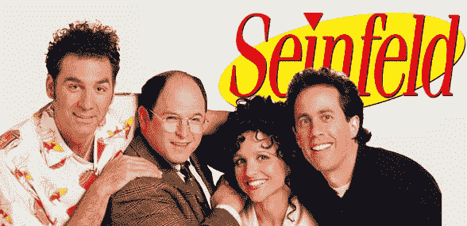

# 《宋飞正传》将很快在网上播放，希望 

> 原文：<https://web.archive.org/web/https://techcrunch.com/2015/03/13/maybe-a-dingo-ate-your-baby/>

# 希望《宋飞正传》很快能在网上播放

我从来没看过超过一两集的《宋飞正传》。我知道，我知道。

我一直想看完整部电视剧，真的——但是除了几集之外，在任何地方都不能(合法地)播放。所以我不打扰了。

这种情况可能很快会改变。有消息称，索尼终于开始许可流媒体播放权了。

我从来没有看过《宋飞正传》,但是看了太多的《另一个 T2 》,所以我会参考其他电视剧来写这篇文章。

谈判的消息通过[《华尔街日报》](https://web.archive.org/web/20221006161750/http://blogs.wsj.com/cmo/2015/03/13/seinfeld-nears-streaming-video-deal-yada-yada/?mod=e2tw)和[美国消费者新闻与商业频道](https://web.archive.org/web/20221006161750/https://twitter.com/CNBCnow/status/576497196067110912)传出。当被问及到底是谁爆料时，奥尔森四胞胎拒绝评论(或承认他们自己的存在)。)

有趣的是:至少据《华尔街日报》报道，网飞没有出价。网飞据称说“你怎么样了？”给索尼公司，但是没有达成协议。

这使得雅虎、亚马逊和 Hulu 处于混乱之中，如果这意味着《宋飞正传》出现在它们的目录中，它们中的任何一家都可能会停止吃 popplers。大牌是吸引订户的因素——随着网飞粉碎原创内容(像 *Orange 是新的黑色*、 *House Of Cards* )和全系列许可内容( *Friends、Blacklist、Doctor Who、Gold Case* 等)。等等。)其他人都在寻找一个响当当的名字——而宋飞是一个相当他妈的响当当的名字。

索尼非常清楚这部剧值多少钱，它正在这里寻找一笔小钱。据说《老友记》每集花费了网飞 50 万美元——虽然这足够犒劳你自己了，但据说索尼希望《宋飞正传》能花更多钱。即使他们只能达到 50 万美元的门槛，还要授权 180 集《宋飞正传》，那也是一笔 9000 万美元的交易。

*【危险地带。*