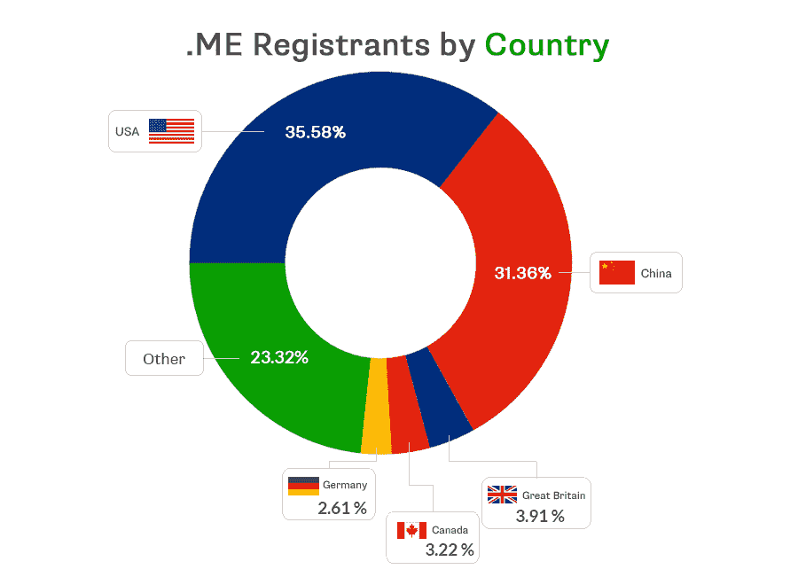
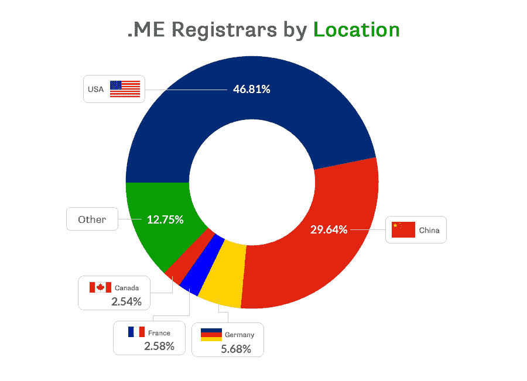

# 。me - 10 年和 2%的出口 

> 原文：<https://web.archive.org/web/https://techcrunch.com/2017/01/10/me-10-years-and-two-percent-of-exports/>

艾伦·邓恩是

[NameCorp](https://web.archive.org/web/20221007081354/https://namecorp.com/)

以及资深数字命名专家和品牌顾问。

More posts by this contributor

十年前，黑山成为一个独立的国家，在独立公投中以不到 1%的微弱优势脱离塞尔维亚。这一新的独立对一个大约相当于康涅狄格州大小的国家来说意味着许多变化。这些重要的变化之一是很少有人预料到的:该国的新域名扩展。

几乎每个国家都有一个独特的域名扩展。这些域名被称为 ccTLDs(国家代码顶级域名)。比如加拿大就有。ca，英国有。英国和丹麦有. dk。但是，因为黑山直到这次公投通过之前都不是一个独立的国家，所以它一直使用 cg.yu(作为南斯拉夫的一部分)。黑山也被指定为。cs 在 2003 年南斯拉夫解体后扩展，但该国从未真正过渡到使用它。

公投结果出来后，黑山政府于 2007 年宣布了正式的公开招标，并成立了一家总部设在黑山的有限责任公司 won-doMEn Ltd，这是 GoDaddy.com、Afilias 有限公司和 ME-net 有限公司的合资企业。但该协议已经延长了 10 年，直到 2023 年。

乍一看，人们可能认为. me 域名是关于所有者的。酪 me 找到了更广泛的受众，许多全球品牌都采用了这一扩展，包括 WordPress、脸书和 PayPal。事实上，这个简短的扩展最终改变了域名和黑山的面貌，永远。

## 一百万注册

2016 年 3 月，。我超过了[一百万](https://web.archive.org/web/20221007081354/http://domain.me/1-million-me-domains-milestone-and-more/)域名注册。这个数字[比香港、爱尔兰和新加坡的注册国家顶级域名总数](https://web.archive.org/web/20221007081354/https://research.domaintools.com/statistics/tld-counts/)还要高(根据域名工具的统计)。

而许多 ccTLDs，如。英国和。de，公布了更高的数字，很少有人像. me 这样取得如此大的全球成功。

## 出口的百分之二

根据黑山统计局 MONSTAT 的数据，2015 年黑山的出口总值为 3.172 亿€。

相比之下，Predrag Lesic 的首席执行官。我注册，注明:“总收入为。2015 年 me 域名是 650 万欧元。”Lesic 先生还提到，域名实际上被归入黑山预算中的电信收入项下；然而，“目前超过 99%的。me 域名由国外注册商注册(出口到国外)。”

本质上，。me 占总出口的 2%多一点。

## 谁是……的最大买家。我的域名？

很像。com 和。net 的一大部分。me 注册由美国和中国的注册人所有。根据……me registry，2016 年第 3 季度末的所有权细分如下:

来源:。me 注册表

甚至服务提供商(域名注册商)在黑山之外也占主导地位。美国和中国的域名注册商占总数的 76.45%。截至 2016 年第三季度注册的 me 域名:

来源:。me 注册表

黑山不仅获得了全球需求的数字产品，还将其货币化，对当地经济产生了重大影响并从中受益。例如，作为 Domain.me 的企业社会责任计划的一部分，2013 年推出的 [Spark.me](https://web.archive.org/web/20221007081354/http://spark.me/2016/) 大会。

该会议每年在海滨度假胜地布德瓦举行，吸引了来自科技行业各个领域的与会者。过去的发言人包括[马特·莫楞威格](https://web.archive.org/web/20221007081354/https://www.crunchbase.com/person/matt-mullenweg#/entity)(WordPress 的创始人)[彼得·桑德·科尔米索皮](https://web.archive.org/web/20221007081354/https://www.crunchbase.com/person/peter-sunde#/entity)(海盗湾的联合创始人)和[克里斯托弗·法比安](https://web.archive.org/web/20221007081354/https://www.crunchbase.com/person/christopher-fabian#/entity)(联合国儿童基金会创新部门的联合创始人和联合领导人，2013 年《时代》杂志“100 位最具影响力的人”之一)。

## 十年一夜成名

今天，有数以千计的不同的域名扩展，但当。10 年前，世界与现在大不相同。波多黎各没有推特账号，新通用顶级域名仍是一个梦想，优步只是一个形容词。

的确，。我不仅成功地使 ccTLD 家喻户晓，而且[与。co](https://web.archive.org/web/20221007081354/http://qz.com/166378/how-a-colombian-internet-address-became-the-online-home-for-startups/) 通常被认为是负责永远改变营销域名扩展剧本的扩展。

对于一个不铸造自己的货币，面积和康涅狄格州差不多大的国家来说，这并不坏。

一点也不差。