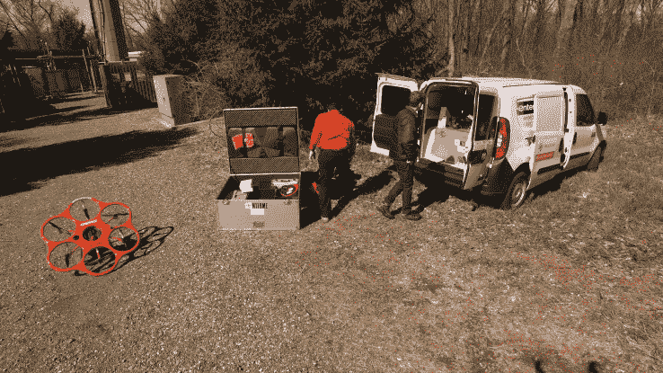
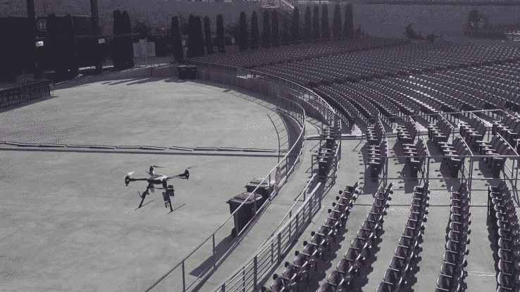

# Measure 筹集了 1500 万美元来为其他公司提供无人机飞行服务 

> 原文：<https://web.archive.org/web/https://techcrunch.com/2017/01/17/measure-raises-15-million-to-fly-drones-as-a-service-for-other-companies/>

[措施](https://web.archive.org/web/20230130235209/http://www.measure.aero/about-us/)可能不是建造终极[飞行摄像机](https://web.archive.org/web/20230130235209/https://techcrunch.com/2017/01/11/unable-to-fund-production-of-its-camera-drone-lily-will-shut-down-and-refund-customers/)，或者[在你家门口扔墨西哥卷饼](https://web.archive.org/web/20230130235209/https://techcrunch.com/2016/09/08/chipotle-to-test-burrito-delivery-by-drone-with-project-wing-at-virginia-tech/)的无人机。但这家总部位于华盛顿特区的初创公司已经筹集了 1500 万美元的 B 轮资金，用于为其他企业提供无人机飞行服务，这些企业希望进行检查，拍摄视频或收集其他高层见解。

Measure 首席执行官和联合创始人 Brandon Torres Declet 说:“在过去的两年里，已经有大约 7.5 亿美元投资到这个领域。绝大多数去了硬件和软件。但是驾驶无人机并不直观。获得高质量的数据是困难的。因此，我们专注于为您提供投资回报，而不仅仅是向您销售硬件或软件许可证。”

IT 服务公司 [Cognizant](https://web.archive.org/web/20230130235209/https://www.cognizant.com/) 牵头投资 Measure，参与投资的还有 [Hudson Bay Capital](https://web.archive.org/web/20230130235209/https://hudsonbaycapital.com/) ，以及一家未具名的主权财富基金。根据 Torres Declet 的说法，该公司将利用这笔资金进行招聘，在地理上扩展到新的市场，并利用市场上最新的无人机、传感器、相机和软件开发新的能力。

到目前为止，[“无人机即服务”初创公司](https://web.archive.org/web/20230130235209/https://twitter.com/droneasaservice)已经积累了一支多样化的舰队，雇佣了 20 名全职飞行员，以及飞行操作、数据工程和无人机工程专家。它使用的无人机包括由 Aerialtronics、Aibotix、DJI 和 Sensefly 制造的固定翼和多旋翼型号。它还使用 Skyward 和 DroneDeploy 等软件进行飞行管理和数据处理。当然，该公司一直在评估这个领域的新硬件和应用。

*Measure 员工架设无人机进行空中巡查。*

Torres Declet 表示，自 Measure 于 2014 年成立以来，该公司已经确保了无人机的安全，并派遣飞行员从事以下工作:为威瑞森(TechCrunch 的母公司)检查手机信号塔；为包括美国广播公司、福克斯新闻频道和美国有线电视新闻网在内的主要网络收集自然灾害后的空中镜头；为大型建筑和工程公司进行现场审计。

去年，Measure 还与得克萨斯州的[孤星 UAS 卓越创新中心](https://web.archive.org/web/20230130235209/http://lsuasc.tamucc.edu/)合作，为一家未指明的客户悄悄开展了用无人机运送消费品的工作。Measure 的首席执行官拒绝讨论这些举措，也没有透露零售商或其他相关客户的名称。然而，这位首席执行官夸口说，2016 年 Measure 飞行了超过 1100 次航班，使其成为美国商业领域经验丰富的航班运营商之一。

现在，联邦航空管理局发布了其[第 107 部分规则](https://web.archive.org/web/20230130235209/https://techcrunch.com/2016/08/29/new-rules-for-commercial-drone-use-take-effect-today-in-the-u-s/)，澄清了无人机操作员如何被允许在美国领空进行商业或工业飞行，这位首席执行官预计，更多的财富 1000 强企业将希望在他们的运营中使用无人机。为什么不成立自己的无人机事业部？

他说，“并不是说这些公司不能自己合法经营，而是我们提供了一种他们大多数人都不具备的专业知识水平。我们知道他们如何利用这项技术，可以用他们收集的数据做什么，所有的要求是什么，何时以及如何获得保险，如何存储和分析他们的数据，所有这些。我们想把问题带走，只给他们可操作的数据。”

*Measure 让无人机在现场娱乐场所上空飞行，以确定哪里可能需要维修或安保。*

该公司的竞争主要来自专注于单一行业的区域性无人机运营商，如弗吉尼亚州的 [Hazon Solutions](https://web.archive.org/web/20230130235209/http://www.hazonsolutions.com/) ，或德克萨斯州的 [Trumbull Unmanned](https://web.archive.org/web/20230130235209/http://www.trumbullunmanned.com/) 。但是风险投资支持的 PrecisionHawk 公司也瞄准了这个市场，该公司已经从制造无人机和软件转向为大公司提供“空中数据服务”。

牵头对 Measure 进行战略投资的 [Cognizant Accelerator](https://web.archive.org/web/20230130235209/https://www.cognizant.com/innovation-at-cognizant) 总裁肖恩·米德尔顿(Sean Middleton)表示，他相信这家初创公司的业务将在美国和其他地区增长:“他们已经有了一个很好的试点网络、覆盖范围和商业模式。现在的问题是如何面对新客户。有趣的是，Measure 提供的一些解决方案甚至更适用于基础设施不像美国那样强健的发展中市场。”

除了扩大其足迹，Measure 还计划在 Cognizant 的帮助下开发技术，如空中图像的自动变化检测，例如，这可以帮助一家能源公司在泄漏之前很久就发现需要维修的管道，或者帮助一家电信公司在客户抱怨服务中断之前找到一座在风暴中受损的塔。