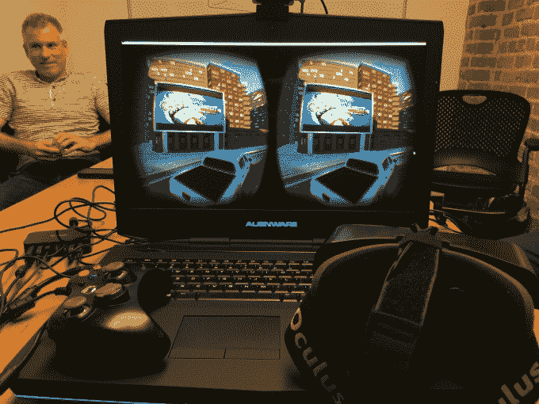
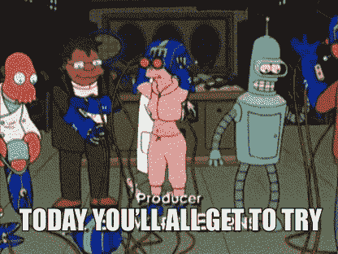
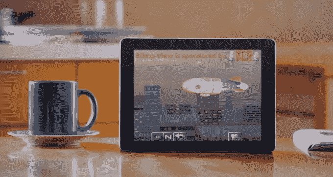

# MediaSpike 让我们快速了解了虚拟现实中的原生广告 

> 原文：<https://web.archive.org/web/https://techcrunch.com/2014/12/08/mediaspike-gave-us-a-quick-look-at-native-ads-in-virtual-reality/>

今年早些时候，当 Oculus 被收购的消息被披露时，许多虚拟现实爱好者最糟糕的噩梦变成了现实。

这是一家羽翼未丰的公司，走在了一个长期梦想、但直到现在才可能面向广大消费者发布的媒体的前沿。凭借几个镜头和智能手机的勇气，Oculus 打开了通往新现实的大门。

然后我们发现这一切都在脸书的控制之下。每当你花 20 分钟去进行虚拟现实冒险时，所有的东西都会溅满广告:

到目前为止，这种担心大多没有被证实。Oculus 似乎在很大程度上独立运营，它的每一次发布都继续专注于让硬件变得更好，并帮助开发者制作和分发很酷的东西。

它还与三星等合作伙伴合作，让你在不同的设备上访问为其商店构建的虚拟现实应用程序，这些应用程序在不同的环境下有意义。一些虚拟现实应用程序在你在家的时候效果最好，而其他体验在你坐在飞机座位上五个小时的时候才有意义。

MediaSpike 是一家帮助开发者在 iOS 和 Android 上广泛流行的游戏中放置产品的初创公司，它认为虚拟现实将在这些不同的用例中拥有广泛的受众。因此，他们调整了他们的 SDK，使其更容易与 Unity 构建的 VR 体验相集成，Unity 是独立开发者中受欢迎的游戏引擎，也是最简单的虚拟现实应用入门方式之一(这是三星在几周前的会议上向开发者展示的 VR 界面制作面板)。

为了配合更新的 SDK，该公司移植了 iPad 演示应用程序，用于展示移动应用程序中的产品放置，以便与最新的 Oculus Rift 开发套件配合使用。

在演示中，您驾驶卡车在一个小城市环境中行驶。实际上，这并不完全正确——你在卡车后面，可以使用 Rift 的运动跟踪自由地四处张望。开车在城里转了一圈，看到广告牌上贴满了《卑鄙的我 2》的海报，一家电影院在播放这部电影，还有一个大型户外电影院在循环播放这部电影的预告片。

就模型和纹理质量而言，它看起来非常像一款 iPad 游戏，但 Oculus Rift 提供的地点感可以让任何内容都感觉很特别(有点像 iPad 上的 Safari 在一段时间内本身就是一种新奇)。登上软式飞艇(由电影赞助，控制器旁边放着一个百事可乐罐)，一看到下面的建筑和地面，我的心跳就加快了一点。

[gallery ids="1091802，1091803，1091801"]

我对演示的总体印象是积极的。每当我开车在城市里四处逛的时候，看到广告飞溅是不是有点奇怪？不尽然，因为在相同的时间内，我在真实的城市*中步行或开车逛*的次数比我看到的要少。**

 *尽管如此，虽然内容并没有让我失去兴趣，但如果玩虚拟现实游戏太长时间，需要大量与你的动作没有直接关联的相机工作，我会有一些常见的恶心。我想知道这在多大程度上会导致[厌恶疗法式的条件反射](https://web.archive.org/web/20221209104208/http://en.wikipedia.org/wiki/Aversion_therapy)——在早期虚拟现实中接触品牌(直到显示器能够以真正消除大多数人晕车的速度刷新还需要一段时间)真的会导致用户对广告感到身体不适吗？*