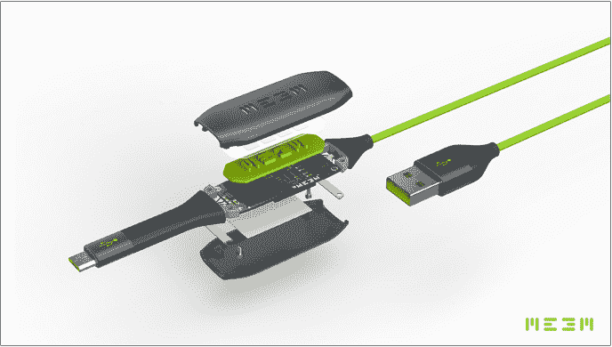

# 每次你给手机充电时，Meem 都会备份你的手机 

> 原文：<https://web.archive.org/web/https://techcrunch.com/2016/06/10/meem-charger-backup/>

# 每次你给手机充电时，Meem 都会备份

又忘记备份手机了？Meem 的新产品可能正是你苦恼的解决方案。该公司为 iOS 和 Android 开发了电源线，每当你插入设备时，它都会为你的设备提供备份。在[成功的 Kickstarter 活动](https://web.archive.org/web/20221125072711/https://www.kickstarter.com/projects/868671768/meem-memory-cable)之后，Meem 的电缆于本周早些时候开始发货。

我们使用智能手机的方式已经发生了很大的变化，我们许多人甚至不再将智能手机插入电脑。与此同时，你保存在手机上的数据很重要，如果你不信任云存储提供商来保护你的数据安全，问题是你如何在日常工作中进行备份。

一定会喜欢一些爆炸的有线电视色情。Phwoar。

Meem 声称，因为电缆是一种物理设备(而不是云服务或你计算机上的文件)，所以它更安全。这在某种程度上是有道理的，但我不了解你——我知道这些年我丢失的充电电缆比云密码多得多。

Meem 的美妙之处在于它完全透明。虽然你可能会忘记备份设备，但忘记充电的可能性几乎为零。插上 Meem 电缆，输入一个四位数的 PIN 码，每次你给手机充电时，你的个人数据就会立即开始备份。

iPhone 和 Android 设备的充电器电缆有 16GB 和 32GB 两种型号。存储空间听起来可能不够(毕竟，许多手机的存储空间都比这大)，但 Meem 团队已经找到了一种方法，可以只备份手机的重要部分，而将操作系统和应用程序等内容留在设备上。该公司还表示，他们将进一步推出 USB-C 版本。

Meem 产品[在 1 月](https://web.archive.org/web/20221125072711/https://www.kickstarter.com/projects/868671768/meem-memory-cable/description)以 Kickstarter 项目的形式开始了它的生命，虽然它只是勉强达到了它的 Kickstarter 目标，但该公司及其高层有着令人印象深刻的记录。在创办 Meem 之前，首席执行官 Kelly Sumner 的简历上列出了 Take-Two interactive(因《侠盗猎车手》而闻名)的首席执行官和 RedOctane(因《吉他英雄》而闻名)的首席执行官，在 Kickstarter 活动之前，Meem 使用英国股权众筹平台 CrowdCube 从 282 名个人投资者那里筹集了 71 万英镑(100 万美元)，对公司的估值为 1100 万澳元(1630 万美元)。

这些电缆可以从制造商的网站和亚马逊网站上获得。

http://www.youtube.com/watch?v=CfJadfTjt0c